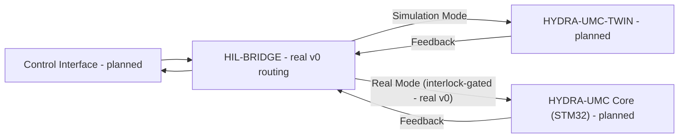

<p align="center">
  
</p>

# 🌉 HYDRA-UMC-HIL-BRIDGE

<p align="center">🇺🇸 <b>English</b> | <a href="README_spa.md">🇪🇸 Español</a> | <a href="README_fra.md">🇫🇷 Français</a> | <a href="README_ita.md">🇮🇹 Italiano</a> | <a href="README_deu.md">🇩🇪 Deutsch</a> | <a href="README_zho.md">🇨🇳 简体中文</a> | <a href="README_jpn.md">🇯🇵 日本語</a></p>

### ⚡ Hardware-in-the-Loop Interface for Real-vs-Virtual Sync

<p align="left">
  
  
  
  
</p>

---

## 1. 🛠️ TECHNICAL OVERVIEW

**HYDRA-UMC-HIL-BRIDGE** is the communication artery that enables Hardware-in-the-Loop (HIL) functionality. It synchronizes the state between the physical controllers and the Digital Twin engine in real-time.

It allows developers to send commands from any interface (App, Suite, Studio) to the simulator as if it were a physical robot, and conversely, it can mirror a physical robot's movements into the virtual world for remote supervision and digital twin shadowing.

### Key Features:
* 🛡️ **Safety Interlock (v0):** the real `route` subcommand blocks a real-hardware-bound command whenever a twin risk report says a collision is imminent - see "Honesty check" below for exactly what runs today.
* 🌉 **Bidirectional Bridge (v0, no transport yet):** real mode-based routing (Real/Simulation) and real unconditional mirroring exist; there is no real gRPC/WebSocket connection to an actual HYDRA-UMC-TWIN or HYDRA-UMC controller yet.
* ⚡ **Zero-Latency Mirroring (partial):** the real `mirror` subcommand shadows a command into a recording sink today; "zero-latency" over a real network connection is still future work.
* 📡 **Unified Protocol (planned):** uses gRPC for high-speed local sync and WebSockets for remote monitoring - no network transport is wired in yet, on purpose (see `Cargo.toml`).
* 🧪 **Fail-safe transport, testable without hardware (v0):** `CommandSink::send()` returns a real `Result`, and a `SimulatedTransport` can model a timed-out or disconnected link; the bridge reports a distinct `TransportFailure` outcome rather than ever claiming a command was delivered when it wasn't - exercisable via `--transport-latency-ms`/`--transport-timeout-ms`/`--transport-disconnected` on `route`.

**Honesty check - what actually runs today:** `route --mode real|simulation --joint NAME --position VALUE [--collision-risk] [--distance METERS] [--transport-latency-ms MS] [--transport-timeout-ms MS] [--transport-disconnected]` makes a real routing decision - `simulation` mode always sends, `real` mode is gated by a real safety interlock that blocks the command whenever `--collision-risk` is set. `mirror --joint NAME --position VALUE` shadows a command unconditionally. Both route to an in-memory sink by default (`RecordingSink`, not a real controller or a real HYDRA-UMC-TWIN instance), or to a `SimulatedTransport` that can genuinely fail (timeout/disconnect) when the transport flags above are passed - there is no gRPC/WebSocket transport yet. See [`CHANGELOG.md`](CHANGELOG.md) for exactly what shipped, and the Roadmap below for what's still ahead.

---

## 2. 🔄 HIL SYNC FLOW

The mode-based split at `BRIDGE` and the safety interlock gate on the
`Real Mode` path are real today (`bridge.rs`/`interlock.rs`), routing to
an in-memory sink rather than a live process. Everything touching a real
`APP`, `TWIN` or `CORE` process over a real connection remains future
work.



---

## 3. 🧱 ARCHITECTURE & DESIGN DECISIONS

* **Why this bridge has no `hardware/`/`firmware/`/`os/` folders.** Pure software - it bridges existing hardware (real apps, real HYDRA-UMC firmware) to the digital twin, no board of its own.
* **Why it's a sibling, not a submodule, of HYDRA-UMC-TWIN.** A hardware-in-the-loop bridge needs to keep running (and keep a real device's commands flowing) independent of whatever HYDRA-UMC-TWIN's own render/physics loop is doing at that instant - a separate process means a twin restart doesn't drop an in-flight real command.
* **How this fits the rest of the ecosystem.** Lets HYDRA-UMC-SUITE, HYDRA-UMC-ANDROID-CONTROL and HYDRA-UMC-IOS-CONTROL control HYDRA-UMC-TWIN as if it were a real HYDRA-UMC-SERVER-backed cell - the same control surface, a simulated target.
* **Why the interlock trusts the twin's own `collision_imminent` flag instead of re-deriving one from a distance threshold.** The twin has already done the real geometric/physics reasoning by the time it reports risk - second-guessing that conclusion here with an independent distance cutoff would just be a second, possibly-inconsistent safety opinion. See `interlock.rs`'s own module docs for how this mirrors HYDRA-UMC-SAFETY-ZONES's detect-vs-enforce boundary.
* **Why `Simulation` mode is never gated by the interlock.** The entire point of routing a command to the twin instead of real hardware is to be able to see a predicted collision play out safely - blocking it there would defeat the feature it exists to support.
* **Why `CommandSink` is a trait with only an in-memory `RecordingSink` implementation today.** No real gRPC/WebSocket transport exists yet (see `Cargo.toml`'s own comment) - `RecordingSink` is honest about that: it records what it was asked to send without transmitting anywhere, the same reasoning as `NullEStopRequester` in HYDRA-UMC-SAFETY-ZONES.
* **Why `CommandSink::send()` returns a `Result` instead of `()`.** A real transport can fail to deliver (timeout, disconnect) independently of whether the interlock allowed the command through - if `send()` can't fail, the bridge has no way to avoid claiming success on a command that never actually arrived. `SimulatedTransport` exists specifically so that failure path is real and testable today, without waiting for a real transport to exist.
* **Why `TransportFailure` is a separate `RouteOutcome` from `BlockedByInterlock`.** They are different kinds of "didn't happen": one is a deliberate safety refusal (the interlock decided not to forward it), the other is best-effort delivery that simply didn't complete. Collapsing them into one generic failure would hide which safety layer actually stopped the command - useful for debugging and for any future policy that treats them differently (e.g. retrying a transport failure is reasonable; retrying past an interlock block is not).

---

## 📂 DIRECTORY STRUCTURE

Pure software bridge with no hardware design of its own, so this project has
no `hardware/`, `firmware/` or `os/` folders under the repository structure policy.

```text
HYDRA-UMC-HIL-BRIDGE/
├── src/
│   ├── protocol.rs       # Real JointCommand/Mode types
│   ├── interlock.rs      # Real safety interlock decision
│   ├── bridge.rs         # Real mode-based routing + mirroring + CommandSink/SimulatedTransport
│   └── main.rs           # Entry point + real `route`/`mirror` subcommands
├── docs/                # Documentation and integration guides
├── build/               # Build notes/artifacts (cargo's own output lives in target/, gitignored)
├── images/              # Media and diagrams
├── scripts/             # Utility scripts
├── tools/
│   ├── build_test.py    # Non-versioning build/compile check
│   └── ci_validate.py   # Manifest/CHANGELOG/docs validation used by CI
├── Cargo.toml           # Package metadata, dependencies, odometer version
├── bump_version.py      # Odometer-style version bump (used by build.sh/.bat)
├── build.sh / build.bat # Bumps version, `cargo test`, then `cargo build --release`
├── build-test.sh / build-test.bat # Non-versioning build check (no CHANGELOG/version bump)
└── run.sh / run.bat     # Runs the compiled release binary (forwards arguments)
```

---

## 🏗️ BUILD AND RUN GUIDE

Requires the Rust toolchain (`cargo`/`rustc`, install via [rustup](https://rustup.rs)) and Python 3.10+ (only for `bump_version.py`).

```bash
# Linux / macOS
./build.sh   # odometer version bump, `cargo test` (15 tests), then `cargo build --release`
./run.sh     # runs target/release/hydra-umc-hil-bridge, prints name + version + role
```

```bat
:: Windows
build.bat
run.bat
```

`build.sh`/`build.bat` bump this project's own `Cargo.toml` version following the ecosystem's "odometer" rule (PATCH+1, carrying into MINOR past 9), run the real test suite, then build a release binary.

The real `route` and `mirror` subcommands:

```bash
./run.sh route --mode real --joint shoulder --position 0.5
# SENT: routed to real HYDRA-UMC controller

./run.sh route --mode real --joint shoulder --position 0.5 --collision-risk --distance 0.02
# BLOCKED: safety interlock refused to forward to real hardware (twin reports imminent collision at 0.020m)

./run.sh route --mode simulation --joint shoulder --position 0.5 --collision-risk --distance 0.02
# SENT: routed to HYDRA-UMC-TWIN (simulation)

./run.sh mirror --joint elbow --position -0.3
# MIRRORED: joint 'elbow' = -0.300000 shadowed into the twin

./run.sh route --mode real --joint shoulder --position 0.5 --transport-timeout-ms 100 --transport-latency-ms 500
# TRANSPORT FAILURE: command was not confirmed delivered (transport timed out after 100ms)

./run.sh route --mode real --joint shoulder --position 0.5 --transport-disconnected
# TRANSPORT FAILURE: command was not confirmed delivered (transport is disconnected)
```

`route` exits `0` (sent), `1` (blocked by the safety interlock - a real, meaningful outcome, not an error), `2` (bad input), or `3` (transport failure - the interlock allowed it, but delivery wasn't confirmed). `mirror` exits `0`, `2`, or `3`.

`Cargo.toml` intentionally carries no external crates yet - see the comment inside it for what gets added once real gRPC/WebSocket transport work starts.

---

## 🚀 ROADMAP
* **Phase 1:** Digital Twin synchronization with real-time hardware telemetry and sub-10ms latency.
* **Phase 2:** Physics Replica integration with industrial-grade simulators (Isaac Sim) and deformable body support.
* **Phase 3:** Node Healing automated recovery patterns for decentralized failover and early sensor degradation detection.
* **Phase 4:** Multi-controller HIL synchronization (Swarm HIL) and photorealistic synthetic data generation support.

---

## 🔗 Related Projects

This project is part of a larger robotics ecosystem by the same author (JuanenRac / Electro Hobby 3D), spanning firmware, control software, AI nodes, and fleet tooling. Worth knowing about, since a request might actually be about one of these rather than this repository.

### Family

**Parent:** **[HYDRA-UMC-TWIN](https://github.com/JuanenRac/HYDRA-UMC-TWIN)** — the integration parent this bridge links to real hardware.

**Siblings:**
- **[HYDRA-UMC-PHYSICS-REPLICA](https://github.com/JuanenRac/HYDRA-UMC-PHYSICS-REPLICA)** — sibling simulation service, same parent.
- **[HYDRA-UMC-SYNTHETIC-DATA-GEN](https://github.com/JuanenRac/HYDRA-UMC-SYNTHETIC-DATA-GEN)** — sibling simulation service, same parent.

### Directly Related (outside the family)

- **[HYDRA-UMC-SERVER](https://github.com/JuanenRac/HYDRA-UMC-SERVER)** — hardware-in-the-loop bridge target.
- **[HYDRA-UMC-SUITE](https://github.com/JuanenRac/HYDRA-UMC-SUITE)** — hardware-in-the-loop bridge target.
- **[HYDRA-UMC-ANDROID-CONTROL](https://github.com/JuanenRac/HYDRA-UMC-ANDROID-CONTROL)** — hardware-in-the-loop bridge target.
- **[HYDRA-UMC-IOS-CONTROL](https://github.com/JuanenRac/HYDRA-UMC-IOS-CONTROL)** — hardware-in-the-loop bridge target.

### Rest of the Ecosystem

**HYDRA-UMC platform** — the multi-robot micro-factory cell
- **[HYDRA-UMC](https://github.com/JuanenRac/HYDRA-UMC)** — the CM5 + STM32H745 motherboard orchestrating up to 8 robot arms.
- **[HYDRA-UMC-SERVER](https://github.com/JuanenRac/HYDRA-UMC-SERVER)** — the Express/WebSocket backend every control client talks to.
- **[HYDRA-UMC-STUDIO](https://github.com/JuanenRac/HYDRA-UMC-STUDIO)** — web-based control dashboard, multi-robot 3D visualization.
- **[HYDRA-UMC-ANDROID-CONTROL](https://github.com/JuanenRac/HYDRA-UMC-ANDROID-CONTROL)** — Android control app over Wi-Fi/Bluetooth.
- **[HYDRA-UMC-IOS-CONTROL](https://github.com/JuanenRac/HYDRA-UMC-IOS-CONTROL)** — iOS/iPadOS control app built in Flutter.
- **[HYDRA-UMC-SUITE](https://github.com/JuanenRac/HYDRA-UMC-SUITE)** — desktop swarm command center (Python/PySide6).
- **[HYDRA-UMC-EDITOR-URDF](https://github.com/JuanenRac/HYDRA-UMC-EDITOR-URDF)** — desktop URDF model editor for the robot catalog.
- **[HYDRA-UMC-DSI](https://github.com/JuanenRac/HYDRA-UMC-DSI)** — native touch UI for the onboard DSI touchscreen.

**URTC platform** — the tool head controller every HYDRA-UMC robot arm carries
- **[URTC](https://github.com/JuanenRac/URTC)** — CAN bus tool head controller, 25 tool profiles.
- **[URTC-FLASHER](https://github.com/JuanenRac/URTC-FLASHER)** — desktop CAN-OTA + SWD/JTAG flashing tool.
- **[URTC-TESTER](https://github.com/JuanenRac/URTC-TESTER)** — desktop live CAN-bus diagnostic tool.
- **[URTC-WEB-STUDIO](https://github.com/JuanenRac/URTC-WEB-STUDIO)** — browser-based alternative via Web Serial API.

**🎥 Vision AI Node (Hailo-8)**
- [HYDRA-UMC-VISION-NODE](https://github.com/JuanenRac/HYDRA-UMC-VISION-NODE)
- [HYDRA-UMC-VISION-STREAMER](https://github.com/JuanenRac/HYDRA-UMC-VISION-STREAMER)
- [HYDRA-UMC-DETECTION-HEF](https://github.com/JuanenRac/HYDRA-UMC-DETECTION-HEF)
- [HYDRA-UMC-SAFETY-ZONES](https://github.com/JuanenRac/HYDRA-UMC-SAFETY-ZONES)
- [HYDRA-UMC-VISUAL-SERVOING-API](https://github.com/JuanenRac/HYDRA-UMC-VISUAL-SERVOING-API)

**🧠 Cognitive AI Node (Hailo-10)**
- [HYDRA-UMC-COGNITIVE-NODE](https://github.com/JuanenRac/HYDRA-UMC-COGNITIVE-NODE)
- [HYDRA-UMC-VLA-ENGINE](https://github.com/JuanenRac/HYDRA-UMC-VLA-ENGINE)
- [HYDRA-UMC-VOICE-UI](https://github.com/JuanenRac/HYDRA-UMC-VOICE-UI)
- [HYDRA-UMC-SEMANTIC-PLANNER](https://github.com/JuanenRac/HYDRA-UMC-SEMANTIC-PLANNER)
- [HYDRA-UMC-DOCS-QA](https://github.com/JuanenRac/HYDRA-UMC-DOCS-QA)

**🐝 Orchestration & Swarm**
- [HYDRA-UMC-ORCHESTRATOR](https://github.com/JuanenRac/HYDRA-UMC-ORCHESTRATOR)
- [HYDRA-UMC-SWARM-SYNC](https://github.com/JuanenRac/HYDRA-UMC-SWARM-SYNC)
- [HYDRA-UMC-PATH-PLANNER-3D](https://github.com/JuanenRac/HYDRA-UMC-PATH-PLANNER-3D)
- [HYDRA-UMC-JOB-DISPATCHER](https://github.com/JuanenRac/HYDRA-UMC-JOB-DISPATCHER)
- [HYDRA-UMC-NODE-HEALING](https://github.com/JuanenRac/HYDRA-UMC-NODE-HEALING)

**📊 Data & Analytics**
- [HYDRA-UMC-DATALAKE](https://github.com/JuanenRac/HYDRA-UMC-DATALAKE)
- [HYDRA-UMC-TELEMETRY-COLLECTOR](https://github.com/JuanenRac/HYDRA-UMC-TELEMETRY-COLLECTOR)
- [HYDRA-UMC-ANOMALY-DETECTOR](https://github.com/JuanenRac/HYDRA-UMC-ANOMALY-DETECTOR)
- [HYDRA-UMC-PRODUCTION-REPORTS](https://github.com/JuanenRac/HYDRA-UMC-PRODUCTION-REPORTS)

**🏭 Industrial Gateway**
- [HYDRA-UMC-GATEWAY-INDUSTRIAL](https://github.com/JuanenRac/HYDRA-UMC-GATEWAY-INDUSTRIAL)
- [HYDRA-UMC-OPCUA-SERVER](https://github.com/JuanenRac/HYDRA-UMC-OPCUA-SERVER)
- [HYDRA-UMC-MQTT-BROKER](https://github.com/JuanenRac/HYDRA-UMC-MQTT-BROKER)
- [HYDRA-UMC-MTCONNECT-ADAPTER](https://github.com/JuanenRac/HYDRA-UMC-MTCONNECT-ADAPTER)

**🛠️ Complementary Tools**
- [URTC-SMART-RACK](https://github.com/JuanenRac/URTC-SMART-RACK)
- [URTC-VISION-TOOL](https://github.com/JuanenRac/URTC-VISION-TOOL)
- [HYDRA-UMC-WATCH](https://github.com/JuanenRac/HYDRA-UMC-WATCH)
- [HYDRA-UMC-TOOL-CLI](https://github.com/JuanenRac/HYDRA-UMC-TOOL-CLI)
- [HYDRA-UMC-DASHBOARD-AI](https://github.com/JuanenRac/HYDRA-UMC-DASHBOARD-AI)


## 👤 AUTHOR
**JuanenRac** (Electro Hobby 3D)
📧 electrohobby3d@gmail.com

## 📜 LICENSE
GPL-3.0 - See LICENSE for details.

## 🛠️ BUILD & RUN

Use the non-versioning build check before a release build:

| Action | Windows | Linux / macOS |
|---|---|---|
| Build check (no version or CHANGELOG change) | `build-test.bat` | `./build-test.sh` |
| Run / development (when provided) | `run*.bat` or `dev*.bat` | `./run*.sh` or `./dev*.sh` |

`build-test.bat` and `build-test.sh` compile or validate the project stack without incrementing `hydra-umc.project.json` or modifying `CHANGELOG.md`. They may create normal compiler output only. Existing `build*.bat`, `build*.sh`, `run*` and `dev*` scripts retain their project-specific, versioned or runtime behavior; use them when that behavior is required.