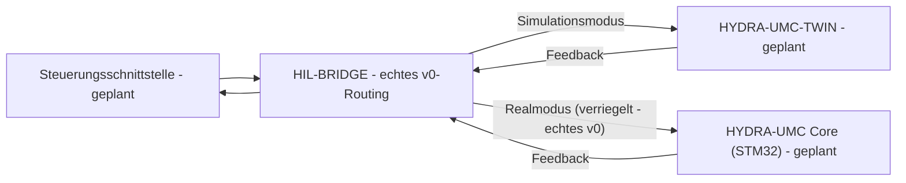

<p align="center">
  
</p>

# 🌉 HYDRA-UMC-HIL-BRIDGE

<p align="center"><a href="README.md">🇺🇸 English</a> | <a href="README_spa.md">🇪🇸 Español</a> | <a href="README_fra.md">🇫🇷 Français</a> | <a href="README_ita.md">🇮🇹 Italiano</a> | 🇩🇪 <b>Deutsch</b> | <a href="README_zho.md">🇨🇳 简体中文</a> | <a href="README_jpn.md">🇯🇵 日本語</a></p>

### ⚡ Hardware-in-the-Loop-Schnittstelle für Real-vs-Virtual-Sync

<p align="left">
  
  
  
  
</p>

---

## 1. 🛠️ TECHNISCHER ÜBERBLICK

**HYDRA-UMC-HIL-BRIDGE** ist die Kommunikationsader, die die Hardware-in-the-Loop (HIL)-Funktionalität ermöglicht. Sie synchronisiert den Zustand zwischen den physischen Controllern und der Digital Twin-Engine in Echtzeit.

Sie ermöglicht es Entwicklern, Befehle von jeder Schnittstelle (App, Suite, Studio) an den Simulator zu senden, als wäre er ein physischer Roboter, und umgekehrt kann sie die Bewegungen eines physischen Roboters in die virtuelle Welt spiegeln, zur Fernüberwachung und zum Shadowing des digitalen Zwillings.

### Hauptmerkmale:
* 🛡️ **Sicherheitsverriegelung (v0):** der echte Subbefehl `route` blockiert einen für echte Hardware bestimmten Befehl, sobald ein Zwillings-Risikobericht eine bevorstehende Kollision meldet - siehe "Ehrlichkeitscheck" unten für das, was heute genau läuft.
* 🌉 **Bidirektionale Brücke (v0, noch ohne Transport):** echtes modusbasiertes Routing (Real/Simulation) und echtes, bedingungsloses Spiegeln existieren bereits; es gibt noch keine echte gRPC/WebSocket-Verbindung zu einem echten HYDRA-UMC-TWIN oder HYDRA-UMC-Controller.
* ⚡ **Zero-Latency Mirroring (teilweise):** der echte Subbefehl `mirror` spiegelt einen Befehl heute in einen In-Memory-Empfänger; "Zero-Latency" über eine echte Netzwerkverbindung bleibt zukünftige Arbeit.
* 📡 **Einheitliches Protokoll (geplant):** nutzt gRPC für Hochgeschwindigkeits-Lokal-Sync und WebSockets für die Fernüberwachung - es ist absichtlich noch kein Netzwerktransport angeschlossen (siehe `Cargo.toml`).
* 🧪 **Fehlersicherer Transport, ohne Hardware testbar (v0):** `CommandSink::send()` gibt jetzt ein echtes `Result` zurück, und ein `SimulatedTransport` kann eine zeitüberschreitende oder getrennte Verbindung modellieren; die Brücke meldet ein eigenes `TransportFailure`-Ergebnis, statt jemals zu behaupten, ein Befehl sei zugestellt worden, obwohl er es nicht wurde - ausübbar über `--transport-latency-ms`/`--transport-timeout-ms`/`--transport-disconnected` bei `route`.
* 🌐 **HTTP-JSON-API (v0):** `serve [--addr ADDR] [--port PORT]` (Standard `127.0.0.1:8113`) stellt genau dieselbe Routing-/Spiegel-Logik über `POST /route`, `POST /mirror` und `GET /stats` auf einem echten, blockierenden `tiny_http`-Server bereit - dieselbe Binärdatei, die die `systemd/hydra-umc-hil-bridge.service`-Unit auf einer eingesetzten CM5 nur über Loopback ausführt. Siehe [`docs/CLI_REFERENCE.md`](docs/CLI_REFERENCE.md) für den vollständigen Anfrage-/Antwort-Vertrag.

**Ehrlichkeitscheck - was heute wirklich läuft:** `route --mode real|simulation --joint NAME --position WERT [--collision-risk] [--distance METER] [--transport-latency-ms MS] [--transport-timeout-ms MS] [--transport-disconnected]` trifft eine echte Routing-Entscheidung - der Modus `simulation` sendet immer, der Modus `real` unterliegt einer echten Sicherheitsverriegelung, die den Befehl blockiert, sobald `--collision-risk` gesetzt ist. `mirror --joint NAME --position WERT` spiegelt einen Befehl bedingungslos. `serve` stellt beides über echtes HTTP JSON bereit statt über einmalige CLI-Aufrufe. Alle drei leiten standardmäßig an einen In-Memory-Empfänger weiter (`RecordingSink`, kein echter Controller oder eine echte HYDRA-UMC-TWIN-Instanz), oder an einen `SimulatedTransport`, der bei gesetzten Transport-Flags oben tatsächlich fehlschlagen kann (Timeout/Verbindungsabbruch) - es gibt noch keinen gRPC/WebSocket-Transport. Siehe [`CHANGELOG.md`](CHANGELOG.md) für genau das, was geliefert wurde, [`docs/CLI_REFERENCE.md`](docs/CLI_REFERENCE.md) für jeden Befehl/Endpunkt, und die Roadmap unten für das, was noch aussteht.

---

## 2. 🔄 HIL-SYNC-ABLAUF

Die modusbasierte Aufteilung bei `BRIDGE` und die Sicherheitsverriegelung
auf dem `Realmodus`-Pfad sind heute real (`bridge.rs`/`interlock.rs`) und
leiten an einen In-Memory-Empfänger weiter, statt an einen echten
laufenden Prozess. Alles, was einen echten `APP`-, `TWIN`- oder
`CORE`-Prozess über eine echte Verbindung betrifft, bleibt zukünftige
Arbeit.



---

## 3. 🧱 ARCHITEKTUR & DESIGNENTSCHEIDUNGEN

* **Warum diese Brücke keine `hardware/`/`firmware/`/`os/`-Ordner hat.** Reine Software - sie verbindet bereits vorhandene Hardware (echte Apps, echte HYDRA-UMC-Firmware) mit dem digitalen Zwilling, ohne eigene Platine.
* **Warum sie Geschwister, kein Submodul, von HYDRA-UMC-TWIN ist.** Eine Hardware-in-the-Loop-Brücke muss weiterlaufen (und die Befehle eines echten Geräts weiterfließen lassen), unabhängig davon, was die eigene Render-/Physikschleife von HYDRA-UMC-TWIN gerade tut - ein separater Prozess bedeutet, dass ein Neustart des Zwillings keinen laufenden echten Befehl verwirft.
* **Wie sich das ins restliche Ökosystem einfügt.** Lässt HYDRA-UMC-SUITE, HYDRA-UMC-ANDROID-CONTROL und HYDRA-UMC-IOS-CONTROL HYDRA-UMC-TWIN steuern, als wäre es eine echte, von HYDRA-UMC-SERVER unterstützte Zelle - dieselbe Steuerungsoberfläche, ein simuliertes Ziel.
* **Warum die Verriegelung dem eigenen `collision_imminent`-Flag des Zwillings vertraut, statt eines aus einem Distanzschwellenwert abzuleiten.** Der Zwilling hat die echte geometrische/physikalische Überlegung bereits angestellt, wenn er das Risiko meldet - diese Schlussfolgerung hier mit einem unabhängigen Distanz-Cutoff infrage zu stellen, wäre nur eine zweite, möglicherweise widersprüchliche Sicherheitsmeinung. Siehe die eigene Dokumentation des `interlock.rs`-Moduls dafür, wie dies die Erkennen-vs-Durchsetzen-Grenze von HYDRA-UMC-SAFETY-ZONES widerspiegelt.
* **Warum der `Simulation`-Modus nie durch die Verriegelung blockiert wird.** Der ganze Sinn, einen Befehl an den Zwilling statt an echte Hardware zu leiten, ist es, eine vorhergesagte Kollision sicher beobachten zu können - sie dort zu blockieren würde genau die Funktion zunichtemachen, die sie unterstützen soll.
* **Warum `CommandSink` heute ein Trait mit nur einer In-Memory-Implementierung `RecordingSink` ist.** Es gibt noch keinen echten gRPC/WebSocket-Transport (siehe den eigenen Kommentar in `Cargo.toml`) - `RecordingSink` ist ehrlich damit: Es zeichnet auf, was es senden sollte, ohne irgendwohin zu übertragen, dieselbe Überlegung wie bei `NullEStopRequester` in HYDRA-UMC-SAFETY-ZONES.
* **Warum `CommandSink::send()` ein `Result` statt `()` zurückgibt.** Ein echter Transport kann bei der Zustellung scheitern (Timeout, Verbindungsabbruch), unabhängig davon, ob die Verriegelung den Befehl durchgelassen hat - wenn `send()` nicht fehlschlagen kann, hat die Brücke keine Möglichkeit, Erfolg für einen Befehl zu behaupten, der nie wirklich angekommen ist. `SimulatedTransport` existiert genau deshalb, damit dieser Fehlerpfad heute real und testbar ist, ohne auf einen echten Transport zu warten.
* **Warum `TransportFailure` ein eigenes `RouteOutcome`, getrennt von `BlockedByInterlock`, ist.** Es sind zwei verschiedene Arten von "ist nicht passiert": Die eine ist eine bewusste Sicherheitsverweigerung (die Verriegelung hat entschieden, nicht weiterzuleiten), die andere ist eine Best-Effort-Zustellung, die einfach nicht abgeschlossen wurde. Sie zu einem generischen Fehler zusammenzufassen würde verbergen, welche Sicherheitsschicht den Befehl tatsächlich gestoppt hat - nützlich zum Debuggen und für jede zukünftige Richtlinie, die sie unterschiedlich behandelt (ein Transportfehler erneut zu versuchen ist sinnvoll; nach einer Verriegelungsblockade erneut zu versuchen nicht).

---

## 📂 VERZEICHNISSTRUKTUR

Reine Software-Brücke ohne eigenes Hardware-Design; daher hat dieses
Projekt keine Ordner `hardware/`, `firmware/` oder `os/`, gemäß der Repository-Strukturpolitik.

```text
HYDRA-UMC-HIL-BRIDGE/
├── src/
│   ├── protocol.rs       # Echte JointCommand/Mode-Typen
│   ├── interlock.rs      # Echte Sicherheitsverriegelungs-Entscheidung
│   ├── bridge.rs         # Echtes modusbasiertes Routing + Spiegeln + CommandSink/SimulatedTransport
│   ├── server.rs         # Einfache JSON/HTTP-Oberfläche (tiny_http, blockierend, ohne Async-Runtime)
│   └── main.rs           # Einstiegspunkt + echte `route`/`mirror`-Subbefehle
├── docs/                # Dokumentation und Integrationsleitfäden
├── build/               # Build-Notizen/Artefakte (die eigentliche cargo-Ausgabe liegt in target/, per .gitignore ausgeschlossen)
├── images/              # Medien und Diagramme
├── systemd/
│   └── hydra-umc-hil-bridge.service # systemd-Unit der lokalen CM5-route/mirror-API
├── tools/
│   ├── build_test.py    # Nicht-versionierender Build-Check
│   └── ci_validate.py   # Manifest/CHANGELOG/Docs-Validierung, von CI genutzt
├── Cargo.toml           # Paket-Metadaten, Abhängigkeiten, Kilometerzähler-Version
├── bump_version.py      # Native Kilometerzähler-artige Versions-Bump (von build.sh/.bat verwendet)
├── bump_manifest_version.py # Synchronisiert die Version von hydra-umc.project.json mit der nativen (--sync)
├── build.sh / build.bat # Erhöht die Version, `cargo test`, dann `cargo build --release`
├── build-test.sh / build-test.bat # Nicht-versionierender Build-Check
└── run.sh / run.bat     # Führt die kompilierte Release-Binärdatei aus (leitet Argumente weiter)
```

---

## 🏗️ BUILD UND RUN

Erfordert die Rust-Toolchain (`cargo`/`rustc`, Installation via [rustup](https://rustup.rs)) und Python 3.10+ (nur für `bump_version.py`).

```bash
# Linux / macOS
./build.sh   # Kilometerzähler-Versions-Bump, `cargo test` (23 Tests), dann `cargo build --release`
./run.sh     # führt target/release/hydra-umc-hil-bridge aus, gibt Name + Version + Rolle aus
```

```bat
:: Windows
build.bat
run.bat
```

`build.sh`/`build.bat` erhöhen die Version der eigenen `Cargo.toml` dieses Projekts nach der "Kilometerzähler"-Regel des Ökosystems (PATCH+1, mit Übertrag auf MINOR nach 9), führen die echte Testsuite aus und bauen dann eine Release-Binärdatei.

Die echten Subbefehle `route` und `mirror`:

```bash
./run.sh route --mode real --joint shoulder --position 0.5
# SENT: routed to real HYDRA-UMC controller

./run.sh route --mode real --joint shoulder --position 0.5 --collision-risk --distance 0.02
# BLOCKED: safety interlock refused to forward to real hardware (twin reports imminent collision at 0.020m)

./run.sh route --mode simulation --joint shoulder --position 0.5 --collision-risk --distance 0.02
# SENT: routed to HYDRA-UMC-TWIN (simulation)

./run.sh mirror --joint elbow --position -0.3
# MIRRORED: joint 'elbow' = -0.300000 shadowed into the twin

./run.sh route --mode real --joint shoulder --position 0.5 --transport-timeout-ms 100 --transport-latency-ms 500
# TRANSPORT FAILURE: command was not confirmed delivered (transport timed out after 100ms)

./run.sh route --mode real --joint shoulder --position 0.5 --transport-disconnected
# TRANSPORT FAILURE: command was not confirmed delivered (transport is disconnected)
```

`route` beendet sich mit `0` (gesendet), `1` (durch die Sicherheitsverriegelung blockiert - ein echtes, aussagekräftiges Ergebnis, kein Fehler), `2` (ungültige Eingabe), oder `3` (Transportfehler - die Verriegelung hat den Befehl durchgelassen, aber die Zustellung wurde nicht bestätigt). `mirror` beendet sich mit `0`, `2` oder `3`.

Dieselbe Routing-/Spiegel-Logik ist auch über echtes HTTP JSON erreichbar:

```bash
./run.sh serve --addr 127.0.0.1 --port 8113
# [hil-bridge] HTTP API listening on 127.0.0.1:8113
# [hil-bridge] POST /route, POST /mirror, GET /stats

curl -X POST http://127.0.0.1:8113/route \
    -d '{"mode":"real","joint":"shoulder","position":1.0,"risk":{"collision_imminent":true,"distance_m":0.02}}'
# {"BlockedByInterlock":{"reason":"twin reports imminent collision at 0.020m"}}
```

Siehe [`docs/CLI_REFERENCE.md`](docs/CLI_REFERENCE.md) für den vollständigen Anfrage-/Antwort-Vertrag von `POST /route`/`POST /mirror`/`GET /stats` - dieselbe Binärdatei, die die `systemd/hydra-umc-hil-bridge.service`-Unit auf einer eingesetzten CM5 ausführt.

`Cargo.toml` enthält absichtlich noch keine externen Crates, abgesehen von `tiny_http`/`serde`/`serde_json` (die echte HTTP-JSON-Schnittstelle) - siehe den Kommentar in der Datei für das, was hinzugefügt wird, wenn die echte gRPC/WebSocket-Transportarbeit beginnt.

---

## 🚀 FAHRPLAN
* **Phase 1:** Digital-Twin-Synchronisation mit Echtzeit-Hardware-Telemetrie und Sub-10ms-Latenz.
* **Phase 2:** Physics Replica-Integration mit industriellen Simulatoren (Isaac Sim) und Unterstützung für verformbare Körper.
* **Phase 3:** Automatisierte Wiederherstellungsmuster von Node Healing für dezentrales Failover und frühzeitige Erkennung von Sensordegradation.
* **Phase 4:** Multi-Controller-HIL-Synchronisation (Swarm HIL) und Unterstützung für fotorealistische Erzeugung synthetischer Daten.

---

## 🔗 Verwandte Projekte

Dieses Projekt ist Teil des HYDRA-UMC-Robotik-Ökosystems desselben Autors (JuanenRac / Electro Hobby 3D). Gut zu wissen, da eine Anfrage eigentlich eines dieser Projekte betreffen könnte statt dieses Repositorys.

**Übergeordnetes Projekt**
- **[HYDRA-UMC-TWIN](https://github.com/JuanenRac/HYDRA-UMC-TWIN)** — Integrationsknoten für die Digital-Twin-Engine, mit einem echten Versionskompatibilitäts-Sync-Vertrag; das übergeordnete Projekt, dessen spezifischer Simulationsdienst dieses Repository innerhalb seiner eigenen Digital-Twin-Engine ist.

**Geschwisterprojekte** — die übrigen Simulationsdienste der eigenen Digital-Twin-Engine von HYDRA-UMC-TWIN
- **[HYDRA-UMC-PHYSICS-REPLICA](https://github.com/JuanenRac/HYDRA-UMC-PHYSICS-REPLICA)** — echte Vorwärtskinematik und Gelenkgrenzenvalidierung über eine echte URDF-Teilmenge.
- **[HYDRA-UMC-SYNTHETIC-DATA-GEN](https://github.com/JuanenRac/HYDRA-UMC-SYNTHETIC-DATA-GEN)** — echter prozeduraler 2D-Szenengenerator mit YOLO/COCO-Annotationsexport.

**Direkt verwandt**
- **[HYDRA-UMC-STUDIO](https://github.com/JuanenRac/HYDRA-UMC-STUDIO)** — Web-Steuerungs-Dashboard mit Echtzeit-3D-Visualisierung mehrerer Roboter — eine der 3 Client-Oberflächen, die über diese Bridge Befehle senden können, als wäre sie ein physischer Roboter, sobald ein echter Transport existiert.
- **[HYDRA-UMC-SUITE](https://github.com/JuanenRac/HYDRA-UMC-SUITE)** — Desktop-Schwarmleitstand (PySide6) für mehrere Server gleichzeitig, verpackt als eigenständige ausführbare Datei — eine der 3 Client-Oberflächen, die über diese Bridge Befehle senden können, als wäre sie ein physischer Roboter, sobald ein echter Transport existiert.
- **[HYDRA-UMC-ANDROID-CONTROL](https://github.com/JuanenRac/HYDRA-UMC-ANDROID-CONTROL)** — native Android-Steuerungs-App mit biometrischem Login und einer gekoppelten Wear-OS-Begleit-App — eine der 3 Client-Oberflächen, die über diese Bridge Befehle senden können, als wäre sie ein physischer Roboter, sobald ein echter Transport existiert.
- **[HYDRA-UMC-IOS-CONTROL](https://github.com/JuanenRac/HYDRA-UMC-IOS-CONTROL)** — iOS/iPadOS-Steuerungs-App (Flutter) mit Echtzeit-WebSocket-Synchronisierung — eine der 3 Client-Oberflächen, die über diese Bridge Befehle senden können, als wäre sie ein physischer Roboter, sobald ein echter Transport existiert.
- **[HYDRA-UMC-SERVER](https://github.com/JuanenRac/HYDRA-UMC-SERVER)** — das reale Headless-Backend (REST/WebSocket), mit dem jeder Steuerungsclient tatsächlich spricht — das Backend hinter allen 3 dieser Client-Oberflächen, der echte Controller, den das eigene `route --mode real` dieser Bridge letztlich anspricht, sobald ein Transport existiert.

**Ebenfalls Teil des Ökosystems**

*Kern-Hardware & Plattform*
- **[HYDRA-UMC](https://github.com/JuanenRac/HYDRA-UMC)** — das physische Motherboard des Roboterarms: CM5-Host + Dual-Core-STM32H745, koordiniert bis zu 8 Werkzeugarme über CAN-OTA/SPI-OTA.
- **[HYDRA-UMC-OS](https://github.com/JuanenRac/HYDRA-UMC-OS)** — reproduzierbare Raspberry-Pi-OS-Produktschicht für den CM5: schreibgeschützter Agent, validierte Konfiguration/Profile, WiFi-Ersteinrichtung.
- **[HYDRA-UMC-SDK](https://github.com/JuanenRac/HYDRA-UMC-SDK)** — der gemeinsame JSON-Schema-Vertrag und die Sicherheitsschranke, gegen die jede Bridge ihre Befehle validiert.

*Kern-Backend & Clients*
- **[HYDRA-UMC-DSI](https://github.com/JuanenRac/HYDRA-UMC-DSI)** — native Touch-UI für das eingebaute 7"-DSI-Touchscreen, direkt auf dem CM5 eingebettet.
- **[HYDRA-UMC-EDITOR-URDF](https://github.com/JuanenRac/HYDRA-UMC-EDITOR-URDF)** — grafischer Desktop-URDF-Ersteller/-Editor, der fertige Modelle in STUDIOs eigenen Katalog überträgt.
- **[HYDRA-UMC-BRIDGE-AMR](https://github.com/JuanenRac/HYDRA-UMC-BRIDGE-AMR)** — Koordinationsschranke für AGV-/AMR-Flotten über einen echten VDA-5050-MQTT-Publisher.
- **[HYDRA-UMC-BRIDGE-CNC](https://github.com/JuanenRac/HYDRA-UMC-BRIDGE-CNC)** — High-Level-Koordinator für CNC-Zellen mit echtem GRBL-Status-/Steuerbyte-Zugriff.
- **[HYDRA-UMC-BRIDGE-DROIDS](https://github.com/JuanenRac/HYDRA-UMC-BRIDGE-DROIDS)** — Koordinationsschranke für laufende/humanoide Droiden, mit einem echten Boston-Dynamics-Spot-Befehlssender.
- **[HYDRA-UMC-BRIDGE-LASER](https://github.com/JuanenRac/HYDRA-UMC-BRIDGE-LASER)** — Sicherheitskoordinator für Laserzellen, liest 3 echte Schlüssel-/Gehäuse-/Verriegelungs-GPIO-Sicherungen.
- **[HYDRA-UMC-BRIDGE-OPENPNP](https://github.com/JuanenRac/HYDRA-UMC-BRIDGE-OPENPNP)** — sicherer High-Level-Koordinator für den Leiterplattenfluss von OpenPnP Pick-and-Place.
- **[HYDRA-UMC-BRIDGE-PRINTER3D](https://github.com/JuanenRac/HYDRA-UMC-BRIDGE-PRINTER3D)** — sichere Koordinationsschranke für Moonraker/Klipper-3D-Drucker, mit echten gesicherten Job-Befehlen.
- **[HYDRA-UMC-BRIDGE-ROS2](https://github.com/JuanenRac/HYDRA-UMC-BRIDGE-ROS2)** — Sicherheitskoordinator mit einem echten, träge importierten rclpy-ROS-2-Transport.
- **[HYDRA-UMC-BRIDGE-UAV](https://github.com/JuanenRac/HYDRA-UMC-BRIDGE-UAV)** — Koordinationsschranke für kameraausgestattete UAVs, mit einem echten MAVLink-Befehlssender.

*URTC-Werkzeugplattform*
- **[URTC](https://github.com/JuanenRac/URTC)** — Firmware für die physische Universal-Robot-Tool-Controller-Platine, 25+ Werkzeugprofile über CAN-Bus.
- **[URTC-FLASHER](https://github.com/JuanenRac/URTC-FLASHER)** — Desktop-GUI-Flash-Tool für URTC-Platinen, CAN-OTA plus Full-Chip-SWD/JTAG.
- **[URTC-TESTER](https://github.com/JuanenRac/URTC-TESTER)** — Desktop-Live-CAN-Bus-Diagnosetool für URTC-Platinen, ein Panel pro Werkzeugprofil.
- **[URTC-WEB-STUDIO](https://github.com/JuanenRac/URTC-WEB-STUDIO)** — browserbasierte Alternative zu URTC-TESTER über die Web-Serial-API, ohne lokale Installation.

*Vision-KI-Knoten (Hailo-8)*
- **[HYDRA-UMC-VISION-NODE](https://github.com/JuanenRac/HYDRA-UMC-VISION-NODE)** — Integrationsknoten für die Hailo-8-Vision-Pipeline, mit einer echten stufenweisen Hardware-Bereitschaftsprüfung.
- **[HYDRA-UMC-DETECTION-HEF](https://github.com/JuanenRac/HYDRA-UMC-DETECTION-HEF)** — echte Registry für kompilierte Modelle mit Hailo-Architektur-/Prüfsummen-Safe-Load-Verifizierung.
- **[HYDRA-UMC-VISION-STREAMER](https://github.com/JuanenRac/HYDRA-UMC-VISION-STREAMER)** — echter GStreamer-Pipeline- + MediaMTX-Konfigurationsgenerator mit einer echten HailoRT-Integrationsschranke.
- **[HYDRA-UMC-VISUAL-SERVOING-API](https://github.com/JuanenRac/HYDRA-UMC-VISUAL-SERVOING-API)** — echtes Position-Based-Visual-Servoing-Korrekturgesetz, sicherheitsgesteuert nach vorgelagertem Zonenstatus.
- **[HYDRA-UMC-SAFETY-ZONES](https://github.com/JuanenRac/HYDRA-UMC-SAFETY-ZONES)** — echte Zonenverletzungsprüfung und E-STOP-Anforderung, mit erzwungener Kalibrierungsaktualität.

*Kognitiver KI-Knoten (Hailo-10)*
- **[HYDRA-UMC-COGNITIVE-NODE](https://github.com/JuanenRac/HYDRA-UMC-COGNITIVE-NODE)** — Integrationsknoten für die Hailo-10-Cognitive-Pipeline (LLM-/VLA-/Sprach-Orchestrierung).
- **[HYDRA-UMC-VLA-ENGINE](https://github.com/JuanenRac/HYDRA-UMC-VLA-ENGINE)** — echte Aktions-Token-Kodierung/-Dekodierung und Trajektoriengenerierung für ein Vision-Language-Action-Modell.
- **[HYDRA-UMC-VOICE-UI](https://github.com/JuanenRac/HYDRA-UMC-VOICE-UI)** — echtes Sprach-Frontend (VAD + Intent-Parser) mit einem begrenzten, bestätigungsgesicherten Watch-Relay.
- **[HYDRA-UMC-SEMANTIC-PLANNER](https://github.com/JuanenRac/HYDRA-UMC-SEMANTIC-PLANNER)** — echte regelbasierte Aufgabenzerlegung und semantische Fehlerbehebung über MCU-Fehlercodes.
- **[HYDRA-UMC-DOCS-QA](https://github.com/JuanenRac/HYDRA-UMC-DOCS-QA)** — echte, nur auf der Standardbibliothek basierende TF-IDF-Dokumentensuche über die eigenen Markdown-Dokumente dieses Ökosystems.

*Orchestrierung & Schwarm*
- **[HYDRA-UMC-ORCHESTRATOR](https://github.com/JuanenRac/HYDRA-UMC-ORCHESTRATOR)** — Integrationsknoten mit einem echten gRPC/Protobuf-Health-Report-Vertrag und einer Missions-Zustandsmaschine.
- **[HYDRA-UMC-JOB-DISPATCHER](https://github.com/JuanenRac/HYDRA-UMC-JOB-DISPATCHER)** — echte prioritätsbasierte Job-Queue mit Deduplizierung, über eine echte HTTP-API.
- **[HYDRA-UMC-NODE-HEALING](https://github.com/JuanenRac/HYDRA-UMC-NODE-HEALING)** — echter gRPC-basierter Flotten-Health-Watchdog mit Retry/Backoff und Identitäts-Mismatch-Erkennung.
- **[HYDRA-UMC-PATH-PLANNER-3D](https://github.com/JuanenRac/HYDRA-UMC-PATH-PLANNER-3D)** — echter RRT-basierter 3D-Pfadplaner mit echter Hindernis-/Arbeitsraum-Kollisionsvalidierung.
- **[HYDRA-UMC-SWARM-SYNC](https://github.com/JuanenRac/HYDRA-UMC-SWARM-SYNC)** — echte CRDT-LWW-Element-Map-Zustandssynchronisation, eigenschaftsgetestet auf Multi-Zellen-Konvergenz.

*Daten & Analytik*
- **[HYDRA-UMC-DATALAKE](https://github.com/JuanenRac/HYDRA-UMC-DATALAKE)** — echter sqlite3-gestützter Zeitreihenspeicher mit einer echten Ingest-/Abfrage-HTTP-API.
- **[HYDRA-UMC-ANOMALY-DETECTOR](https://github.com/JuanenRac/HYDRA-UMC-ANOMALY-DETECTOR)** — echter FFT- + statistischer Basislinien-Anomaliedetektor mit Drift-Überwachung.
- **[HYDRA-UMC-PRODUCTION-REPORTS](https://github.com/JuanenRac/HYDRA-UMC-PRODUCTION-REPORTS)** — echte OEE-/Verfügbarkeitsberechnung über den DATALAKE-Verlauf, mit reproduzierbarem CSV-Export.
- **[HYDRA-UMC-TELEMETRY-COLLECTOR](https://github.com/JuanenRac/HYDRA-UMC-TELEMETRY-COLLECTOR)** — echte CAN/WebSocket-Ingestion-Pipeline in DATALAKE, mit Sequenz-Deduplizierung.

*Industrie-Gateway*
- **[HYDRA-UMC-GATEWAY-INDUSTRIAL](https://github.com/JuanenRac/HYDRA-UMC-GATEWAY-INDUSTRIAL)** — Integrationsknoten, der zu Industrieprotokollen weiterleitet, mit einer echten Befehls-Allowlist-/Backpressure-Schicht.
- **[HYDRA-UMC-OPCUA-SERVER](https://github.com/JuanenRac/HYDRA-UMC-OPCUA-SERVER)** — echter OPC-UA-Adressraum, verifiziert mit einer echten Binärprotokoll-Client-Session.
- **[HYDRA-UMC-MQTT-BROKER](https://github.com/JuanenRac/HYDRA-UMC-MQTT-BROKER)** — echter MQTT-Broker mit optionaler Pro-Client-Authentifizierung und Topic-ACLs.
- **[HYDRA-UMC-MTCONNECT-ADAPTER](https://github.com/JuanenRac/HYDRA-UMC-MTCONNECT-ADAPTER)** — echte MTConnect-`/probe`- und `/current`-XML-Endpunkte mit Degraded-Mode-Ausgabe.

*Ergänzende Tools & Ökosystembetrieb*
- **[HYDRA-UMC-DASHBOARD-AI](https://github.com/JuanenRac/HYDRA-UMC-DASHBOARD-AI)** — Smart-Summaries- und Anomaly-Highlighting-Panels über DATALAKE/ANOMALY-DETECTOR, mit einem ehrlichen statistischen Fallback.
- **[HYDRA-UMC-TOOL-CLI](https://github.com/JuanenRac/HYDRA-UMC-TOOL-CLI)** — Flotten-CLI mit einem echten, stabilen Exit-Code-Vertrag, ein echter Live-Client der eigenen API von HYDRA-UMC-SERVER.
- **[HYDRA-UMC-WATCH](https://github.com/JuanenRac/HYDRA-UMC-WATCH)** — WearOS-Begleit-App mit echten haptischen Alarmen und einem Sprach-Relay zum gekoppelten Telefon.
- **[URTC-SMART-RACK](https://github.com/JuanenRac/URTC-SMART-RACK)** — Firmware für ein Platinenmontagegestell mit echter Werkzeug-ID-Dekodierung und Smart-Idle-Vorheizlogik.
- **[URTC-VISION-TOOL](https://github.com/JuanenRac/URTC-VISION-TOOL)** — Firmware plus ein echter Python-Vision-Begleiter für einen Thermal-/RGB-Inspektionswerkzeugkopf.
- **[HYDRA-UMC-UPDATER](https://github.com/JuanenRac/HYDRA-UMC-UPDATER)** — administratives Desktop-Tool, das jedes Repository in diesem Ökosystem entdeckt, klont und aktualisiert.
- **[HYDRA-UMC-OS-REBUILDER](https://github.com/JuanenRac/HYDRA-UMC-OS-REBUILDER)** — Windows/Linux-Desktop-Tool, das ein flashbereites CM5-Image baut, vorgeladen mit den aktuellsten Versionen des Ökosystems, mit Ersteinrichtungs-Konfiguration für WLAN/Benutzer/SSH im Stil von Raspberry Pi Imager.


---

## 📚 Dokumentation & Community

- **[CONTRIBUTING.md](CONTRIBUTING.md)** — Technologie-Stack und Coding-Richtlinien für einen Pull Request.
- **[CODE_OF_CONDUCT.md](CODE_OF_CONDUCT.md)** — die in dieser Community erwarteten Verhaltensstandards.
- **[SECURITY.md](SECURITY.md)** — wie man eine Schwachstelle meldet, und die echten Sicherheitsschwerpunkte dieses Projekts.
- **[SUPPORT.md](SUPPORT.md)** — wo man Fragen stellt und Fehler meldet.
- **[LICENSE.md](LICENSE.md)** — die eigene Lizenz dieses Projekts.

## 👤 AUTOR
**JuanenRac** (Electro Hobby 3D)
📧 electrohobby3d@gmail.com
📺 [youtube.com/@electrohobby3d](https://youtube.com/@electrohobby3d)

## 📜 LIZENZ
GPL-3.0 - Siehe LICENSE für Details.
