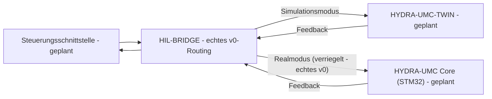

<p align="center">
  
</p>

# 🌉 HYDRA-UMC-HIL-BRIDGE

<p align="center"><a href="README.md">🇺🇸 English</a> | <a href="README_spa.md">🇪🇸 Español</a> | <a href="README_fra.md">🇫🇷 Français</a> | <a href="README_ita.md">🇮🇹 Italiano</a> | 🇩🇪 <b>Deutsch</b> | <a href="README_zho.md">🇨🇳 简体中文</a> | <a href="README_jpn.md">🇯🇵 日本語</a></p>

### ⚡ Hardware-in-the-Loop-Schnittstelle für Real-vs-Virtual-Sync

<p align="left">
  
  
  
  
</p>

---

## 1. 🛠️ TECHNISCHER ÜBERBLICK

**HYDRA-UMC-HIL-BRIDGE** ist die Kommunikationsader, die die Hardware-in-the-Loop (HIL)-Funktionalität ermöglicht. Sie synchronisiert den Zustand zwischen den physischen Controllern und der Digital Twin-Engine in Echtzeit.

Sie ermöglicht es Entwicklern, Befehle von jeder Schnittstelle (App, Suite, Studio) an den Simulator zu senden, als wäre er ein physischer Roboter, und umgekehrt kann sie die Bewegungen eines physischen Roboters in die virtuelle Welt spiegeln, zur Fernüberwachung und zum Shadowing des digitalen Zwillings.

### Hauptmerkmale:
* 🛡️ **Sicherheitsverriegelung (v0):** der echte Subbefehl `route` blockiert einen für echte Hardware bestimmten Befehl, sobald ein Zwillings-Risikobericht eine bevorstehende Kollision meldet - siehe "Ehrlichkeitscheck" unten für das, was heute genau läuft.
* 🌉 **Bidirektionale Brücke (v0, noch ohne Transport):** echtes modusbasiertes Routing (Real/Simulation) und echtes, bedingungsloses Spiegeln existieren bereits; es gibt noch keine echte gRPC/WebSocket-Verbindung zu einem echten HYDRA-UMC-TWIN oder HYDRA-UMC-Controller.
* ⚡ **Zero-Latency Mirroring (teilweise):** der echte Subbefehl `mirror` spiegelt einen Befehl heute in einen In-Memory-Empfänger; "Zero-Latency" über eine echte Netzwerkverbindung bleibt zukünftige Arbeit.
* 📡 **Einheitliches Protokoll (geplant):** nutzt gRPC für Hochgeschwindigkeits-Lokal-Sync und WebSockets für die Fernüberwachung - es ist absichtlich noch kein Netzwerktransport angeschlossen (siehe `Cargo.toml`).

**Ehrlichkeitscheck - was heute wirklich läuft:** `route --mode real|simulation --joint NAME --position WERT [--collision-risk] [--distance METER]` trifft eine echte Routing-Entscheidung - der Modus `simulation` sendet immer, der Modus `real` unterliegt einer echten Sicherheitsverriegelung, die den Befehl blockiert, sobald `--collision-risk` gesetzt ist. `mirror --joint NAME --position WERT` spiegelt einen Befehl bedingungslos. Beide leiten an einen In-Memory-`RecordingSink` weiter, nicht an einen echten Controller oder eine echte HYDRA-UMC-TWIN-Instanz - es gibt noch keinen gRPC/WebSocket-Transport. Siehe [`CHANGELOG.md`](CHANGELOG.md) für genau das, was geliefert wurde, und die Roadmap unten für das, was noch aussteht.

---

## 2. 🔄 HIL-SYNC-ABLAUF

Die modusbasierte Aufteilung bei `BRIDGE` und die Sicherheitsverriegelung
auf dem `Realmodus`-Pfad sind heute real (`bridge.rs`/`interlock.rs`) und
leiten an einen In-Memory-Empfänger weiter, statt an einen echten
laufenden Prozess. Alles, was einen echten `APP`-, `TWIN`- oder
`CORE`-Prozess über eine echte Verbindung betrifft, bleibt zukünftige
Arbeit.



---

## 3. 🧱 ARCHITEKTUR & DESIGNENTSCHEIDUNGEN

* **Warum diese Brücke keine `hardware/`/`firmware/`/`os/`-Ordner hat.** Reine Software - sie verbindet bereits vorhandene Hardware (echte Apps, echte HYDRA-UMC-Firmware) mit dem digitalen Zwilling, ohne eigene Platine.
* **Warum sie Geschwister, kein Submodul, von HYDRA-UMC-TWIN ist.** Eine Hardware-in-the-Loop-Brücke muss weiterlaufen (und die Befehle eines echten Geräts weiterfließen lassen), unabhängig davon, was die eigene Render-/Physikschleife von HYDRA-UMC-TWIN gerade tut - ein separater Prozess bedeutet, dass ein Neustart des Zwillings keinen laufenden echten Befehl verwirft.
* **Wie sich das ins restliche Ökosystem einfügt.** Lässt HYDRA-UMC-SUITE, HYDRA-UMC-ANDROID-CONTROL und HYDRA-UMC-IOS-CONTROL HYDRA-UMC-TWIN steuern, als wäre es eine echte, von HYDRA-UMC-SERVER unterstützte Zelle - dieselbe Steuerungsoberfläche, ein simuliertes Ziel.
* **Warum die Verriegelung dem eigenen `collision_imminent`-Flag des Zwillings vertraut, statt eines aus einem Distanzschwellenwert abzuleiten.** Der Zwilling hat die echte geometrische/physikalische Überlegung bereits angestellt, wenn er das Risiko meldet - diese Schlussfolgerung hier mit einem unabhängigen Distanz-Cutoff infrage zu stellen, wäre nur eine zweite, möglicherweise widersprüchliche Sicherheitsmeinung. Siehe die eigene Dokumentation des `interlock.rs`-Moduls dafür, wie dies die Erkennen-vs-Durchsetzen-Grenze von HYDRA-UMC-SAFETY-ZONES widerspiegelt.
* **Warum der `Simulation`-Modus nie durch die Verriegelung blockiert wird.** Der ganze Sinn, einen Befehl an den Zwilling statt an echte Hardware zu leiten, ist es, eine vorhergesagte Kollision sicher beobachten zu können - sie dort zu blockieren würde genau die Funktion zunichtemachen, die sie unterstützen soll.
* **Warum `CommandSink` heute ein Trait mit nur einer In-Memory-Implementierung `RecordingSink` ist.** Es gibt noch keinen echten gRPC/WebSocket-Transport (siehe den eigenen Kommentar in `Cargo.toml`) - `RecordingSink` ist ehrlich damit: Es zeichnet auf, was es senden sollte, ohne irgendwohin zu übertragen, dieselbe Überlegung wie bei `NullEStopRequester` in HYDRA-UMC-SAFETY-ZONES.

---

## 📂 VERZEICHNISSTRUKTUR

Reine Software-Brücke ohne eigenes Hardware-Design - daher hat dieses
Projekt keine Ordner `hardware/`, `firmware/` oder `os/` (siehe die
Ordner-Pruning-Regel in `SONNET/5.PLAN_EJECUCION_32_PROYECTOS_NUEVOS.txt`).

```text
HYDRA-UMC-HIL-BRIDGE/
├── src/
│   ├── protocol.rs       # Echte JointCommand/Mode-Typen
│   ├── interlock.rs       # Echte Sicherheitsverriegelungs-Entscheidung
│   ├── bridge.rs            # Echtes modusbasiertes Routing + Spiegeln
│   └── main.rs                 # Einstiegspunkt + echte `route`/`mirror`-Subbefehle
├── docs/                # Dokumentation und Integrationsleitfäden
├── build/               # Build-Notizen/Artefakte (die eigentliche cargo-Ausgabe liegt in target/, per .gitignore ausgeschlossen)
├── images/              # Medien und Diagramme
├── scripts/             # Utility-Skripte
├── Cargo.toml           # Paket-Metadaten, Abhängigkeiten, Kilometerzähler-Version
├── bump_version.py      # Kilometerzähler-artiger Versions-Bump (von build.sh/.bat verwendet)
├── build.sh / build.bat # Erhöht die Version, `cargo test`, dann `cargo build --release`
└── run.sh / run.bat     # Führt die kompilierte Release-Binärdatei aus (leitet Argumente weiter)
```

---

## 🏗️ BUILD UND RUN

Erfordert die Rust-Toolchain (`cargo`/`rustc`, Installation via [rustup](https://rustup.rs)) und Python 3.10+ (nur für `bump_version.py`).

```bash
# Linux / macOS
./build.sh   # Kilometerzähler-Versions-Bump, `cargo test` (7 Tests), dann `cargo build --release`
./run.sh     # führt target/release/hydra-umc-hil-bridge aus, gibt Name + Version + Rolle aus
```

```bat
:: Windows
build.bat
run.bat
```

`build.sh`/`build.bat` erhöhen die Version der eigenen `Cargo.toml` dieses Projekts nach der "Kilometerzähler"-Regel des Ökosystems (PATCH+1, mit Übertrag auf MINOR nach 9), führen die echte Testsuite aus und bauen dann eine Release-Binärdatei.

Die echten Subbefehle `route` und `mirror`:

```bash
./run.sh route --mode real --joint shoulder --position 0.5
# SENT: routed to real HYDRA-UMC controller

./run.sh route --mode real --joint shoulder --position 0.5 --collision-risk --distance 0.02
# BLOCKED: safety interlock refused to forward to real hardware (twin reports imminent collision at 0.020m)

./run.sh route --mode simulation --joint shoulder --position 0.5 --collision-risk --distance 0.02
# SENT: routed to HYDRA-UMC-TWIN (simulation)

./run.sh mirror --joint elbow --position -0.3
# MIRRORED: joint 'elbow' = -0.300000 shadowed into the twin
```

`route` beendet sich mit `0` (gesendet), `1` (durch die Sicherheitsverriegelung blockiert - ein echtes, aussagekräftiges Ergebnis, kein Fehler) oder `2` (ungültige Eingabe). `mirror` beendet sich mit `0` oder `2`.

`Cargo.toml` enthält absichtlich noch keine externen Crates - siehe den Kommentar in der Datei für das, was hinzugefügt wird, wenn die echte gRPC/WebSocket-Transportarbeit beginnt.

---

## 🚀 ROADMAP
* **Phase 1:** Digital-Twin-Synchronisation mit Echtzeit-Hardware-Telemetrie und Sub-10ms-Latenz.
* **Phase 2:** Physics Replica-Integration mit industriellen Simulatoren (Isaac Sim) und Unterstützung für verformbare Körper.
* **Phase 3:** Automatisierte Wiederherstellungsmuster von Node Healing für dezentrales Failover und frühzeitige Erkennung von Sensordegradation.
* **Phase 4:** Multi-Controller-HIL-Synchronisation (Swarm HIL) und Unterstützung für fotorealistische Erzeugung synthetischer Daten.

---

## 🔗 Verwandte Projekte

Dieses Projekt ist Teil eines größeren Robotik-Ökosystems desselben Autors (JuanenRac / Electro Hobby 3D), das Firmware, Steuerungssoftware, KI-Knoten und Flotten-Tools umfasst. Gut zu wissen, denn eine Anfrage könnte tatsächlich eines dieser Projekte betreffen statt dieses Repository.

### Familie

**Elternteil:** **[HYDRA-UMC-TWIN](https://github.com/JuanenRac/HYDRA-UMC-TWIN)** — der Integrations-Elternteil, den diese Brücke mit realer Hardware verbindet.

**Geschwister:**
- **[HYDRA-UMC-PHYSICS-REPLICA](https://github.com/JuanenRac/HYDRA-UMC-PHYSICS-REPLICA)** — Geschwister-Simulationsdienst, gleicher Elternteil.
- **[HYDRA-UMC-SYNTHETIC-DATA-GEN](https://github.com/JuanenRac/HYDRA-UMC-SYNTHETIC-DATA-GEN)** — Geschwister-Simulationsdienst, gleicher Elternteil.

### Direkte Beziehung (außerhalb der Familie)

- **[HYDRA-UMC-SERVER](https://github.com/JuanenRac/HYDRA-UMC-SERVER)** — Ziel der Hardware-in-the-Loop-Brücke.
- **[HYDRA-UMC-SUITE](https://github.com/JuanenRac/HYDRA-UMC-SUITE)** — Ziel der Hardware-in-the-Loop-Brücke.
- **[HYDRA-UMC-ANDROID-CONTROL](https://github.com/JuanenRac/HYDRA-UMC-ANDROID-CONTROL)** — Ziel der Hardware-in-the-Loop-Brücke.
- **[HYDRA-UMC-IOS-CONTROL](https://github.com/JuanenRac/HYDRA-UMC-IOS-CONTROL)** — Ziel der Hardware-in-the-Loop-Brücke.

### Restliches Ökosystem

**HYDRA-UMC-Plattform** — die Multi-Roboter-Mikrofabrikzelle
- **[HYDRA-UMC](https://github.com/JuanenRac/HYDRA-UMC)** — das CM5 + STM32H745-Motherboard, das bis zu 8 Roboterarme orchestriert.
- **[HYDRA-UMC-SERVER](https://github.com/JuanenRac/HYDRA-UMC-SERVER)** — das Express/WebSocket-Backend, mit dem jeder Steuerungsclient spricht.
- **[HYDRA-UMC-STUDIO](https://github.com/JuanenRac/HYDRA-UMC-STUDIO)** — webbasiertes Steuerungs-Dashboard, Multi-Roboter-3D-Visualisierung.
- **[HYDRA-UMC-ANDROID-CONTROL](https://github.com/JuanenRac/HYDRA-UMC-ANDROID-CONTROL)** — Android-Steuerungs-App über Wi-Fi/Bluetooth.
- **[HYDRA-UMC-IOS-CONTROL](https://github.com/JuanenRac/HYDRA-UMC-IOS-CONTROL)** — iOS/iPadOS-Steuerungs-App, gebaut in Flutter.
- **[HYDRA-UMC-SUITE](https://github.com/JuanenRac/HYDRA-UMC-SUITE)** — Desktop-Schwarm-Kommandozentrale (Python/PySide6).
- **[HYDRA-UMC-EDITOR-URDF](https://github.com/JuanenRac/HYDRA-UMC-EDITOR-URDF)** — Desktop-URDF-Modelleditor für den Roboterkatalog.
- **[HYDRA-UMC-DSI](https://github.com/JuanenRac/HYDRA-UMC-DSI)** — native Touch-UI für den eingebauten DSI-Touchscreen.

**URTC-Plattform** — der Werkzeugkopf-Controller, den jeder HYDRA-UMC-Roboterarm trägt
- **[URTC](https://github.com/JuanenRac/URTC)** — CAN-Bus-Werkzeugkopf-Controller, 25 Werkzeugprofile.
- **[URTC-FLASHER](https://github.com/JuanenRac/URTC-FLASHER)** — Desktop-Tool für CAN-OTA + SWD/JTAG-Flashing.
- **[URTC-TESTER](https://github.com/JuanenRac/URTC-TESTER)** — Desktop-Tool für Live-CAN-Bus-Diagnose.
- **[URTC-WEB-STUDIO](https://github.com/JuanenRac/URTC-WEB-STUDIO)** — browserbasierte Alternative über die Web-Serial-API.

**🎥 Vision AI Node (Hailo-8)**
- [HYDRA-UMC-VISION-NODE](https://github.com/JuanenRac/HYDRA-UMC-VISION-NODE)
- [HYDRA-UMC-VISION-STREAMER](https://github.com/JuanenRac/HYDRA-UMC-VISION-STREAMER)
- [HYDRA-UMC-DETECTION-HEF](https://github.com/JuanenRac/HYDRA-UMC-DETECTION-HEF)
- [HYDRA-UMC-SAFETY-ZONES](https://github.com/JuanenRac/HYDRA-UMC-SAFETY-ZONES)
- [HYDRA-UMC-VISUAL-SERVOING-API](https://github.com/JuanenRac/HYDRA-UMC-VISUAL-SERVOING-API)

**🧠 Cognitive AI Node (Hailo-10)**
- [HYDRA-UMC-COGNITIVE-NODE](https://github.com/JuanenRac/HYDRA-UMC-COGNITIVE-NODE)
- [HYDRA-UMC-VLA-ENGINE](https://github.com/JuanenRac/HYDRA-UMC-VLA-ENGINE)
- [HYDRA-UMC-VOICE-UI](https://github.com/JuanenRac/HYDRA-UMC-VOICE-UI)
- [HYDRA-UMC-SEMANTIC-PLANNER](https://github.com/JuanenRac/HYDRA-UMC-SEMANTIC-PLANNER)
- [HYDRA-UMC-DOCS-QA](https://github.com/JuanenRac/HYDRA-UMC-DOCS-QA)

**🐝 Orchestration & Swarm**
- [HYDRA-UMC-ORCHESTRATOR](https://github.com/JuanenRac/HYDRA-UMC-ORCHESTRATOR)
- [HYDRA-UMC-SWARM-SYNC](https://github.com/JuanenRac/HYDRA-UMC-SWARM-SYNC)
- [HYDRA-UMC-PATH-PLANNER-3D](https://github.com/JuanenRac/HYDRA-UMC-PATH-PLANNER-3D)
- [HYDRA-UMC-JOB-DISPATCHER](https://github.com/JuanenRac/HYDRA-UMC-JOB-DISPATCHER)
- [HYDRA-UMC-NODE-HEALING](https://github.com/JuanenRac/HYDRA-UMC-NODE-HEALING)

**📊 Data & Analytics**
- [HYDRA-UMC-DATALAKE](https://github.com/JuanenRac/HYDRA-UMC-DATALAKE)
- [HYDRA-UMC-TELEMETRY-COLLECTOR](https://github.com/JuanenRac/HYDRA-UMC-TELEMETRY-COLLECTOR)
- [HYDRA-UMC-ANOMALY-DETECTOR](https://github.com/JuanenRac/HYDRA-UMC-ANOMALY-DETECTOR)
- [HYDRA-UMC-PRODUCTION-REPORTS](https://github.com/JuanenRac/HYDRA-UMC-PRODUCTION-REPORTS)

**🏭 Industrial Gateway**
- [HYDRA-UMC-GATEWAY-INDUSTRIAL](https://github.com/JuanenRac/HYDRA-UMC-GATEWAY-INDUSTRIAL)
- [HYDRA-UMC-OPCUA-SERVER](https://github.com/JuanenRac/HYDRA-UMC-OPCUA-SERVER)
- [HYDRA-UMC-MQTT-BROKER](https://github.com/JuanenRac/HYDRA-UMC-MQTT-BROKER)
- [HYDRA-UMC-MTCONNECT-ADAPTER](https://github.com/JuanenRac/HYDRA-UMC-MTCONNECT-ADAPTER)

**🛠️ Complementary Tools**
- [URTC-SMART-RACK](https://github.com/JuanenRac/URTC-SMART-RACK)
- [URTC-VISION-TOOL](https://github.com/JuanenRac/URTC-VISION-TOOL)
- [HYDRA-UMC-WATCH](https://github.com/JuanenRac/HYDRA-UMC-WATCH)
- [HYDRA-UMC-TOOL-CLI](https://github.com/JuanenRac/HYDRA-UMC-TOOL-CLI)
- [HYDRA-UMC-DASHBOARD-AI](https://github.com/JuanenRac/HYDRA-UMC-DASHBOARD-AI)


## 👤 AUTOR
**JuanenRac** (Electro Hobby 3D)
📧 electrohobby3d@gmail.com

## 📜 LIZENZ
GPL-3.0 - Siehe LICENSE für Details.
