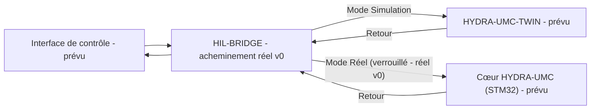

<p align="center">
  
</p>

# 🌉 HYDRA-UMC-HIL-BRIDGE

<p align="center"><a href="README.md">🇺🇸 English</a> | <a href="README_spa.md">🇪🇸 Español</a> | 🇫🇷 <b>Français</b> | <a href="README_ita.md">🇮🇹 Italiano</a> | <a href="README_deu.md">🇩🇪 Deutsch</a> | <a href="README_zho.md">🇨🇳 简体中文</a> | <a href="README_jpn.md">🇯🇵 日本語</a></p>

### ⚡ Interface Hardware-in-the-Loop pour la synchronisation réel vs virtuel

<p align="left">
  
  
  
  
</p>

---

## 1. 🛠️ APERÇU TECHNIQUE

**HYDRA-UMC-HIL-BRIDGE** est l'artère de communication qui active la fonctionnalité Hardware-in-the-Loop (HIL). Il synchronise l'état entre les contrôleurs physiques et le moteur du jumeau numérique (Digital Twin) en temps réel.

Il permet aux développeurs d'envoyer des commandes depuis n'importe quelle interface (App, Suite, Studio) au simulateur comme s'il s'agissait d'un robot physique, et inversement, il peut refléter les mouvements d'un robot physique dans le monde virtuel pour une supervision à distance et un suivi (shadowing) du jumeau numérique.

### Caractéristiques principales :
* 🛡️ **Verrouillage de sécurité (v0) :** le vrai sous-commande `route` bloque une commande destinée au matériel réel dès qu'un rapport de risque du jumeau signale une collision imminente - voir « Vérification d'honnêteté » ci-dessous pour ce qui fonctionne exactement aujourd'hui.
* 🌉 **Pont bidirectionnel (v0, sans transport pour l'instant) :** un vrai acheminement basé sur le mode (Réel/Simulation) et une vraie mise en miroir inconditionnelle existent ; il n'y a encore aucune vraie connexion gRPC/WebSocket vers un vrai HYDRA-UMC-TWIN ou contrôleur HYDRA-UMC.
* ⚡ **Mise en miroir sans latence (partiel) :** le vrai sous-commande `mirror` reflète aujourd'hui une commande vers un récepteur en mémoire ; la « latence zéro » sur une vraie connexion réseau reste du travail futur.
* 📡 **Protocole unifié (prévu) :** utilise gRPC pour une synchronisation locale haute vitesse et les WebSockets pour la surveillance à distance - aucun transport réseau n'est encore branché, volontairement (voir `Cargo.toml`).
* 🧪 **Transport à sécurité intrinsèque, testable sans matériel (v0) :** `CommandSink::send()` renvoie désormais un vrai `Result`, et un `SimulatedTransport` peut simuler une liaison en timeout ou déconnectée ; le pont rapporte un résultat `TransportFailure` distinct plutôt que de jamais prétendre qu'une commande a été livrée alors qu'elle ne l'a pas été - exerçable via `--transport-latency-ms`/`--transport-timeout-ms`/`--transport-disconnected` sur `route`.

**Vérification d'honnêteté - ce qui fonctionne réellement aujourd'hui :** `route --mode real|simulation --joint NOM --position VALEUR [--collision-risk] [--distance MÈTRES] [--transport-latency-ms MS] [--transport-timeout-ms MS] [--transport-disconnected]` prend une vraie décision d'acheminement - le mode `simulation` envoie toujours, le mode `real` est soumis à un vrai verrouillage de sécurité qui bloque la commande dès que `--collision-risk` est indiqué. `mirror --joint NOM --position VALEUR` reflète une commande inconditionnellement. Les deux acheminent par défaut vers un récepteur en mémoire (`RecordingSink`, pas un vrai contrôleur ni une vraie instance HYDRA-UMC-TWIN), ou vers un `SimulatedTransport` qui peut réellement échouer (timeout/déconnexion) quand les indicateurs de transport ci-dessus sont passés - il n'y a pas encore de transport gRPC/WebSocket. Voir [`CHANGELOG.md`](CHANGELOG.md) pour ce qui a été livré exactement, et la Roadmap ci-dessous pour ce qui reste à venir.

---

## 2. 🔄 FLUX DE SYNCHRONISATION HIL

La répartition par mode au niveau de `BRIDGE` et la porte de verrouillage
de sécurité sur le chemin `Mode Réel` sont réelles aujourd'hui
(`bridge.rs`/`interlock.rs`), acheminant vers un récepteur en mémoire
plutôt qu'un vrai processus en direct. Tout ce qui touche un vrai
processus `APP`, `TWIN` ou `CORE` via une vraie connexion reste du
travail futur.



---

## 3. 🧱 ARCHITECTURE & DÉCISIONS DE CONCEPTION

* **Pourquoi ce pont n'a pas de dossiers `hardware/`/`firmware/`/`os/`.** Logiciel pur - il relie du matériel déjà existant (vraies applications, vrai firmware HYDRA-UMC) au jumeau numérique, sans carte propre.
* **Pourquoi c'est un frère, pas un sous-module, de HYDRA-UMC-TWIN.** Un pont hardware-in-the-loop doit continuer de fonctionner (et continuer de faire circuler les commandes d'un vrai appareil) indépendamment de ce que fait à cet instant la propre boucle rendu/physique de HYDRA-UMC-TWIN - un processus séparé signifie qu'un redémarrage du jumeau ne perd pas une vraie commande en cours.
* **Comment cela s'intègre dans le reste de l'écosystème.** Permet à HYDRA-UMC-SUITE, HYDRA-UMC-ANDROID-CONTROL et HYDRA-UMC-IOS-CONTROL de contrôler HYDRA-UMC-TWIN comme s'il s'agissait d'une vraie cellule adossée à HYDRA-UMC-SERVER - la même surface de contrôle, une cible simulée.
* **Pourquoi le verrouillage fait confiance au propre indicateur `collision_imminent` du jumeau plutôt que d'en dériver un à partir d'un seuil de distance.** Le jumeau a déjà effectué le vrai raisonnement géométrique/physique au moment où il signale un risque - remettre en question cette conclusion ici avec un seuil de distance indépendant ne serait qu'un second avis de sécurité, potentiellement incohérent. Voir la documentation propre du module `interlock.rs` pour la manière dont cela reflète la frontière détecter-vs-appliquer de HYDRA-UMC-SAFETY-ZONES.
* **Pourquoi le mode `Simulation` n'est jamais verrouillé.** Tout l'intérêt d'acheminer une commande vers le jumeau plutôt que vers le matériel réel est de pouvoir observer en toute sécurité une collision prédite se dérouler - la bloquer là annulerait la fonctionnalité même qu'elle est censée soutenir.
* **Pourquoi `CommandSink` est un trait avec seulement une implémentation `RecordingSink` en mémoire aujourd'hui.** Aucun vrai transport gRPC/WebSocket n'existe encore (voir le propre commentaire de `Cargo.toml`) - `RecordingSink` est honnête à ce sujet : il enregistre ce qu'on lui a demandé d'envoyer sans rien transmettre nulle part, le même raisonnement que `NullEStopRequester` dans HYDRA-UMC-SAFETY-ZONES.
* **Pourquoi `CommandSink::send()` renvoie un `Result` plutôt que `()`.** Un vrai transport peut échouer à livrer (timeout, déconnexion) indépendamment du fait que le verrouillage ait laissé passer la commande - si `send()` ne peut pas échouer, le pont n'a aucun moyen d'éviter de prétendre au succès pour une commande qui n'est jamais réellement arrivée. `SimulatedTransport` existe précisément pour que ce chemin d'échec soit réel et testable dès aujourd'hui, sans attendre qu'un vrai transport existe.
* **Pourquoi `TransportFailure` est un `RouteOutcome` distinct de `BlockedByInterlock`.** Ce sont deux types différents de « ne s'est pas produit » : l'un est un refus de sécurité délibéré (le verrouillage a décidé de ne pas transmettre), l'autre est une livraison au mieux qui ne s'est simplement pas terminée. Les fusionner en un échec générique masquerait quelle couche de sécurité a réellement arrêté la commande - utile pour le débogage et pour toute politique future qui les traiterait différemment (réessayer un échec de transport est raisonnable ; réessayer après un blocage du verrouillage ne l'est pas).

---

## 📂 STRUCTURE DES RÉPERTOIRES

Pont purement logiciel, sans conception matérielle propre ; ce projet ne
comporte donc pas de dossiers `hardware/`, `firmware/` ni `os/`, conformément à la politique de structure du dépôt.

```text
HYDRA-UMC-HIL-BRIDGE/
├── src/
│   ├── protocol.rs       # Vrais types JointCommand/Mode
│   ├── interlock.rs      # Vraie décision de verrouillage de sécurité
│   ├── bridge.rs         # Vrai acheminement basé sur le mode + mise en miroir + CommandSink/SimulatedTransport
│   └── main.rs           # Point d'entrée + vrais sous-commandes `route`/`mirror`
├── docs/                # Documentation et guides d'intégration
├── build/               # Notes/artefacts de build (la sortie réelle de cargo vit dans target/, ignoré par git)
├── images/              # Médias et diagrammes
├── scripts/             # Scripts utilitaires
├── tools/
│   ├── build_test.py    # Vérification de build sans versionnage
│   └── ci_validate.py   # Validation manifeste/CHANGELOG/docs utilisée par CI
├── Cargo.toml           # Métadonnées du paquet, dépendances, version compteur kilométrique
├── bump_version.py      # Incrément de version type compteur kilométrique (utilisé par build.sh/.bat)
├── build.sh / build.bat # Incrémente la version, `cargo test`, puis `cargo build --release`
├── build-test.sh / build-test.bat # Vérification de build sans versionnage
└── run.sh / run.bat     # Exécute le binaire release compilé (relaie les arguments)
```

---

## 🏗️ BUILD ET RUN

Nécessite la chaîne d'outils Rust (`cargo`/`rustc`, à installer via [rustup](https://rustup.rs)) et Python 3.10+ (uniquement pour `bump_version.py`).

```bash
# Linux / macOS
./build.sh   # incrément de version compteur kilométrique, `cargo test` (14 tests), puis `cargo build --release`
./run.sh     # exécute target/release/hydra-umc-hil-bridge, affiche nom + version + rôle
```

```bat
:: Windows
build.bat
run.bat
```

`build.sh`/`build.bat` incrémentent la version du propre `Cargo.toml` de ce projet selon la règle "compteur kilométrique" de l'écosystème (PATCH+1, avec retenue vers MINOR au-delà de 9), exécutent la vraie suite de tests, puis construisent un binaire release.

Les vrais sous-commandes `route` et `mirror` :

```bash
./run.sh route --mode real --joint shoulder --position 0.5
# SENT: routed to real HYDRA-UMC controller

./run.sh route --mode real --joint shoulder --position 0.5 --collision-risk --distance 0.02
# BLOCKED: safety interlock refused to forward to real hardware (twin reports imminent collision at 0.020m)

./run.sh route --mode simulation --joint shoulder --position 0.5 --collision-risk --distance 0.02
# SENT: routed to HYDRA-UMC-TWIN (simulation)

./run.sh mirror --joint elbow --position -0.3
# MIRRORED: joint 'elbow' = -0.300000 shadowed into the twin

./run.sh route --mode real --joint shoulder --position 0.5 --transport-timeout-ms 100 --transport-latency-ms 500
# TRANSPORT FAILURE: command was not confirmed delivered (transport timed out after 100ms)

./run.sh route --mode real --joint shoulder --position 0.5 --transport-disconnected
# TRANSPORT FAILURE: command was not confirmed delivered (transport is disconnected)
```

`route` se termine avec `0` (envoyé), `1` (bloqué par le verrouillage de sécurité - un vrai résultat significatif, pas une erreur), `2` (entrée invalide), ou `3` (échec de transport - le verrouillage a laissé passer la commande, mais la livraison n'a pas été confirmée). `mirror` se termine avec `0`, `2` ou `3`.

`Cargo.toml` ne comporte volontairement aucune crate externe pour l'instant - voir le commentaire dans le fichier pour ce qui sera ajouté quand le vrai travail de transport gRPC/WebSocket commencera.

---

## 🚀 FEUILLE DE ROUTE
* **Phase 1 :** Synchronisation du jumeau numérique avec la télémétrie matérielle en temps réel et latence inférieure à 10 ms.
* **Phase 2 :** Intégration de Physics Replica avec des simulateurs de classe industrielle (Isaac Sim) et prise en charge des corps déformables.
* **Phase 3 :** Modèles de récupération automatisés de Node Healing pour un basculement décentralisé et détection précoce de la dégradation des capteurs.
* **Phase 4 :** Synchronisation HIL multi-contrôleurs (Swarm HIL) et prise en charge de la génération de données synthétiques photoréalistes.

---

## 🔗 Projets Liés

Ce projet fait partie d'un écosystème robotique plus large du même auteur (JuanenRac / Electro Hobby 3D), couvrant firmware, logiciel de contrôle, nœuds IA et outillage de flotte. Bon à savoir, car une demande pourrait en réalité concerner l'un de ces projets plutôt que ce dépôt.

### Famille

**Parent :** **[HYDRA-UMC-TWIN](https://github.com/JuanenRac/HYDRA-UMC-TWIN)** — le parent d'intégration que ce pont relie au matériel réel.

**Frères et sœurs :**
- **[HYDRA-UMC-PHYSICS-REPLICA](https://github.com/JuanenRac/HYDRA-UMC-PHYSICS-REPLICA)** — service de simulation frère, même parent.
- **[HYDRA-UMC-SYNTHETIC-DATA-GEN](https://github.com/JuanenRac/HYDRA-UMC-SYNTHETIC-DATA-GEN)** — service de simulation frère, même parent.

### Relation Directe (hors de la famille)

- **[HYDRA-UMC-SERVER](https://github.com/JuanenRac/HYDRA-UMC-SERVER)** — le backend derrière les 3 éléments ci-dessus ; le véritable contrôleur que `route --mode real` finit par cibler une fois qu'un transport existera.
- **[HYDRA-UMC-SUITE](https://github.com/JuanenRac/HYDRA-UMC-SUITE)** — cible du pont hardware-in-the-loop.
- **[HYDRA-UMC-ANDROID-CONTROL](https://github.com/JuanenRac/HYDRA-UMC-ANDROID-CONTROL)** — cible du pont hardware-in-the-loop.
- **[HYDRA-UMC-IOS-CONTROL](https://github.com/JuanenRac/HYDRA-UMC-IOS-CONTROL)** — cible du pont hardware-in-the-loop.

### Reste de l'Écosystème

**Plateforme HYDRA-UMC** — la cellule de micro-usine multi-robot
- **[HYDRA-UMC](https://github.com/JuanenRac/HYDRA-UMC)** — la carte mère CM5 + STM32H745 orchestrant jusqu'à 8 bras robotiques.
- **[HYDRA-UMC-SERVER](https://github.com/JuanenRac/HYDRA-UMC-SERVER)** — le backend Express/WebSocket auquel parle chaque client de contrôle.
- **[HYDRA-UMC-STUDIO](https://github.com/JuanenRac/HYDRA-UMC-STUDIO)** — tableau de bord de contrôle web, visualisation 3D multi-robot.
- **[HYDRA-UMC-ANDROID-CONTROL](https://github.com/JuanenRac/HYDRA-UMC-ANDROID-CONTROL)** — application de contrôle Android via Wi-Fi/Bluetooth.
- **[HYDRA-UMC-IOS-CONTROL](https://github.com/JuanenRac/HYDRA-UMC-IOS-CONTROL)** — application de contrôle iOS/iPadOS construite en Flutter.
- **[HYDRA-UMC-SUITE](https://github.com/JuanenRac/HYDRA-UMC-SUITE)** — centre de commande d'essaim de bureau (Python/PySide6).
- **[HYDRA-UMC-EDITOR-URDF](https://github.com/JuanenRac/HYDRA-UMC-EDITOR-URDF)** — éditeur de modèles URDF de bureau pour le catalogue de robots.
- **[HYDRA-UMC-DSI](https://github.com/JuanenRac/HYDRA-UMC-DSI)** — interface tactile native pour l'écran DSI embarqué.

**Plateforme URTC** — le contrôleur de tête d'outil que porte chaque bras HYDRA-UMC
- **[URTC](https://github.com/JuanenRac/URTC)** — contrôleur de tête d'outil sur bus CAN, 25 profils d'outil.
- **[URTC-FLASHER](https://github.com/JuanenRac/URTC-FLASHER)** — outil de bureau de flashage CAN-OTA + SWD/JTAG.
- **[URTC-TESTER](https://github.com/JuanenRac/URTC-TESTER)** — outil de bureau de diagnostic CAN en direct.
- **[URTC-WEB-STUDIO](https://github.com/JuanenRac/URTC-WEB-STUDIO)** — alternative basée navigateur via l'API Web Serial.

**🎥 Nœud de Vision IA (Hailo-8)**
- [HYDRA-UMC-VISION-NODE](https://github.com/JuanenRac/HYDRA-UMC-VISION-NODE)
- [HYDRA-UMC-VISION-STREAMER](https://github.com/JuanenRac/HYDRA-UMC-VISION-STREAMER)
- [HYDRA-UMC-DETECTION-HEF](https://github.com/JuanenRac/HYDRA-UMC-DETECTION-HEF)
- [HYDRA-UMC-SAFETY-ZONES](https://github.com/JuanenRac/HYDRA-UMC-SAFETY-ZONES)
- [HYDRA-UMC-VISUAL-SERVOING-API](https://github.com/JuanenRac/HYDRA-UMC-VISUAL-SERVOING-API)

**🧠 Nœud Cognitif IA (Hailo-10)**
- [HYDRA-UMC-COGNITIVE-NODE](https://github.com/JuanenRac/HYDRA-UMC-COGNITIVE-NODE)
- [HYDRA-UMC-VLA-ENGINE](https://github.com/JuanenRac/HYDRA-UMC-VLA-ENGINE)
- [HYDRA-UMC-VOICE-UI](https://github.com/JuanenRac/HYDRA-UMC-VOICE-UI)
- [HYDRA-UMC-SEMANTIC-PLANNER](https://github.com/JuanenRac/HYDRA-UMC-SEMANTIC-PLANNER)
- [HYDRA-UMC-DOCS-QA](https://github.com/JuanenRac/HYDRA-UMC-DOCS-QA)

**🐝 Orchestration et Essaim**
- [HYDRA-UMC-ORCHESTRATOR](https://github.com/JuanenRac/HYDRA-UMC-ORCHESTRATOR)
- [HYDRA-UMC-SWARM-SYNC](https://github.com/JuanenRac/HYDRA-UMC-SWARM-SYNC)
- [HYDRA-UMC-PATH-PLANNER-3D](https://github.com/JuanenRac/HYDRA-UMC-PATH-PLANNER-3D)
- [HYDRA-UMC-JOB-DISPATCHER](https://github.com/JuanenRac/HYDRA-UMC-JOB-DISPATCHER)
- [HYDRA-UMC-NODE-HEALING](https://github.com/JuanenRac/HYDRA-UMC-NODE-HEALING)

**📊 Données et Analytique**
- [HYDRA-UMC-DATALAKE](https://github.com/JuanenRac/HYDRA-UMC-DATALAKE)
- [HYDRA-UMC-TELEMETRY-COLLECTOR](https://github.com/JuanenRac/HYDRA-UMC-TELEMETRY-COLLECTOR)
- [HYDRA-UMC-ANOMALY-DETECTOR](https://github.com/JuanenRac/HYDRA-UMC-ANOMALY-DETECTOR)
- [HYDRA-UMC-PRODUCTION-REPORTS](https://github.com/JuanenRac/HYDRA-UMC-PRODUCTION-REPORTS)

**🏭 Passerelle Industrielle**
- [HYDRA-UMC-GATEWAY-INDUSTRIAL](https://github.com/JuanenRac/HYDRA-UMC-GATEWAY-INDUSTRIAL)
- [HYDRA-UMC-OPCUA-SERVER](https://github.com/JuanenRac/HYDRA-UMC-OPCUA-SERVER)
- [HYDRA-UMC-MQTT-BROKER](https://github.com/JuanenRac/HYDRA-UMC-MQTT-BROKER)
- [HYDRA-UMC-MTCONNECT-ADAPTER](https://github.com/JuanenRac/HYDRA-UMC-MTCONNECT-ADAPTER)

**🛠️ Outils Complémentaires**
- [URTC-SMART-RACK](https://github.com/JuanenRac/URTC-SMART-RACK)
- [URTC-VISION-TOOL](https://github.com/JuanenRac/URTC-VISION-TOOL)
- [HYDRA-UMC-WATCH](https://github.com/JuanenRac/HYDRA-UMC-WATCH)
- [HYDRA-UMC-TOOL-CLI](https://github.com/JuanenRac/HYDRA-UMC-TOOL-CLI)
- [HYDRA-UMC-DASHBOARD-AI](https://github.com/JuanenRac/HYDRA-UMC-DASHBOARD-AI)


## 👤 AUTEUR
**JuanenRac** (Electro Hobby 3D)
📧 electrohobby3d@gmail.com
📺 [youtube.com/@electrohobby3d](https://youtube.com/@electrohobby3d)

## 📜 LICENCE
GPL-3.0 - Voir le fichier LICENSE pour plus de détails.
