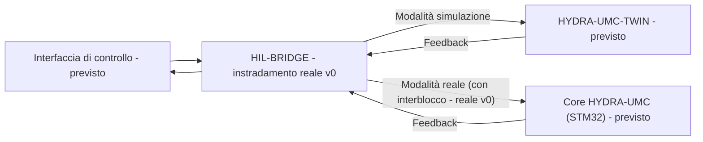

<p align="center">
  
</p>

# 🌉 HYDRA-UMC-HIL-BRIDGE

<p align="center"><a href="README.md">🇺🇸 English</a> | <a href="README_spa.md">🇪🇸 Español</a> | <a href="README_fra.md">🇫🇷 Français</a> | 🇮🇹 <b>Italiano</b> | <a href="README_deu.md">🇩🇪 Deutsch</a> | <a href="README_zho.md">🇨🇳 简体中文</a> | <a href="README_jpn.md">🇯🇵 日本語</a></p>

### ⚡ Interfaccia Hardware-in-the-Loop per la sincronizzazione reale vs virtuale

<p align="left">
  
  
  
  
</p>

---

## 1. 🛠️ PANORAMICA TECNICA

**HYDRA-UMC-HIL-BRIDGE** è l'arteria di comunicazione che abilita la funzionalità Hardware-in-the-Loop (HIL). Sincronizza lo stato tra i controller fisici e il motore Digital Twin in tempo reale.

Consente agli sviluppatori di inviare comandi da qualsiasi interfaccia (App, Suite, Studio) al simulatore come se fosse un robot fisico e, viceversa, può riflettere i movimenti di un robot fisico nel mondo virtuale per la supervisione remota e il shadowing del digital twin.

### Caratteristiche principali:
* 🛡️ **Interblocco di sicurezza (v0):** il vero sottocomando `route` blocca un comando diretto all'hardware reale ogni volta che un report di rischio del twin segnala una collisione imminente - vedi "Verifica di onestà" sotto per cosa funziona esattamente oggi.
* 🌉 **Bridge bidirezionale (v0, senza trasporto per ora):** esiste un vero instradamento basato su modalità (Reale/Simulazione) e un vero mirroring incondizionato; non esiste ancora nessuna vera connessione gRPC/WebSocket verso un vero HYDRA-UMC-TWIN o controller HYDRA-UMC.
* ⚡ **Mirroring a latenza zero (parziale):** il vero sottocomando `mirror` oggi riflette un comando verso un ricevitore in memoria; la "latenza zero" su una vera connessione di rete resta lavoro futuro.
* 📡 **Protocollo unificato (previsto):** utilizza gRPC per la sincronizzazione locale ad alta velocità e WebSocket per il monitoraggio remoto - nessun trasporto di rete è ancora collegato, di proposito (vedi `Cargo.toml`).
* 🧪 **Trasporto a prova di guasto, testabile senza hardware (v0):** `CommandSink::send()` ora restituisce un vero `Result`, e un `SimulatedTransport` può simulare un collegamento in timeout o disconnesso; il ponte segnala un esito `TransportFailure` distinto invece di dichiarare mai che un comando è stato consegnato quando non lo è stato - esercitabile tramite `--transport-latency-ms`/`--transport-timeout-ms`/`--transport-disconnected` su `route`.

**Verifica di onestà - cosa funziona davvero oggi:** `route --mode real|simulation --joint NOME --position VALORE [--collision-risk] [--distance METRI] [--transport-latency-ms MS] [--transport-timeout-ms MS] [--transport-disconnected]` prende una vera decisione di instradamento - la modalità `simulation` invia sempre, la modalità `real` è soggetta a un vero interblocco di sicurezza che blocca il comando ogni volta che viene indicato `--collision-risk`. `mirror --joint NOME --position VALORE` riflette un comando incondizionatamente. Entrambi instradano per default verso un ricevitore in memoria (`RecordingSink`, non un vero controller né una vera istanza HYDRA-UMC-TWIN), oppure verso un `SimulatedTransport` che può fallire davvero (timeout/disconnessione) quando vengono passati i flag di trasporto sopra - non esiste ancora trasporto gRPC/WebSocket. Vedi [`CHANGELOG.md`](CHANGELOG.md) per ciò che è stato consegnato esattamente, e la Roadmap sotto per ciò che resta da fare.

---

## 2. 🔄 FLUSSO DI SINCRONIZZAZIONE HIL

La suddivisione basata su modalità in `BRIDGE` e la porta dell'interblocco
di sicurezza sul percorso `Modalità reale` sono reali oggi
(`bridge.rs`/`interlock.rs`), instradando verso un ricevitore in memoria
anziché un vero processo live. Tutto ciò che tocca un vero processo
`APP`, `TWIN` o `CORE` tramite una vera connessione resta lavoro futuro.



---

## 3. 🧱 ARCHITETTURA E DECISIONI DI PROGETTAZIONE

* **Perché questo ponte non ha cartelle `hardware/`/`firmware/`/`os/`.** Software puro - collega hardware già esistente (app reali, firmware reale HYDRA-UMC) al gemello digitale, senza scheda propria.
* **Perché è fratello, non un sottomodulo, di HYDRA-UMC-TWIN.** Un ponte hardware-in-the-loop deve continuare a funzionare (e continuare a far fluire i comandi di un dispositivo reale) indipendentemente da ciò che sta facendo in quell'istante il ciclo rendering/fisica proprio di HYDRA-UMC-TWIN - un processo separato significa che un riavvio del gemello non perde un comando reale in corso.
* **Come si inserisce nel resto dell'ecosistema.** Permette a HYDRA-UMC-SUITE, HYDRA-UMC-ANDROID-CONTROL e HYDRA-UMC-IOS-CONTROL di controllare HYDRA-UMC-TWIN come se fosse una vera cella supportata da HYDRA-UMC-SERVER - la stessa superficie di controllo, un obiettivo simulato.
* **Perché l'interblocco si fida della bandiera `collision_imminent` propria del twin invece di derivarne una da una soglia di distanza.** Il twin ha già svolto il vero ragionamento geometrico/fisico nel momento in cui riporta il rischio - rimettere in discussione quella conclusione qui con una soglia di distanza indipendente sarebbe solo una seconda opinione di sicurezza, potenzialmente incoerente. Vedi la documentazione propria del modulo `interlock.rs` per come questo rispecchia il confine rileva-vs-applica di HYDRA-UMC-SAFETY-ZONES.
* **Perché la modalità `Simulation` non è mai soggetta all'interblocco.** Tutto il senso di instradare un comando verso il twin invece che verso l'hardware reale è poter vedere svolgersi in sicurezza una collisione prevista - bloccarla lì vanificherebbe la funzione stessa che esiste per supportare.
* **Perché `CommandSink` è un trait con solo un'implementazione `RecordingSink` in memoria oggi.** Non esiste ancora nessun vero trasporto gRPC/WebSocket (vedi il commento proprio di `Cargo.toml`) - `RecordingSink` è onesto al riguardo: registra ciò che gli è stato chiesto di inviare senza trasmettere da nessuna parte, lo stesso ragionamento di `NullEStopRequester` in HYDRA-UMC-SAFETY-ZONES.
* **Perché `CommandSink::send()` restituisce un `Result` invece di `()`.** Un vero trasporto può fallire nella consegna (timeout, disconnessione) indipendentemente dal fatto che l'interblocco abbia lasciato passare il comando - se `send()` non può fallire, il ponte non ha modo di evitare di dichiarare successo per un comando mai arrivato davvero. `SimulatedTransport` esiste proprio perché questo percorso di fallimento sia reale e testabile oggi, senza aspettare che esista un vero trasporto.
* **Perché `TransportFailure` è un `RouteOutcome` separato da `BlockedByInterlock`.** Sono due tipi diversi di "non è successo": uno è un rifiuto di sicurezza deliberato (l'interblocco ha deciso di non inoltrarlo), l'altro è una consegna al meglio delle possibilità che semplicemente non si è completata. Fonderli in un fallimento generico nasconderebbe quale livello di sicurezza abbia effettivamente fermato il comando - utile per il debug e per qualsiasi policy futura che li tratti diversamente (ritentare dopo un fallimento di trasporto è ragionevole; ritentare dopo un blocco dell'interblocco no).

---

## 📂 STRUTTURA DELLE CARTELLE

Bridge puramente software, senza progettazione hardware propria; per
questo il progetto non ha cartelle `hardware/`, `firmware/` né `os/`,
secondo la politica della struttura del repository.

```text
HYDRA-UMC-HIL-BRIDGE/
├── src/
│   ├── protocol.rs       # Veri tipi JointCommand/Mode
│   ├── interlock.rs      # Vera decisione di interblocco di sicurezza
│   ├── bridge.rs         # Vero instradamento basato su modalità + mirroring + CommandSink/SimulatedTransport
│   ├── server.rs         # Superficie JSON/HTTP semplice (tiny_http, bloccante, senza runtime async)
│   └── main.rs           # Entry point + veri sottocomandi `route`/`mirror`
├── docs/                # Documentazione e guide all'integrazione
├── build/               # Note/artefatti di build (l'output reale di cargo vive in target/, escluso da git)
├── images/              # Media e diagrammi
├── systemd/
│   └── hydra-umc-hil-bridge.service # Unità systemd della API locale route/mirror sulla CM5
├── tools/
│   ├── build_test.py    # Controllo build senza versionamento
│   └── ci_validate.py   # Validazione manifest/CHANGELOG/docs usata dalla CI
├── Cargo.toml           # Metadati del pacchetto, dipendenze, version contachilometri
├── bump_version.py      # Bump di version nativa tipo contachilometri (usato da build.sh/.bat)
├── bump_manifest_version.py # Sincronizza la versione di hydra-umc.project.json con quella nativa (--sync)
├── build.sh / build.bat # Bump della version, `cargo test`, poi `cargo build --release`
├── build-test.sh / build-test.bat # Controllo build senza versionamento
└── run.sh / run.bat     # Esegue il binario release compilato (inoltra gli argomenti)
```

---

## 🏗️ BUILD E RUN

Richiede il toolchain Rust (`cargo`/`rustc`, installabile via [rustup](https://rustup.rs)) e Python 3.10+ (solo per `bump_version.py`).

```bash
# Linux / macOS
./build.sh   # bump di version contachilometri, `cargo test` (23 test), poi `cargo build --release`
./run.sh     # esegue target/release/hydra-umc-hil-bridge, stampa nome + version + ruolo
```

```bat
:: Windows
build.bat
run.bat
```

`build.sh`/`build.bat` incrementano la version del proprio `Cargo.toml` di questo progetto seguendo la regola "contachilometri" dell'ecosistema (PATCH+1, con riporto a MINOR superato 9), eseguono la vera suite di test, e poi costruiscono un binario release.

I veri sottocomandi `route` e `mirror`:

```bash
./run.sh route --mode real --joint shoulder --position 0.5
# SENT: routed to real HYDRA-UMC controller

./run.sh route --mode real --joint shoulder --position 0.5 --collision-risk --distance 0.02
# BLOCKED: safety interlock refused to forward to real hardware (twin reports imminent collision at 0.020m)

./run.sh route --mode simulation --joint shoulder --position 0.5 --collision-risk --distance 0.02
# SENT: routed to HYDRA-UMC-TWIN (simulation)

./run.sh mirror --joint elbow --position -0.3
# MIRRORED: joint 'elbow' = -0.300000 shadowed into the twin

./run.sh route --mode real --joint shoulder --position 0.5 --transport-timeout-ms 100 --transport-latency-ms 500
# TRANSPORT FAILURE: command was not confirmed delivered (transport timed out after 100ms)

./run.sh route --mode real --joint shoulder --position 0.5 --transport-disconnected
# TRANSPORT FAILURE: command was not confirmed delivered (transport is disconnected)
```

`route` esce con `0` (inviato), `1` (bloccato dall'interblocco di sicurezza - un vero risultato significativo, non un errore), `2` (input non valido), o `3` (fallimento di trasporto - l'interblocco lo ha lasciato passare, ma la consegna non è stata confermata). `mirror` esce con `0`, `2` o `3`.

`Cargo.toml` non ha ancora crate esterne di proposito - vedere il commento nel file per cosa verrà aggiunto quando inizierà il vero lavoro di trasporto gRPC/WebSocket.

---

## 🚀 TABELLA DI MARCIA
* **Fase 1:** Sincronizzazione del Digital Twin con telemetria hardware in tempo reale e latenza inferiore a 10 ms.
* **Fase 2:** Integrazione di Physics Replica con simulatori di livello industriale (Isaac Sim) e supporto per corpi deformabili.
* **Fase 3:** Modelli di ripristino automatizzati di Node Healing per failover decentralizzato e rilevamento precoce del degrado dei sensori.
* **Fase 4:** Sincronizzazione HIL multi-controller (Swarm HIL) e supporto alla generazione di dati sintetici fotorealistici.

---

## 🔗 Progetti Correlati

Questo progetto fa parte dell'ecosistema robotico HYDRA-UMC dello stesso autore (JuanenRac / Electro Hobby 3D). Vale la pena conoscerlo, poiché una richiesta potrebbe in realtà riguardare uno di questi invece di questo repository.

**Progetto Padre**
- **[HYDRA-UMC-TWIN](https://github.com/JuanenRac/HYDRA-UMC-TWIN)** — hub di integrazione per il motore di gemello digitale, con un vero contratto di sincronizzazione per compatibilità di versione; il genitore di cui questo repository è un servizio di simulazione specifico, all'interno del proprio motore di gemello digitale.

**Progetti Fratelli** — gli altri servizi di simulazione del motore di gemello digitale proprio di HYDRA-UMC-TWIN
- **[HYDRA-UMC-PHYSICS-REPLICA](https://github.com/JuanenRac/HYDRA-UMC-PHYSICS-REPLICA)** — vera cinematica diretta e validazione dei limiti articolari su un vero sottoinsieme URDF.
- **[HYDRA-UMC-SYNTHETIC-DATA-GEN](https://github.com/JuanenRac/HYDRA-UMC-SYNTHETIC-DATA-GEN)** — vero generatore procedurale di scene 2D con esportazione di annotazioni YOLO/COCO.

**Direttamente Correlati**
- **[HYDRA-UMC-STUDIO](https://github.com/JuanenRac/HYDRA-UMC-STUDIO)** — dashboard di controllo web con visualizzazione 3D multi-robot in tempo reale — una delle 3 interfacce client che possono inviare comandi attraverso questo bridge come se fosse un robot fisico, una volta che esiste un trasporto reale.
- **[HYDRA-UMC-SUITE](https://github.com/JuanenRac/HYDRA-UMC-SUITE)** — centro di comando sciame desktop (PySide6) per più server contemporaneamente, pacchettizzato come eseguibile standalone — una delle 3 interfacce client che possono inviare comandi attraverso questo bridge come se fosse un robot fisico, una volta che esiste un trasporto reale.
- **[HYDRA-UMC-ANDROID-CONTROL](https://github.com/JuanenRac/HYDRA-UMC-ANDROID-CONTROL)** — app di controllo nativa per Android con login biometrico e un companion Wear OS abbinato — una delle 3 interfacce client che possono inviare comandi attraverso questo bridge come se fosse un robot fisico, una volta che esiste un trasporto reale.
- **[HYDRA-UMC-IOS-CONTROL](https://github.com/JuanenRac/HYDRA-UMC-IOS-CONTROL)** — app di controllo per iOS/iPadOS (Flutter) con sincronizzazione WebSocket in tempo reale — una delle 3 interfacce client che possono inviare comandi attraverso questo bridge come se fosse un robot fisico, una volta che esiste un trasporto reale.
- **[HYDRA-UMC-SERVER](https://github.com/JuanenRac/HYDRA-UMC-SERVER)** — il vero backend headless (REST/WebSocket) con cui parla davvero ogni client di controllo — il backend dietro tutte e 3 queste interfacce client, il vero controller a cui punta infine il proprio `route --mode real` di questo bridge una volta che esiste un trasporto.

**Fa Anche Parte dell'Ecosistema**

*Hardware e Piattaforma di Base*
- **[HYDRA-UMC](https://github.com/JuanenRac/HYDRA-UMC)** — la scheda madre fisica del braccio robotico: host CM5 + coprocessore STM32H745 dual-core, che coordina fino a 8 bracci utensile via CAN-OTA/SPI-OTA.
- **[HYDRA-UMC-OS](https://github.com/JuanenRac/HYDRA-UMC-OS)** — livello prodotto riproducibile su Raspberry Pi OS per il CM5: agente in sola lettura, config/profili validati, provisioning WiFi al primo contatto.
- **[HYDRA-UMC-SDK](https://github.com/JuanenRac/HYDRA-UMC-SDK)** — il contratto JSON-Schema condiviso e la barriera di sicurezza contro cui ogni bridge valida i propri comandi.

*Backend Centrale e Client*
- **[HYDRA-UMC-DSI](https://github.com/JuanenRac/HYDRA-UMC-DSI)** — interfaccia touch nativa per il touchscreen DSI da 7" a bordo, incorporata direttamente nel CM5.
- **[HYDRA-UMC-EDITOR-URDF](https://github.com/JuanenRac/HYDRA-UMC-EDITOR-URDF)** — creatore/editor grafico desktop di URDF che invia i modelli finiti al catalogo di STUDIO.
- **[HYDRA-UMC-BRIDGE-AMR](https://github.com/JuanenRac/HYDRA-UMC-BRIDGE-AMR)** — barriera di coordinamento per flotte AGV/AMR tramite un publisher MQTT VDA 5050 reale.
- **[HYDRA-UMC-BRIDGE-CNC](https://github.com/JuanenRac/HYDRA-UMC-BRIDGE-CNC)** — coordinatore ad alto livello per celle CNC con accesso reale a stato/byte di controllo GRBL.
- **[HYDRA-UMC-BRIDGE-DROIDS](https://github.com/JuanenRac/HYDRA-UMC-BRIDGE-DROIDS)** — barriera di coordinamento per droidi con zampe/umanoidi, con un vero mittente di comandi per Boston Dynamics Spot.
- **[HYDRA-UMC-BRIDGE-LASER](https://github.com/JuanenRac/HYDRA-UMC-BRIDGE-LASER)** — coordinatore di sicurezza per celle laser che legge 3 salvaguardie GPIO reali di chiave/involucro/interblocco.
- **[HYDRA-UMC-BRIDGE-OPENPNP](https://github.com/JuanenRac/HYDRA-UMC-BRIDGE-OPENPNP)** — coordinatore ad alto livello sicuro per il flusso schede del pick-and-place OpenPnP.
- **[HYDRA-UMC-BRIDGE-PRINTER3D](https://github.com/JuanenRac/HYDRA-UMC-BRIDGE-PRINTER3D)** — barriera di coordinamento sicura per stampanti 3D Moonraker/Klipper, con comandi di lavoro reali e controllati.
- **[HYDRA-UMC-BRIDGE-ROS2](https://github.com/JuanenRac/HYDRA-UMC-BRIDGE-ROS2)** — coordinatore di sicurezza con un vero trasporto ROS 2 rclpy, importato in modo lazy.
- **[HYDRA-UMC-BRIDGE-UAV](https://github.com/JuanenRac/HYDRA-UMC-BRIDGE-UAV)** — barriera di coordinamento per UAV dotati di fotocamera, con un vero mittente di comandi MAVLink.

*Piattaforma Strumenti URTC*
- **[URTC](https://github.com/JuanenRac/URTC)** — firmware per la scheda fisica dell'Universal Robot Tool Controller, oltre 25 profili utensile su bus CAN.
- **[URTC-FLASHER](https://github.com/JuanenRac/URTC-FLASHER)** — strumento desktop con GUI per il flashing delle schede URTC, CAN-OTA più SWD/JTAG a chip intero.
- **[URTC-TESTER](https://github.com/JuanenRac/URTC-TESTER)** — strumento desktop di diagnostica CAN-bus dal vivo per schede URTC, un pannello per profilo utensile.
- **[URTC-WEB-STUDIO](https://github.com/JuanenRac/URTC-WEB-STUDIO)** — alternativa basata su browser a URTC-TESTER tramite la Web Serial API, senza installazione locale.

*Nodo IA Visione (Hailo-8)*
- **[HYDRA-UMC-VISION-NODE](https://github.com/JuanenRac/HYDRA-UMC-VISION-NODE)** — hub di integrazione per la pipeline di visione Hailo-8, con un vero controllo di prontezza hardware per fase.
- **[HYDRA-UMC-DETECTION-HEF](https://github.com/JuanenRac/HYDRA-UMC-DETECTION-HEF)** — registro reale di modelli compilati con verifica di caricamento sicuro per architettura Hailo/checksum.
- **[HYDRA-UMC-VISION-STREAMER](https://github.com/JuanenRac/HYDRA-UMC-VISION-STREAMER)** — generatore reale di pipeline GStreamer + config MediaMTX, con una vera barriera di integrazione HailoRT.
- **[HYDRA-UMC-VISUAL-SERVOING-API](https://github.com/JuanenRac/HYDRA-UMC-VISUAL-SERVOING-API)** — vera legge di correzione Position-Based Visual Servoing, con cancello di sicurezza sullo stato di zona a monte.
- **[HYDRA-UMC-SAFETY-ZONES](https://github.com/JuanenRac/HYDRA-UMC-SAFETY-ZONES)** — vero controllo di violazione zona e richiesta E-STOP, con imposizione della freschezza di calibrazione.

*Nodo IA Cognitivo (Hailo-10)*
- **[HYDRA-UMC-COGNITIVE-NODE](https://github.com/JuanenRac/HYDRA-UMC-COGNITIVE-NODE)** — hub di integrazione per la pipeline cognitiva Hailo-10 (orchestrazione LLM/VLA/voce).
- **[HYDRA-UMC-VLA-ENGINE](https://github.com/JuanenRac/HYDRA-UMC-VLA-ENGINE)** — vera codifica/decodifica di token d'azione e generazione di traiettoria per un modello Vision-Language-Action.
- **[HYDRA-UMC-VOICE-UI](https://github.com/JuanenRac/HYDRA-UMC-VOICE-UI)** — vero front-end vocale (VAD + parser di intenti) con un relay verso Watch limitato e soggetto a conferma.
- **[HYDRA-UMC-SEMANTIC-PLANNER](https://github.com/JuanenRac/HYDRA-UMC-SEMANTIC-PLANNER)** — vera scomposizione dei task basata su regole e recupero semantico degli errori sui codici errore MCU.
- **[HYDRA-UMC-DOCS-QA](https://github.com/JuanenRac/HYDRA-UMC-DOCS-QA)** — vera ricerca documentale TF-IDF (solo libreria standard) sui documenti Markdown di questo ecosistema.

*Orchestrazione e Sciame*
- **[HYDRA-UMC-ORCHESTRATOR](https://github.com/JuanenRac/HYDRA-UMC-ORCHESTRATOR)** — hub di integrazione con un vero contratto di health-report gRPC/Protobuf e una macchina a stati di missione.
- **[HYDRA-UMC-JOB-DISPATCHER](https://github.com/JuanenRac/HYDRA-UMC-JOB-DISPATCHER)** — vera coda di lavori basata su priorità con deduplicazione, su una vera API HTTP.
- **[HYDRA-UMC-NODE-HEALING](https://github.com/JuanenRac/HYDRA-UMC-NODE-HEALING)** — vero watchdog di salute della flotta basato su gRPC, con retry/backoff e rilevamento di discrepanza d'identità.
- **[HYDRA-UMC-PATH-PLANNER-3D](https://github.com/JuanenRac/HYDRA-UMC-PATH-PLANNER-3D)** — vero pianificatore di percorsi 3D basato su RRT, con vera validazione delle collisioni ostacolo/spazio di lavoro.
- **[HYDRA-UMC-SWARM-SYNC](https://github.com/JuanenRac/HYDRA-UMC-SWARM-SYNC)** — vera sincronizzazione di stato CRDT LWW-Element-Map, con property test per la convergenza multi-cella.

*Dati e Analisi*
- **[HYDRA-UMC-DATALAKE](https://github.com/JuanenRac/HYDRA-UMC-DATALAKE)** — vero archivio di serie temporali basato su sqlite3, con una vera API HTTP di ingestione/query.
- **[HYDRA-UMC-ANOMALY-DETECTOR](https://github.com/JuanenRac/HYDRA-UMC-ANOMALY-DETECTOR)** — vero rilevatore di anomalie FFT + baseline statistica, con monitoraggio della deriva.
- **[HYDRA-UMC-PRODUCTION-REPORTS](https://github.com/JuanenRac/HYDRA-UMC-PRODUCTION-REPORTS)** — vero calcolo OEE/disponibilità sullo storico di DATALAKE, con esportazione CSV riproducibile.
- **[HYDRA-UMC-TELEMETRY-COLLECTOR](https://github.com/JuanenRac/HYDRA-UMC-TELEMETRY-COLLECTOR)** — vera pipeline di ingestione CAN/WebSocket verso DATALAKE, con deduplicazione per sequenza.

*Gateway Industriale*
- **[HYDRA-UMC-GATEWAY-INDUSTRIAL](https://github.com/JuanenRac/HYDRA-UMC-GATEWAY-INDUSTRIAL)** — hub di integrazione che inoltra ai protocolli industriali, con un vero livello di allowlist dei comandi/backpressure.
- **[HYDRA-UMC-OPCUA-SERVER](https://github.com/JuanenRac/HYDRA-UMC-OPCUA-SERVER)** — vero spazio di indirizzi OPC-UA, verificato con una vera sessione client del protocollo binario.
- **[HYDRA-UMC-MQTT-BROKER](https://github.com/JuanenRac/HYDRA-UMC-MQTT-BROKER)** — vero broker MQTT con autenticazione opzionale per client e ACL sui topic.
- **[HYDRA-UMC-MTCONNECT-ADAPTER](https://github.com/JuanenRac/HYDRA-UMC-MTCONNECT-ADAPTER)** — veri endpoint XML `/probe` e `/current` di MTConnect, con output in modalità degradata.

*Strumenti Complementari e Operazioni dell'Ecosistema*
- **[HYDRA-UMC-DASHBOARD-AI](https://github.com/JuanenRac/HYDRA-UMC-DASHBOARD-AI)** — pannelli Smart Summaries e Anomaly Highlighting su DATALAKE/ANOMALY-DETECTOR, con un fallback statistico onesto.
- **[HYDRA-UMC-TOOL-CLI](https://github.com/JuanenRac/HYDRA-UMC-TOOL-CLI)** — CLI di flotta con un vero e stabile contratto di exit-code, un client live reale della stessa API di HYDRA-UMC-SERVER.
- **[HYDRA-UMC-WATCH](https://github.com/JuanenRac/HYDRA-UMC-WATCH)** — app companion WearOS con avvisi aptici reali e un relay vocale verso il telefono abbinato.
- **[URTC-SMART-RACK](https://github.com/JuanenRac/URTC-SMART-RACK)** — firmware per un rack di montaggio schede con decodifica reale dell'ID utensile e logica di preriscaldamento Smart Idle.
- **[URTC-VISION-TOOL](https://github.com/JuanenRac/URTC-VISION-TOOL)** — firmware più un vero companion di visione Python per una testa utensile di ispezione termica/RGB.
- **[HYDRA-UMC-UPDATER](https://github.com/JuanenRac/HYDRA-UMC-UPDATER)** — strumento amministrativo desktop che scopre, clona e aggiorna ogni repository di questo ecosistema.


## 👤 AUTORE
**JuanenRac** (Electro Hobby 3D)
📧 electrohobby3d@gmail.com
📺 [youtube.com/@electrohobby3d](https://youtube.com/@electrohobby3d)

## 📜 LICENZA
GPL-3.0 - Vedere LICENSE per i dettagli.
