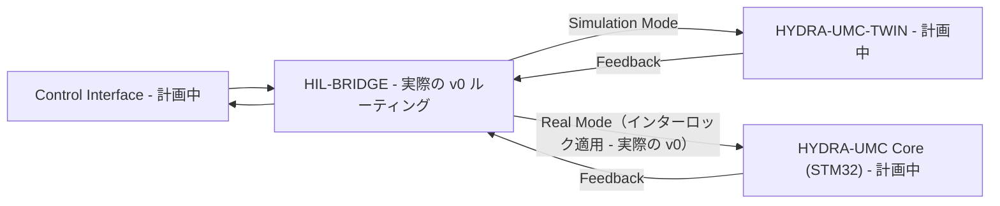

<p align="center">
  
</p>

# 🌉 HYDRA-UMC-HIL-BRIDGE

<p align="center"><a href="README.md">🇺🇸 English</a> | <a href="README_spa.md">🇪🇸 Español</a> | <a href="README_fra.md">🇫🇷 Français</a> | <a href="README_ita.md">🇮🇹 Italiano</a> | <a href="README_deu.md">🇩🇪 Deutsch</a> | <a href="README_zho.md">🇨🇳 简体中文</a> | 🇯🇵 <b>日本語</b></p>

### ⚡ 実際と仮想の同期のためのハードウェア・イン・ザ・ループインターフェース

<p align="left">
  
  
  
  
</p>

---

## 1. 🛠️ 技術概要

**HYDRA-UMC-HIL-BRIDGE** は、ハードウェア・イン・ザ・ループ（HIL）機能
を実現する通信の動脈です。物理コントローラーとデジタルツインエンジンの
間の状態をリアルタイムで同期します。

開発者は、任意のインターフェース（アプリ、Suite、Studio）からコマンドを
シミュレーターへ送信でき、それはあたかも物理的なロボットであるかのよう
に扱われます。逆に、物理ロボットの動きを仮想世界へミラーリングし、
リモート監視やデジタルツインシャドーイングにも利用できます。

### 主な機能：
* 🛡️ **安全インターロック（v0）：** 実際の `route` サブコマンドは、ツインのリスクレポートが衝突切迫を示すたびに、実際のハードウェア宛てのコマンドをブロックします——今日実際に何が動くのかは下記「正直な現状確認」を参照してください。
* 🌉 **双方向ブリッジ（v0、まだトランスポートなし）：** 実際のモードベースルーティング（実際/シミュレーション）と実際の無条件ミラーリングはすでに存在します。実際の HYDRA-UMC-TWIN や HYDRA-UMC コントローラーへの実際の gRPC/WebSocket 接続はまだありません。
* ⚡ **ゼロレイテンシーミラーリング（部分的）：** 実際の `mirror` サブコマンドは、今日はコマンドをメモリ内の記録用シンクへミラーリングします。実際のネットワーク接続上での「ゼロレイテンシー」はまだ今後の課題です。
* 📡 **統一プロトコル（計画中）：** 高速なローカル同期には gRPC を、リモート監視には WebSocket を使用します——意図的に、まだどのネットワークトランスポートも接続されていません（`Cargo.toml` を参照）。
* 🧪 **ハードウェアなしでテスト可能なフェイルセーフ・トランスポート（v0）：** `CommandSink::send()` は今では実際の `Result` を返し、`SimulatedTransport` はタイムアウトまたは切断されたリンクをモデル化できます。ブリッジはコマンドが実際には届いていないのに届いたと主張することは決してなく、独立した `TransportFailure` という結果を報告します——`route` の `--transport-latency-ms`/`--transport-timeout-ms`/`--transport-disconnected` で実際に発生させて確認できます。
* 🌐 **HTTP JSON API（v0）：** `serve [--addr ADDR] [--port PORT]`（デフォルト `127.0.0.1:8113`）は、同じルーティング/ミラーリングロジックを実際のブロッキング `tiny_http` サーバー経由で `POST /route`、`POST /mirror`、`GET /stats` として公開します——デプロイされた CM5 の `systemd/hydra-umc-hil-bridge.service` ユニットが実行するのと同じバイナリです（ループバックのみ）。完全なリクエスト/レスポンス契約は [`docs/CLI_REFERENCE.md`](docs/CLI_REFERENCE.md) を参照してください。

**正直な現状確認 —— 今日実際に動くもの：** `route --mode real|simulation --joint 名前 --position 値 [--collision-risk] [--distance メートル] [--transport-latency-ms MS] [--transport-timeout-ms MS] [--transport-disconnected]` は実際のルーティング判断を行います——`simulation` モードは常に送信し、`real` モードは `--collision-risk` が指定されるたびにコマンドをブロックする実際の安全インターロックの対象になります。`mirror --joint 名前 --position 値` はコマンドを無条件にミラーリングします。`serve` は、一度きりの CLI 呼び出しの代わりに、両方を実際の HTTP JSON 経由でも公開します。3つとも既定ではメモリ内の受信先（`RecordingSink`、実際のコントローラーや実際の HYDRA-UMC-TWIN インスタンスではない）へルーティングされ、上記のトランスポートフラグが渡された場合は実際に失敗しうる（タイムアウト/切断）`SimulatedTransport` へルーティングされます——まだ gRPC/WebSocket トランスポートは存在しません。実際に出荷済みの内容は [`CHANGELOG.md`](CHANGELOG.md) を、すべてのコマンド/エンドポイントは [`docs/CLI_REFERENCE.md`](docs/CLI_REFERENCE.md) を、まだ残っている作業は下記のロードマップを参照してください。

---

## 2. 🔄 HIL 同期フロー

`BRIDGE` でのモードベースの分岐、および `Real Mode` パス上の安全
インターロックのゲートは、今日すでに実際に動作しています
（`bridge.rs`/`interlock.rs`）。実際のライブプロセスではなく、メモリ内
のシンクへルーティングします。実際の `APP`、`TWIN`、`CORE` プロセスに
実際の接続を通じて触れる部分はすべて、今後の課題のままです。



---

## 3. 🧱 アーキテクチャと設計上の決定

* **本ブリッジに `hardware/`/`firmware/`/`os/` フォルダがない理由。** 純粋なソフトウェアです——既存のハードウェア（実際のアプリ、実際の HYDRA-UMC ファームウェア）をデジタルツインに橋渡しするだけで、独自の基板を持ちません。
* **HYDRA-UMC-TWIN のサブモジュールではなく兄弟プロジェクトである理由。** ハードウェア・イン・ザ・ループのブリッジは、その瞬間に HYDRA-UMC-TWIN 自身のレンダリング/物理ループが何をしていようとも、独立して動作し続ける（そして実際のデバイスのコマンドを流し続ける）必要があります——独立したプロセスであることにより、ツインの再起動が進行中の実際のコマンドを取りこぼすことはありません。
* **エコシステムの他の部分との関係。** HYDRA-UMC-SUITE、HYDRA-UMC-ANDROID-CONTROL、HYDRA-UMC-IOS-CONTROL が、HYDRA-UMC-TWIN をあたかも実際の HYDRA-UMC-SERVER に支えられたセルであるかのように制御できるようにします——同じ制御インターフェースで、対象がシミュレーションであるという違いだけです。
* **インターロックが距離しきい値から再導出する代わりに、ツイン自身の `collision_imminent` フラグを信頼する理由。** ツインはリスクを報告する時点で、すでに実際の幾何学的/物理的な推論を行っています——ここで独立した距離カットオフを使ってその結論に異議を唱えても、2 つ目の、場合によっては矛盾する安全上の意見が生まれるだけです。これが HYDRA-UMC-SAFETY-ZONES の検知と執行の境界をどう反映しているかについては、`interlock.rs` 自身のモジュールドキュメントを参照してください。
* **`Simulation` モードが決してインターロックの対象にならない理由。** 実際のハードウェアではなくツインへコマンドをルーティングすることの意味そのものが、予測された衝突を安全に観察できるようにすることです——そこでブロックしてしまうと、この機能が支えるはずの目的そのものが失われます。
* **`CommandSink` が今日、メモリ内実装 `RecordingSink` のみを持つトレイトである理由。** 実際の gRPC/WebSocket トランスポートはまだ存在しません（`Cargo.toml` 自身のコメントを参照）——`RecordingSink` はその点について正直です：送信を依頼された内容を記録するだけで、どこにも送信しません。これは HYDRA-UMC-SAFETY-ZONES の `NullEStopRequester` と同じ考え方です。
* **`CommandSink::send()` が `()` ではなく `Result` を返す理由。** 実際のトランスポートは、インターロックがコマンドを通過させたかどうかとは無関係に、配送に失敗する（タイムアウト、切断）ことがあります——`send()` が失敗しえないなら、ブリッジには実際には届いていないコマンドについて成功を主張することを避ける手段がありません。`SimulatedTransport` は、実際のトランスポートの完成を待たずとも、この失敗経路を今日から実際にテスト可能にするために存在します。
* **`TransportFailure` が `BlockedByInterlock` とは別の `RouteOutcome` である理由。** どちらも「起きなかった」という点では同じですが、種類が異なります——一方は意図的な安全上の拒否（インターロックが転送しないと決定した）、もう一方はベストエフォートの配送が単に完了しなかったというものです。これらを汎用的な失敗にまとめてしまうと、実際にどの安全層がコマンドを止めたのかが分からなくなります——デバッグに有用であり、両者を異なる扱いにする将来のポリシー（トランスポート失敗のリトライは妥当だが、インターロックによるブロックの後のリトライは妥当ではない）にも有用です。

---

## 📂 リポジトリ構成

純粋なソフトウェアブリッジであり、独自のハードウェア設計を持たないため、
本プロジェクトは `hardware/`、`firmware/`、`os/` フォルダを持たず、
リポジトリ構造ポリシーに従っています。

```text
HYDRA-UMC-HIL-BRIDGE/
├── src/
│   ├── protocol.rs       # 実際の JointCommand/Mode 型
│   ├── interlock.rs      # 実際の安全インターロック判断
│   ├── bridge.rs         # 実際のモードベースルーティング + ミラーリング + CommandSink/SimulatedTransport
│   ├── server.rs         # シンプルなJSON/HTTPサーフェス(tiny_http、ブロッキング、非同期ランタイムなし)
│   └── main.rs           # エントリポイント + 実際の `route`/`mirror` サブコマンド
├── docs/                # ドキュメントと統合ガイド
├── build/               # ビルドノート/成果物（cargo 自身の出力は target/ にあり、gitignore 対象）
├── images/              # メディアと図表
├── systemd/
│   └── hydra-umc-hil-bridge.service # ローカルCM5 route/mirror APIのsystemdユニット
├── tools/
│   ├── build_test.py    # バージョンを増やさないビルドチェック
│   └── ci_validate.py   # CI が使用するマニフェスト/CHANGELOG/ドキュメント検証
├── Cargo.toml           # パッケージメタデータ、依存関係、オドメーターバージョン
├── bump_version.py      # ネイティブバージョンのオドメーター式インクリメント（build.sh/.bat が使用）
├── bump_manifest_version.py # hydra-umc.project.json のバージョンをネイティブ版と同期(--sync)
├── build.sh / build.bat # バージョンを増加させ、`cargo test`、その後 `cargo build --release` を実行
├── build-test.sh / build-test.bat # バージョンを増やさないビルドチェック
└── run.sh / run.bat     # コンパイル済みの release バイナリを実行（引数を転送）
```

---

## 🏗️ ビルドと実行

Rust ツールチェーン（`cargo`/`rustc`、[rustup](https://rustup.rs) 経由で
インストール）と Python 3.10+（`bump_version.py` のみに使用）が必要です。

```bash
# Linux / macOS
./build.sh   # オドメーター式バージョンインクリメント、`cargo test`（23 件のテスト）、その後 `cargo build --release`
./run.sh     # target/release/hydra-umc-hil-bridge を実行し、名前 + バージョン + 役割を表示
```

```bat
:: Windows
build.bat
run.bat
```

`build.sh`/`build.bat` は、エコシステムの「オドメーター」規則
（PATCH+1、9 を超えると MINOR に繰り上がる）に従って本プロジェクト
自身の `Cargo.toml` のバージョンを増加させ、実際のテストスイートを
実行し、その後 release バイナリをビルドします。

実際の `route` および `mirror` サブコマンド：

```bash
./run.sh route --mode real --joint shoulder --position 0.5
# SENT: routed to real HYDRA-UMC controller

./run.sh route --mode real --joint shoulder --position 0.5 --collision-risk --distance 0.02
# BLOCKED: safety interlock refused to forward to real hardware (twin reports imminent collision at 0.020m)

./run.sh route --mode simulation --joint shoulder --position 0.5 --collision-risk --distance 0.02
# SENT: routed to HYDRA-UMC-TWIN (simulation)

./run.sh mirror --joint elbow --position -0.3
# MIRRORED: joint 'elbow' = -0.300000 shadowed into the twin

./run.sh route --mode real --joint shoulder --position 0.5 --transport-timeout-ms 100 --transport-latency-ms 500
# TRANSPORT FAILURE: command was not confirmed delivered (transport timed out after 100ms)

./run.sh route --mode real --joint shoulder --position 0.5 --transport-disconnected
# TRANSPORT FAILURE: command was not confirmed delivered (transport is disconnected)
```

`route` は成功時に終了コード `0`、安全インターロックによってブロック
された場合は `1`（これはエラーではなく、実際の意味のある結果です）、
不正な入力の場合は `2`、トランスポート失敗（インターロックは通過した
が配送が確認されなかった）の場合は `3` で終了します。`mirror` は `0`、
`2`、または `3` で
終了します。

同じルーティング/ミラーリングロジックは、実際の HTTP JSON 経由でも
到達できます：

```bash
./run.sh serve --addr 127.0.0.1 --port 8113
# [hil-bridge] HTTP API listening on 127.0.0.1:8113
# [hil-bridge] POST /route, POST /mirror, GET /stats

curl -X POST http://127.0.0.1:8113/route \
    -d '{"mode":"real","joint":"shoulder","position":1.0,"risk":{"collision_imminent":true,"distance_m":0.02}}'
# {"BlockedByInterlock":{"reason":"twin reports imminent collision at 0.020m"}}
```

完全な `POST /route`/`POST /mirror`/`GET /stats` リクエスト/レスポンス
契約は [`docs/CLI_REFERENCE.md`](docs/CLI_REFERENCE.md) を参照してくだ
さい——これはデプロイされた CM5 の
`systemd/hydra-umc-hil-bridge.service` ユニットが実行するのと同じバイ
ナリです。

`Cargo.toml` は今のところ意図的に、実際の HTTP JSON サーフェスに使う
`tiny_http`/`serde`/`serde_json` 以外の外部クレートを含んでいません
——実際の gRPC/WebSocket トランスポート作業が始まった際に他に何が
追加されるかについては、その内部のコメントを参照してください。

---

## 🚀 ロードマップ
* **フェーズ 1：** リアルタイムハードウェアテレメトリとのデジタルツイン同期、サブ 10ms の遅延。
* **フェーズ 2：** 産業グレードのシミュレーター（Isaac Sim）との Physics Replica 統合、変形体サポート。
* **フェーズ 3：** 分散型フェイルオーバーと早期センサー劣化検知のためのノード自己修復自動化パターン。
* **フェーズ 4：** マルチコントローラー HIL 同期（スウォーム HIL）とフォトリアリスティックな合成データ生成のサポート。

---

## 🔗 関連プロジェクト

本プロジェクトは、同じ作者(JuanenRac / Electro Hobby 3D)による HYDRA-UMC ロボティクスエコシステムの一部です。リクエストが実はこの中のどれかについてのものである可能性があるため、知っておく価値があります。

**親プロジェクト**
- **[HYDRA-UMC-TWIN](https://github.com/JuanenRac/HYDRA-UMC-TWIN)** — デジタルツインエンジンの統合ハブ、実際のバージョン互換性同期契約付き。本リポジトリは、その自身のデジタルツインエンジン内における特定のシミュレーションサービスとして、この親の一部を成す。

**兄弟プロジェクト** —— HYDRA-UMC-TWIN 自身のデジタルツインエンジンにおける他のシミュレーションサービス
- **[HYDRA-UMC-PHYSICS-REPLICA](https://github.com/JuanenRac/HYDRA-UMC-PHYSICS-REPLICA)** — 実際の URDF サブセットに対する、実際の順運動学と関節限界検証。
- **[HYDRA-UMC-SYNTHETIC-DATA-GEN](https://github.com/JuanenRac/HYDRA-UMC-SYNTHETIC-DATA-GEN)** — YOLO/COCO アノテーションのエクスポート機能を持つ、実際のプロシージャル 2D シーンジェネレーター。

**直接関連**
- **[HYDRA-UMC-STUDIO](https://github.com/JuanenRac/HYDRA-UMC-STUDIO)** — リアルタイムのマルチロボット 3D 可視化を備えたウェブ制御ダッシュボード ——実際のトランスポートが存在すれば、あたかも物理ロボットであるかのように本ブリッジ経由でコマンドを送信できる 3 つのクライアントインターフェースのひとつ。
- **[HYDRA-UMC-SUITE](https://github.com/JuanenRac/HYDRA-UMC-SUITE)** — 複数のサーバーを同時に扱えるデスクトップ(PySide6)スウォームコマンドセンター、スタンドアロン実行ファイルとしてパッケージ化 ——実際のトランスポートが存在すれば、あたかも物理ロボットであるかのように本ブリッジ経由でコマンドを送信できる 3 つのクライアントインターフェースのひとつ。
- **[HYDRA-UMC-ANDROID-CONTROL](https://github.com/JuanenRac/HYDRA-UMC-ANDROID-CONTROL)** — 生体認証ログインとペアリングされた Wear OS コンパニオンを備えたネイティブ Android 制御アプリ ——実際のトランスポートが存在すれば、あたかも物理ロボットであるかのように本ブリッジ経由でコマンドを送信できる 3 つのクライアントインターフェースのひとつ。
- **[HYDRA-UMC-IOS-CONTROL](https://github.com/JuanenRac/HYDRA-UMC-IOS-CONTROL)** — リアルタイム WebSocket 同期を備えた iOS/iPadOS 制御アプリ(Flutter) ——実際のトランスポートが存在すれば、あたかも物理ロボットであるかのように本ブリッジ経由でコマンドを送信できる 3 つのクライアントインターフェースのひとつ。
- **[HYDRA-UMC-SERVER](https://github.com/JuanenRac/HYDRA-UMC-SERVER)** — すべての制御クライアントが実際に通信する、本物のヘッドレスバックエンド(REST/WebSocket) ——これら 3 つのクライアントインターフェースすべての背後にあるバックエンドであり、トランスポートが存在すれば本ブリッジ自身の `route --mode real` が最終的に対象とする実際のコントローラー。

**エコシステムの他のプロジェクト**

*コアハードウェア&プラットフォーム*
- **[HYDRA-UMC](https://github.com/JuanenRac/HYDRA-UMC)** — 実際のロボットアームのマザーボード——CM5 ホスト + デュアルコア STM32H745、CAN-OTA/SPI-OTA 経由で最大 8 本のツールアームを統括。
- **[HYDRA-UMC-OS](https://github.com/JuanenRac/HYDRA-UMC-OS)** — CM5 向けの再現可能な Raspberry Pi OS プロダクト層——読み取り専用エージェント、検証済み設定/プロファイル、WiFi 初回接続プロビジョニング。
- **[HYDRA-UMC-SDK](https://github.com/JuanenRac/HYDRA-UMC-SDK)** — すべてのブリッジが自身のコマンドを検証する共有 JSON-Schema 契約と安全ゲートの境界。

*コアバックエンド&クライアント*
- **[HYDRA-UMC-DSI](https://github.com/JuanenRac/HYDRA-UMC-DSI)** — 本体搭載の 7 インチ DSI タッチスクリーン向けネイティブタッチ UI、CM5 自体に組み込み。
- **[HYDRA-UMC-EDITOR-URDF](https://github.com/JuanenRac/HYDRA-UMC-EDITOR-URDF)** — 完成したモデルを STUDIO 自身のカタログへ送信するデスクトップ用グラフィカル URDF 作成/編集ツール。
- **[HYDRA-UMC-BRIDGE-AMR](https://github.com/JuanenRac/HYDRA-UMC-BRIDGE-AMR)** — 実際の VDA 5050 MQTT パブリッシャーによる AGV/AMR フリートの調整境界。
- **[HYDRA-UMC-BRIDGE-CNC](https://github.com/JuanenRac/HYDRA-UMC-BRIDGE-CNC)** — 実際の GRBL ステータス/制御バイトへのアクセスを持つ、CNC セルの高レベルコーディネーター。
- **[HYDRA-UMC-BRIDGE-DROIDS](https://github.com/JuanenRac/HYDRA-UMC-BRIDGE-DROIDS)** — 実際の Boston Dynamics Spot コマンド送信機能を持つ、脚型/ヒューマノイドドロイドの調整境界。
- **[HYDRA-UMC-BRIDGE-LASER](https://github.com/JuanenRac/HYDRA-UMC-BRIDGE-LASER)** — 実際のキー/筐体/インターロック GPIO セーフガード 3 系統を読み取る、レーザーセルの安全コーディネーター。
- **[HYDRA-UMC-BRIDGE-OPENPNP](https://github.com/JuanenRac/HYDRA-UMC-BRIDGE-OPENPNP)** — OpenPnP ピックアンドプレースの基板フローを安全に統括する高レベルコーディネーター。
- **[HYDRA-UMC-BRIDGE-PRINTER3D](https://github.com/JuanenRac/HYDRA-UMC-BRIDGE-PRINTER3D)** — 実際にゲート制御されたジョブコマンドを持つ、Moonraker/Klipper 3D プリンター向けの安全な調整境界。
- **[HYDRA-UMC-BRIDGE-ROS2](https://github.com/JuanenRac/HYDRA-UMC-BRIDGE-ROS2)** — 実際の遅延インポート rclpy ROS 2 トランスポートを持つ安全コーディネーター。
- **[HYDRA-UMC-BRIDGE-UAV](https://github.com/JuanenRac/HYDRA-UMC-BRIDGE-UAV)** — 実際の MAVLink コマンド送信機能を持つ、カメラ搭載 UAV の調整境界。

*URTC ツールプラットフォーム*
- **[URTC](https://github.com/JuanenRac/URTC)** — 物理的な Universal Robot Tool Controller 基板向けファームウェア、CAN バス経由の 25 以上のツールプロファイル。
- **[URTC-FLASHER](https://github.com/JuanenRac/URTC-FLASHER)** — URTC 基板用のデスクトップ GUI 書き込みツール、CAN-OTA およびフルチップ SWD/JTAG。
- **[URTC-TESTER](https://github.com/JuanenRac/URTC-TESTER)** — URTC 基板向けのデスクトップ CAN バスライブ診断ツール、ツールプロファイルごとに 1 パネル。
- **[URTC-WEB-STUDIO](https://github.com/JuanenRac/URTC-WEB-STUDIO)** — Web Serial API を使ったブラウザベースの URTC-TESTER の代替、ローカルインストール不要。

*ビジョン AI ノード(Hailo-8)*
- **[HYDRA-UMC-VISION-NODE](https://github.com/JuanenRac/HYDRA-UMC-VISION-NODE)** — Hailo-8 ビジョンパイプラインの統合ハブ、段階ごとの実際のハードウェア準備状況チェック付き。
- **[HYDRA-UMC-DETECTION-HEF](https://github.com/JuanenRac/HYDRA-UMC-DETECTION-HEF)** — Hailo アーキテクチャ/チェックサムによる安全読み込み検証を備えた、実際のコンパイル済みモデルレジストリ。
- **[HYDRA-UMC-VISION-STREAMER](https://github.com/JuanenRac/HYDRA-UMC-VISION-STREAMER)** — 実際の HailoRT 統合境界を持つ、実際の GStreamer パイプライン + MediaMTX 設定生成器。
- **[HYDRA-UMC-VISUAL-SERVOING-API](https://github.com/JuanenRac/HYDRA-UMC-VISUAL-SERVOING-API)** — 上流のゾーン状態に応じて安全ゲート制御される、実際の Position-Based Visual Servoing 補正則。
- **[HYDRA-UMC-SAFETY-ZONES](https://github.com/JuanenRac/HYDRA-UMC-SAFETY-ZONES)** — キャリブレーションの鮮度を強制する、実際のゾーン侵入チェックと E-STOP 要求。

*コグニティブ AI ノード(Hailo-10)*
- **[HYDRA-UMC-COGNITIVE-NODE](https://github.com/JuanenRac/HYDRA-UMC-COGNITIVE-NODE)** — Hailo-10 コグニティブパイプライン(LLM/VLA/音声オーケストレーション)の統合ハブ。
- **[HYDRA-UMC-VLA-ENGINE](https://github.com/JuanenRac/HYDRA-UMC-VLA-ENGINE)** — Vision-Language-Action モデル向けの、実際のアクショントークンのエンコード/デコードと軌道生成。
- **[HYDRA-UMC-VOICE-UI](https://github.com/JuanenRac/HYDRA-UMC-VOICE-UI)** — 確認ゲート付きの限定的な Watch リレーを備えた、実際の音声フロントエンド(VAD + 意図解析)。
- **[HYDRA-UMC-SEMANTIC-PLANNER](https://github.com/JuanenRac/HYDRA-UMC-SEMANTIC-PLANNER)** — MCU エラーコードに対する、実際のルールベースのタスク分解と意味的エラー復旧。
- **[HYDRA-UMC-DOCS-QA](https://github.com/JuanenRac/HYDRA-UMC-DOCS-QA)** — このエコシステム自身の Markdown ドキュメントに対する、標準ライブラリのみの実際の TF-IDF 文書検索。

*オーケストレーション&スウォーム*
- **[HYDRA-UMC-ORCHESTRATOR](https://github.com/JuanenRac/HYDRA-UMC-ORCHESTRATOR)** — 実際の gRPC/Protobuf ヘルスレポート契約とミッションステートマシンを持つ統合ハブ。
- **[HYDRA-UMC-JOB-DISPATCHER](https://github.com/JuanenRac/HYDRA-UMC-JOB-DISPATCHER)** — 実際の HTTP API 上に構築された、優先度ベースの実際のジョブキュー(重複排除付き)。
- **[HYDRA-UMC-NODE-HEALING](https://github.com/JuanenRac/HYDRA-UMC-NODE-HEALING)** — リトライ/バックオフとアイデンティティ不一致検出を備えた、実際の gRPC ベースのフリートヘルスウォッチドッグ。
- **[HYDRA-UMC-PATH-PLANNER-3D](https://github.com/JuanenRac/HYDRA-UMC-PATH-PLANNER-3D)** — 実際の障害物/ワークスペース衝突検証を備えた、実際の RRT ベースの 3D 経路プランナー。
- **[HYDRA-UMC-SWARM-SYNC](https://github.com/JuanenRac/HYDRA-UMC-SWARM-SYNC)** — 複数セルの収束についてプロパティテストされた、実際の CRDT LWW-Element-Map 状態同期。

*データ&分析*
- **[HYDRA-UMC-DATALAKE](https://github.com/JuanenRac/HYDRA-UMC-DATALAKE)** — 実際の取り込み/クエリ HTTP API を備えた、実際の sqlite3 ベースの時系列ストア。
- **[HYDRA-UMC-ANOMALY-DETECTOR](https://github.com/JuanenRac/HYDRA-UMC-ANOMALY-DETECTOR)** — ドリフト監視を備えた、実際の FFT + 統計ベースラインによる異常検知器。
- **[HYDRA-UMC-PRODUCTION-REPORTS](https://github.com/JuanenRac/HYDRA-UMC-PRODUCTION-REPORTS)** — DATALAKE の履歴に対する実際の OEE/稼働率計算、再現可能な CSV エクスポート付き。
- **[HYDRA-UMC-TELEMETRY-COLLECTOR](https://github.com/JuanenRac/HYDRA-UMC-TELEMETRY-COLLECTOR)** — シーケンス重複排除機能を備えた、DATALAKE への実際の CAN/WebSocket 取り込みパイプライン。

*産業用ゲートウェイ*
- **[HYDRA-UMC-GATEWAY-INDUSTRIAL](https://github.com/JuanenRac/HYDRA-UMC-GATEWAY-INDUSTRIAL)** — 実際のコマンド許可リスト/バックプレッシャー層を持つ、産業用プロトコルへ中継する統合ハブ。
- **[HYDRA-UMC-OPCUA-SERVER](https://github.com/JuanenRac/HYDRA-UMC-OPCUA-SERVER)** — 実際のバイナリプロトコルクライアントセッションで検証された、実際の OPC-UA アドレス空間。
- **[HYDRA-UMC-MQTT-BROKER](https://github.com/JuanenRac/HYDRA-UMC-MQTT-BROKER)** — クライアント単位のオプション認証とトピック ACL を備えた、実際の MQTT ブローカー。
- **[HYDRA-UMC-MTCONNECT-ADAPTER](https://github.com/JuanenRac/HYDRA-UMC-MTCONNECT-ADAPTER)** — 縮退モード出力を備えた、実際の MTConnect `/probe` および `/current` XML エンドポイント。

*補完ツール&エコシステム運用*
- **[HYDRA-UMC-DASHBOARD-AI](https://github.com/JuanenRac/HYDRA-UMC-DASHBOARD-AI)** — 誠実な統計フォールバックを備えた、DATALAKE/ANOMALY-DETECTOR 上のスマートサマリーと異常ハイライトパネル。
- **[HYDRA-UMC-TOOL-CLI](https://github.com/JuanenRac/HYDRA-UMC-TOOL-CLI)** — 実際の安定した終了コード契約を持つフリート CLI、HYDRA-UMC-SERVER 自身の API の本物のライブクライアント。
- **[HYDRA-UMC-WATCH](https://github.com/JuanenRac/HYDRA-UMC-WATCH)** — 実際の触覚アラートとペアリングされたスマートフォンへの音声リレーを備えた WearOS コンパニオンアプリ。
- **[URTC-SMART-RACK](https://github.com/JuanenRac/URTC-SMART-RACK)** — 実際の工具 ID デコードと Smart Idle 予熱ロジックを備えた、基板搭載ラック用ファームウェア。
- **[URTC-VISION-TOOL](https://github.com/JuanenRac/URTC-VISION-TOOL)** — サーマル/RGB 検査ツールヘッド向けの、ファームウェアと実際の Python ビジョンコンパニオン。
- **[HYDRA-UMC-UPDATER](https://github.com/JuanenRac/HYDRA-UMC-UPDATER)** — このエコシステム内のすべてのリポジトリを検出・クローン・更新する、管理用デスクトップツール。


---

## 📚 ドキュメント & コミュニティ

- **[docs/CLI_REFERENCE.md](docs/CLI_REFERENCE.md)** — すべての `route`/`mirror`/`serve` 呼び出し、ビルド済みリリースバイナリから実際に取得した出力、終了コード表、そして `POST /route`/`POST /mirror`/`GET /stats` の HTTP JSON 契約。
- **[CONTRIBUTING.md](CONTRIBUTING.md)** —— プルリクエストのための技術スタックとコーディング指針。
- **[CODE_OF_CONDUCT.md](CODE_OF_CONDUCT.md)** —— このコミュニティで期待される行動規範。
- **[SECURITY.md](SECURITY.md)** —— 脆弱性の報告方法と、このプロジェクトの実際のセキュリティ重点領域。
- **[SUPPORT.md](SUPPORT.md)** —— 質問の投稿先とバグの報告先。
- **[LICENSE.md](LICENSE.md)** —— このプロジェクト自身のライセンス。

## 👤 作者
**JuanenRac** (Electro Hobby 3D)
📧 electrohobby3d@gmail.com
📺 [youtube.com/@electrohobby3d](https://youtube.com/@electrohobby3d)

## 📜 ライセンス
GPL-3.0 —— 詳細は LICENSE を参照してください。
