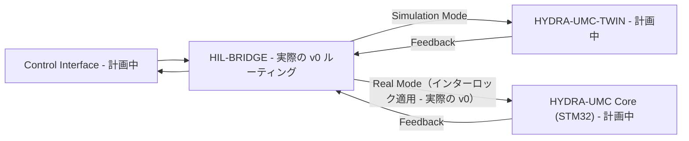

<p align="center">
  
</p>

# 🌉 HYDRA-UMC-HIL-BRIDGE

<p align="center"><a href="README.md">🇺🇸 English</a> | <a href="README_spa.md">🇪🇸 Español</a> | <a href="README_fra.md">🇫🇷 Français</a> | <a href="README_ita.md">🇮🇹 Italiano</a> | <a href="README_deu.md">🇩🇪 Deutsch</a> | <a href="README_zho.md">🇨🇳 简体中文</a> | 🇯🇵 <b>日本語</b></p>

### ⚡ 実際と仮想の同期のためのハードウェア・イン・ザ・ループインターフェース

<p align="left">
  
  
  
  
</p>

---

## 1. 🛠️ 技術概要

**HYDRA-UMC-HIL-BRIDGE** は、ハードウェア・イン・ザ・ループ（HIL）機能
を実現する通信の動脈です。物理コントローラーとデジタルツインエンジンの
間の状態をリアルタイムで同期します。

開発者は、任意のインターフェース（アプリ、Suite、Studio）からコマンドを
シミュレーターへ送信でき、それはあたかも物理的なロボットであるかのよう
に扱われます。逆に、物理ロボットの動きを仮想世界へミラーリングし、
リモート監視やデジタルツインシャドーイングにも利用できます。

### 主な機能：
* 🛡️ **安全インターロック（v0）：** 実際の `route` サブコマンドは、ツインのリスクレポートが衝突切迫を示すたびに、実際のハードウェア宛てのコマンドをブロックします——今日実際に何が動くのかは下記「正直な現状確認」を参照してください。
* 🌉 **双方向ブリッジ（v0、まだトランスポートなし）：** 実際のモードベースルーティング（実際/シミュレーション）と実際の無条件ミラーリングはすでに存在します。実際の HYDRA-UMC-TWIN や HYDRA-UMC コントローラーへの実際の gRPC/WebSocket 接続はまだありません。
* ⚡ **ゼロレイテンシーミラーリング（部分的）：** 実際の `mirror` サブコマンドは、今日はコマンドをメモリ内の記録用シンクへミラーリングします。実際のネットワーク接続上での「ゼロレイテンシー」はまだ今後の課題です。
* 📡 **統一プロトコル（計画中）：** 高速なローカル同期には gRPC を、リモート監視には WebSocket を使用します——意図的に、まだどのネットワークトランスポートも接続されていません（`Cargo.toml` を参照）。

**正直な現状確認 —— 今日実際に動くもの：** `route --mode real|simulation --joint 名前 --position 値 [--collision-risk] [--distance メートル]` は実際のルーティング判断を行います——`simulation` モードは常に送信し、`real` モードは `--collision-risk` が指定されるたびにコマンドをブロックする実際の安全インターロックの対象になります。`mirror --joint 名前 --position 値` はコマンドを無条件にミラーリングします。どちらもメモリ内の `RecordingSink` へルーティングされ、実際のコントローラーや実際の HYDRA-UMC-TWIN インスタンスへではありません——まだ gRPC/WebSocket トランスポートは存在しません。実際に出荷済みの内容は [`CHANGELOG.md`](CHANGELOG.md) を、まだ残っている作業は下記のロードマップを参照してください。

---

## 2. 🔄 HIL 同期フロー

`BRIDGE` でのモードベースの分岐、および `Real Mode` パス上の安全
インターロックのゲートは、今日すでに実際に動作しています
（`bridge.rs`/`interlock.rs`）。実際のライブプロセスではなく、メモリ内
のシンクへルーティングします。実際の `APP`、`TWIN`、`CORE` プロセスに
実際の接続を通じて触れる部分はすべて、今後の課題のままです。



---

## 3. 🧱 アーキテクチャと設計上の決定

* **本ブリッジに `hardware/`/`firmware/`/`os/` フォルダがない理由。** 純粋なソフトウェアです——既存のハードウェア（実際のアプリ、実際の HYDRA-UMC ファームウェア）をデジタルツインに橋渡しするだけで、独自の基板を持ちません。
* **HYDRA-UMC-TWIN のサブモジュールではなく兄弟プロジェクトである理由。** ハードウェア・イン・ザ・ループのブリッジは、その瞬間に HYDRA-UMC-TWIN 自身のレンダリング/物理ループが何をしていようとも、独立して動作し続ける（そして実際のデバイスのコマンドを流し続ける）必要があります——独立したプロセスであることにより、ツインの再起動が進行中の実際のコマンドを取りこぼすことはありません。
* **エコシステムの他の部分との関係。** HYDRA-UMC-SUITE、HYDRA-UMC-ANDROID-CONTROL、HYDRA-UMC-IOS-CONTROL が、HYDRA-UMC-TWIN をあたかも実際の HYDRA-UMC-SERVER に支えられたセルであるかのように制御できるようにします——同じ制御インターフェースで、対象がシミュレーションであるという違いだけです。
* **インターロックが距離しきい値から再導出する代わりに、ツイン自身の `collision_imminent` フラグを信頼する理由。** ツインはリスクを報告する時点で、すでに実際の幾何学的/物理的な推論を行っています——ここで独立した距離カットオフを使ってその結論に異議を唱えても、2 つ目の、場合によっては矛盾する安全上の意見が生まれるだけです。これが HYDRA-UMC-SAFETY-ZONES の検知と執行の境界をどう反映しているかについては、`interlock.rs` 自身のモジュールドキュメントを参照してください。
* **`Simulation` モードが決してインターロックの対象にならない理由。** 実際のハードウェアではなくツインへコマンドをルーティングすることの意味そのものが、予測された衝突を安全に観察できるようにすることです——そこでブロックしてしまうと、この機能が支えるはずの目的そのものが失われます。
* **`CommandSink` が今日、メモリ内実装 `RecordingSink` のみを持つトレイトである理由。** 実際の gRPC/WebSocket トランスポートはまだ存在しません（`Cargo.toml` 自身のコメントを参照）——`RecordingSink` はその点について正直です：送信を依頼された内容を記録するだけで、どこにも送信しません。これは HYDRA-UMC-SAFETY-ZONES の `NullEStopRequester` と同じ考え方です。

---

## 📂 リポジトリ構成

純粋なソフトウェアブリッジであり、独自のハードウェア設計を持たないため、
本プロジェクトは `hardware/`、`firmware/`、`os/` フォルダを持たず、
リポジトリ構造ポリシーに従っています。

```text
HYDRA-UMC-HIL-BRIDGE/
├── src/
│   ├── protocol.rs       # 実際の JointCommand/Mode 型
│   ├── interlock.rs       # 実際の安全インターロック判断
│   ├── bridge.rs            # 実際のモードベースルーティング + ミラーリング
│   └── main.rs                 # エントリポイント + 実際の `route`/`mirror` サブコマンド
├── docs/                # ドキュメントと統合ガイド
├── build/               # ビルドノート/成果物（cargo 自身の出力は target/ にあり、gitignore 対象）
├── images/              # メディアと図表
├── scripts/             # ユーティリティスクリプト
├── Cargo.toml           # パッケージメタデータ、依存関係、オドメーターバージョン
├── bump_version.py      # オドメーター式バージョンインクリメント（build.sh/.bat が使用）
├── build.sh / build.bat # バージョンを増加させ、`cargo test`、その後 `cargo build --release` を実行
└── run.sh / run.bat     # コンパイル済みの release バイナリを実行（引数を転送）
```

---

## 🏗️ ビルドと実行

Rust ツールチェーン（`cargo`/`rustc`、[rustup](https://rustup.rs) 経由で
インストール）と Python 3.10+（`bump_version.py` のみに使用）が必要です。

```bash
# Linux / macOS
./build.sh   # オドメーター式バージョンインクリメント、`cargo test`（7 件のテスト）、その後 `cargo build --release`
./run.sh     # target/release/hydra-umc-hil-bridge を実行し、名前 + バージョン + 役割を表示
```

```bat
:: Windows
build.bat
run.bat
```

`build.sh`/`build.bat` は、エコシステムの「オドメーター」規則
（PATCH+1、9 を超えると MINOR に繰り上がる）に従って本プロジェクト
自身の `Cargo.toml` のバージョンを増加させ、実際のテストスイートを
実行し、その後 release バイナリをビルドします。

実際の `route` および `mirror` サブコマンド：

```bash
./run.sh route --mode real --joint shoulder --position 0.5
# SENT: routed to real HYDRA-UMC controller

./run.sh route --mode real --joint shoulder --position 0.5 --collision-risk --distance 0.02
# BLOCKED: safety interlock refused to forward to real hardware (twin reports imminent collision at 0.020m)

./run.sh route --mode simulation --joint shoulder --position 0.5 --collision-risk --distance 0.02
# SENT: routed to HYDRA-UMC-TWIN (simulation)

./run.sh mirror --joint elbow --position -0.3
# MIRRORED: joint 'elbow' = -0.300000 shadowed into the twin
```

`route` は成功時に終了コード `0`、安全インターロックによってブロック
された場合は `1`（これはエラーではなく、実際の意味のある結果です）、
不正な入力の場合は `2` で終了します。`mirror` は `0` または `2` で
終了します。

`Cargo.toml` は今のところ意図的に外部クレートを一切含んでいません——
実際の gRPC/WebSocket トランスポート作業が始まった際に何が追加される
かについては、その内部のコメントを参照してください。

---

## 🚀 ロードマップ
* **フェーズ 1：** リアルタイムハードウェアテレメトリとのデジタルツイン同期、サブ 10ms の遅延。
* **フェーズ 2：** 産業グレードのシミュレーター（Isaac Sim）との Physics Replica 統合、変形体サポート。
* **フェーズ 3：** 分散型フェイルオーバーと早期センサー劣化検知のためのノード自己修復自動化パターン。
* **フェーズ 4：** マルチコントローラー HIL 同期（スウォーム HIL）とフォトリアリスティックな合成データ生成のサポート。

---

## 🔗 関連プロジェクト

本プロジェクトは、同一著者（JuanenRac / Electro Hobby 3D）による、
ファームウェア、制御ソフトウェア、AI ノード、フリート管理ツールにまたがる、
より大きなロボティクスエコシステムの一部です。ご要望が実際にはこれらの
プロジェクトのいずれかに関するものであり、本リポジトリのものではない
可能性もあるため、知っておく価値があります。

### プロジェクトファミリー

**親プロジェクト：** **[HYDRA-UMC-TWIN](https://github.com/JuanenRac/HYDRA-UMC-TWIN)** —— 本ブリッジが実際のハードウェアに接続する統合親プロジェクト。

**兄弟プロジェクト：**
- **[HYDRA-UMC-PHYSICS-REPLICA](https://github.com/JuanenRac/HYDRA-UMC-PHYSICS-REPLICA)** —— 同じ親プロジェクトを持つ兄弟シミュレーションサービス。
- **[HYDRA-UMC-SYNTHETIC-DATA-GEN](https://github.com/JuanenRac/HYDRA-UMC-SYNTHETIC-DATA-GEN)** —— 同じ親プロジェクトを持つ兄弟シミュレーションサービス。

### 直接関連（ファミリー外）

- **[HYDRA-UMC-SERVER](https://github.com/JuanenRac/HYDRA-UMC-SERVER)** —— ハードウェア・イン・ザ・ループブリッジの対象。
- **[HYDRA-UMC-SUITE](https://github.com/JuanenRac/HYDRA-UMC-SUITE)** —— ハードウェア・イン・ザ・ループブリッジの対象。
- **[HYDRA-UMC-ANDROID-CONTROL](https://github.com/JuanenRac/HYDRA-UMC-ANDROID-CONTROL)** —— ハードウェア・イン・ザ・ループブリッジの対象。
- **[HYDRA-UMC-IOS-CONTROL](https://github.com/JuanenRac/HYDRA-UMC-IOS-CONTROL)** —— ハードウェア・イン・ザ・ループブリッジの対象。

### エコシステムのその他のプロジェクト

**HYDRA-UMC プラットフォーム** — マルチロボット・マイクロファクトリーセル
- **[HYDRA-UMC](https://github.com/JuanenRac/HYDRA-UMC)** — 最大 8 台のロボットアームを統括する CM5 + STM32H745 マザーボード。
- **[HYDRA-UMC-SERVER](https://github.com/JuanenRac/HYDRA-UMC-SERVER)** — すべての制御クライアントが接続する Express/WebSocket バックエンド。
- **[HYDRA-UMC-STUDIO](https://github.com/JuanenRac/HYDRA-UMC-STUDIO)** — Web ベースの制御ダッシュボード、マルチロボット 3D 可視化。
- **[HYDRA-UMC-ANDROID-CONTROL](https://github.com/JuanenRac/HYDRA-UMC-ANDROID-CONTROL)** — Wi-Fi/Bluetooth 経由の Android 制御アプリ。
- **[HYDRA-UMC-IOS-CONTROL](https://github.com/JuanenRac/HYDRA-UMC-IOS-CONTROL)** — Flutter で構築された iOS/iPadOS 制御アプリ。
- **[HYDRA-UMC-SUITE](https://github.com/JuanenRac/HYDRA-UMC-SUITE)** — デスクトップ版群制御コマンドセンター（Python/PySide6）。
- **[HYDRA-UMC-EDITOR-URDF](https://github.com/JuanenRac/HYDRA-UMC-EDITOR-URDF)** — ロボットカタログ向けのデスクトップ版 URDF モデルエディター。
- **[HYDRA-UMC-DSI](https://github.com/JuanenRac/HYDRA-UMC-DSI)** — 機載 DSI タッチスクリーン用のネイティブタッチ UI。

**URTC プラットフォーム** — すべての HYDRA-UMC ロボットアームが搭載するツールヘッドコントローラー
- **[URTC](https://github.com/JuanenRac/URTC)** — CAN バスツールヘッドコントローラー、25 種類のツールプロファイル。
- **[URTC-FLASHER](https://github.com/JuanenRac/URTC-FLASHER)** — デスクトップ版 CAN-OTA + SWD/JTAG フラッシュツール。
- **[URTC-TESTER](https://github.com/JuanenRac/URTC-TESTER)** — デスクトップ版ライブ CAN バス診断ツール。
- **[URTC-WEB-STUDIO](https://github.com/JuanenRac/URTC-WEB-STUDIO)** — Web Serial API によるブラウザベースの代替版。

**🎥 ビジョン AI ノード（Hailo-8）**
- [HYDRA-UMC-VISION-NODE](https://github.com/JuanenRac/HYDRA-UMC-VISION-NODE)
- [HYDRA-UMC-VISION-STREAMER](https://github.com/JuanenRac/HYDRA-UMC-VISION-STREAMER)
- [HYDRA-UMC-DETECTION-HEF](https://github.com/JuanenRac/HYDRA-UMC-DETECTION-HEF)
- [HYDRA-UMC-SAFETY-ZONES](https://github.com/JuanenRac/HYDRA-UMC-SAFETY-ZONES)
- [HYDRA-UMC-VISUAL-SERVOING-API](https://github.com/JuanenRac/HYDRA-UMC-VISUAL-SERVOING-API)

**🧠 認知 AI ノード（Hailo-10）**
- [HYDRA-UMC-COGNITIVE-NODE](https://github.com/JuanenRac/HYDRA-UMC-COGNITIVE-NODE)
- [HYDRA-UMC-VLA-ENGINE](https://github.com/JuanenRac/HYDRA-UMC-VLA-ENGINE)
- [HYDRA-UMC-VOICE-UI](https://github.com/JuanenRac/HYDRA-UMC-VOICE-UI)
- [HYDRA-UMC-SEMANTIC-PLANNER](https://github.com/JuanenRac/HYDRA-UMC-SEMANTIC-PLANNER)
- [HYDRA-UMC-DOCS-QA](https://github.com/JuanenRac/HYDRA-UMC-DOCS-QA)

**🐝 オーケストレーションと群制御**
- [HYDRA-UMC-ORCHESTRATOR](https://github.com/JuanenRac/HYDRA-UMC-ORCHESTRATOR)
- [HYDRA-UMC-SWARM-SYNC](https://github.com/JuanenRac/HYDRA-UMC-SWARM-SYNC)
- [HYDRA-UMC-PATH-PLANNER-3D](https://github.com/JuanenRac/HYDRA-UMC-PATH-PLANNER-3D)
- [HYDRA-UMC-JOB-DISPATCHER](https://github.com/JuanenRac/HYDRA-UMC-JOB-DISPATCHER)
- [HYDRA-UMC-NODE-HEALING](https://github.com/JuanenRac/HYDRA-UMC-NODE-HEALING)

**📊 データと分析**
- [HYDRA-UMC-DATALAKE](https://github.com/JuanenRac/HYDRA-UMC-DATALAKE)
- [HYDRA-UMC-TELEMETRY-COLLECTOR](https://github.com/JuanenRac/HYDRA-UMC-TELEMETRY-COLLECTOR)
- [HYDRA-UMC-ANOMALY-DETECTOR](https://github.com/JuanenRac/HYDRA-UMC-ANOMALY-DETECTOR)
- [HYDRA-UMC-PRODUCTION-REPORTS](https://github.com/JuanenRac/HYDRA-UMC-PRODUCTION-REPORTS)

**🏭 産業用ゲートウェイ**
- [HYDRA-UMC-GATEWAY-INDUSTRIAL](https://github.com/JuanenRac/HYDRA-UMC-GATEWAY-INDUSTRIAL)
- [HYDRA-UMC-OPCUA-SERVER](https://github.com/JuanenRac/HYDRA-UMC-OPCUA-SERVER)
- [HYDRA-UMC-MQTT-BROKER](https://github.com/JuanenRac/HYDRA-UMC-MQTT-BROKER)
- [HYDRA-UMC-MTCONNECT-ADAPTER](https://github.com/JuanenRac/HYDRA-UMC-MTCONNECT-ADAPTER)

**🛠️ 補完ツール**
- [URTC-SMART-RACK](https://github.com/JuanenRac/URTC-SMART-RACK)
- [URTC-VISION-TOOL](https://github.com/JuanenRac/URTC-VISION-TOOL)
- [HYDRA-UMC-WATCH](https://github.com/JuanenRac/HYDRA-UMC-WATCH)
- [HYDRA-UMC-TOOL-CLI](https://github.com/JuanenRac/HYDRA-UMC-TOOL-CLI)
- [HYDRA-UMC-DASHBOARD-AI](https://github.com/JuanenRac/HYDRA-UMC-DASHBOARD-AI)


## 👤 作者
**JuanenRac**（Electro Hobby 3D）
📧 electrohobby3d@gmail.com

## 📜 ライセンス
GPL-3.0 —— 詳細は LICENSE を参照してください。

## 🛠️ BUILD & RUN

リリースビルドの前に、バージョンを変更しないビルドチェックを使用してください。

| 操作 | Windows | Linux / macOS |
|---|---|---|
| ビルドチェック（バージョンと CHANGELOG を変更しない） | `build-test.bat` | `./build-test.sh` |
| 実行 / 開発（提供されている場合） | `run*.bat` または `dev*.bat` | `./run*.sh` または `./dev*.sh` |

`build-test.bat` と `build-test.sh` は、`hydra-umc.project.json` をインクリメントせず、`CHANGELOG.md` も変更せずにプロジェクトのスタックをコンパイルまたは検証します。通常のコンパイラ出力だけが作成される場合があります。既存の `build*.bat`、`build*.sh`、`run*`、`dev*` は、各プロジェクト固有のバージョン化または実行時の動作を維持します。その動作が必要な場合はそれらを使用してください。