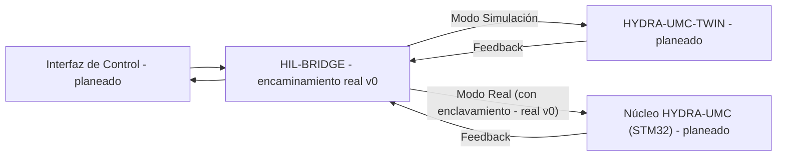

<p align="center">
  
</p>

# 🌉 HYDRA-UMC-HIL-BRIDGE

<p align="center"><a href="README.md">🇺🇸 English</a> | 🇪🇸 <b>Español</b> | <a href="README_fra.md">🇫🇷 Français</a> | <a href="README_ita.md">🇮🇹 Italiano</a> | <a href="README_deu.md">🇩🇪 Deutsch</a> | <a href="README_zho.md">🇨🇳 简体中文</a> | <a href="README_jpn.md">🇯🇵 日本語</a></p>

### ⚡ Interfaz Hardware-in-the-Loop para Sincronización Real vs Virtual

<p align="left">
  
  
  
  
</p>

---

## 1. 🛠️ VISIÓN GENERAL TÉCNICA

**HYDRA-UMC-HIL-BRIDGE** es la arteria de comunicación que permite la funcionalidad Hardware-in-the-Loop (HIL). Sincroniza el estado entre los controladores físicos y el motor del Digital Twin en tiempo real.

Permite a los desarrolladores enviar comandos desde cualquier interfaz (App, Suite, Studio) al simulador como si fuera un robot físico y, a la inversa, puede reflejar los movimientos de un robot físico en el mundo virtual para supervisión remota y seguimiento (shadowing) del gemelo digital.

### Características Clave:
* 🛡️ **Enclavamiento de Seguridad (v0):** el subcomando real `route` bloquea un comando destinado a hardware real siempre que un reporte de riesgo del gemelo indique una colisión inminente - ver "Comprobación de honestidad" abajo para lo que funciona hoy exactamente.
* 🌉 **Puente Bidireccional (v0, sin transporte todavía):** existe encaminamiento real basado en modo (Real/Simulación) y reflejo (mirroring) real e incondicional; todavía no hay ninguna conexión gRPC/WebSocket real hacia un HYDRA-UMC-TWIN o controlador HYDRA-UMC de verdad.
* ⚡ **Mirroring de Latencia Cero (parcial):** el subcomando real `mirror` refleja hoy un comando hacia un receptor en memoria; "latencia cero" sobre una conexión de red real sigue siendo trabajo futuro.
* 📡 **Protocolo Unificado (planeado):** usa gRPC para sincronización local de alta velocidad y WebSockets para monitorización remota - todavía no hay ningún transporte de red conectado, a propósito (ver `Cargo.toml`).
* 🧪 **Transporte a prueba de fallos, testeable sin hardware (v0):** `CommandSink::send()` devuelve un `Result` real, y un `SimulatedTransport` puede modelar un enlace con timeout o desconectado; el puente reporta un resultado `TransportFailure` diferenciado en vez de afirmar jamás que un comando fue entregado cuando no lo fue - se puede probar vía `--transport-latency-ms`/`--transport-timeout-ms`/`--transport-disconnected` en `route`.

**Comprobación de honestidad - qué funciona hoy de verdad:** `route --mode real|simulation --joint NOMBRE --position VALOR [--collision-risk] [--distance METROS] [--transport-latency-ms MS] [--transport-timeout-ms MS] [--transport-disconnected]` toma una decisión real de encaminamiento - el modo `simulation` siempre envía, el modo `real` está sujeto a un enclavamiento de seguridad real que bloquea el comando siempre que se indique `--collision-risk`. `mirror --joint NOMBRE --position VALOR` refleja un comando incondicionalmente. Ambos encaminan por defecto hacia un receptor en memoria (`RecordingSink`, no un controlador real ni una instancia real de HYDRA-UMC-TWIN), o hacia un `SimulatedTransport` que puede fallar de verdad (timeout/desconexión) cuando se pasan los flags de transporte de arriba - todavía no hay transporte gRPC/WebSocket. Ver [`CHANGELOG.md`](CHANGELOG.md) para lo entregado exactamente, y la Hoja de Ruta abajo para lo que sigue por delante.

---

## 2. 🔄 FLUJO DE SINCRONIZACIÓN HIL

La división por modo en `BRIDGE` y la compuerta del enclavamiento de
seguridad en la ruta `Modo Real` son reales hoy (`bridge.rs`/
`interlock.rs`), encaminando hacia un receptor en memoria en vez de un
proceso real en vivo. Todo lo que toca un proceso real `APP`, `TWIN` o
`CORE` mediante una conexión real sigue siendo trabajo futuro.



---

## 3. 🧱 ARQUITECTURA Y DECISIONES DE DISEÑO

* **Por qué este puente no tiene carpetas `hardware/`/`firmware/`/`os/`.** Software puro - conecta hardware ya existente (apps reales, firmware real de HYDRA-UMC) con el gemelo digital, sin placa propia.
* **Por qué es hermano, no un submódulo, de HYDRA-UMC-TWIN.** Un puente hardware-in-the-loop necesita seguir funcionando (y seguir dejando fluir los comandos de un dispositivo real) con independencia de lo que esté haciendo en ese instante el propio bucle de renderizado/física de HYDRA-UMC-TWIN - un proceso separado significa que un reinicio del gemelo no descarta un comando real en curso.
* **Cómo encaja en el resto del ecosistema.** Permite que HYDRA-UMC-SUITE, HYDRA-UMC-ANDROID-CONTROL y HYDRA-UMC-IOS-CONTROL controlen HYDRA-UMC-TWIN como si fuera una célula real respaldada por HYDRA-UMC-SERVER - la misma superficie de control, un objetivo simulado.
* **Por qué el enclavamiento confía en la propia bandera `collision_imminent` del gemelo en vez de derivar una a partir de un umbral de distancia.** El gemelo ya ha hecho el razonamiento geométrico/físico real en el momento en que reporta el riesgo - cuestionar esa conclusión aquí con un umbral de distancia independiente solo sería una segunda opinión de seguridad, posiblemente inconsistente. Ver la documentación propia del módulo `interlock.rs` para cómo esto refleja el límite detect-vs-enforce de HYDRA-UMC-SAFETY-ZONES.
* **Por qué el modo `Simulation` nunca está sujeto al enclavamiento.** Todo el sentido de encaminar un comando hacia el gemelo en vez de hardware real es poder ver una colisión predicha desarrollarse de forma segura - bloquearla ahí anularía la propia función que existe para respaldar.
* **Por qué `CommandSink` es un trait con solo una implementación en memoria `RecordingSink` hoy.** Todavía no existe ningún transporte gRPC/WebSocket real (ver el propio comentario de `Cargo.toml`) - `RecordingSink` es honesto al respecto: registra lo que se le pidió enviar sin transmitir a ningún sitio, el mismo razonamiento que `NullEStopRequester` en HYDRA-UMC-SAFETY-ZONES.
* **Por qué `CommandSink::send()` devuelve un `Result` en vez de `()`.** Un transporte real puede fallar en la entrega (timeout, desconexión) con independencia de si el enclavamiento permitió el comando - si `send()` no puede fallar, el puente no tiene forma de evitar afirmar éxito ante un comando que nunca llegó de verdad. `SimulatedTransport` existe justamente para que ese camino de fallo sea real y testeable hoy, sin esperar a que exista un transporte real.
* **Por qué `TransportFailure` es un `RouteOutcome` separado de `BlockedByInterlock`.** Son dos tipos distintos de "no ocurrió": uno es un rechazo deliberado de seguridad (el enclavamiento decidió no reenviarlo), el otro es una entrega de mejor esfuerzo que simplemente no se completó. Fusionarlos en un fallo genérico ocultaría qué capa de seguridad detuvo realmente el comando - útil para depurar y para cualquier política futura que los trate de forma distinta (reintentar un fallo de transporte es razonable; reintentar tras un bloqueo del enclavamiento no lo es).

---

## 📂 ESTRUCTURA DE DIRECTORIOS

Puente puramente software, sin diseño de hardware propio; por eso este
proyecto no lleva carpetas `hardware/`, `firmware/` ni `os/`, conforme a la política de estructura del repositorio.

```text
HYDRA-UMC-HIL-BRIDGE/
├── src/
│   ├── protocol.rs       # Tipos reales JointCommand/Mode
│   ├── interlock.rs      # Decisión real de enclavamiento de seguridad
│   ├── bridge.rs         # Encaminamiento real basado en modo + mirroring + CommandSink/SimulatedTransport
│   ├── server.rs         # Superficie JSON/HTTP plana (tiny_http, bloqueante, sin runtime async)
│   └── main.rs           # Entry point + subcomandos reales `route`/`mirror`
├── docs/                # Documentación y guías de integración
├── build/               # Notas/artefactos de build (la salida real de cargo vive en target/, en .gitignore)
├── images/              # Medios y diagramas
├── systemd/
│   └── hydra-umc-hil-bridge.service # Unidad systemd de la API local de route/mirror en la CM5
├── tools/
│   ├── build_test.py    # Comprobación de compilación sin versionado
│   └── ci_validate.py   # Validación de manifiesto/CHANGELOG/docs usada por CI
├── Cargo.toml           # Metadatos del paquete, dependencias, version cuentakilometros
├── bump_version.py      # Bump de version nativa tipo cuentakilometros (usado por build.sh/.bat)
├── bump_manifest_version.py # Sincroniza la versión de hydra-umc.project.json con la nativa (--sync)
├── build.sh / build.bat # Bump de version, `cargo test`, luego `cargo build --release`
├── build-test.sh / build-test.bat # Comprobación de compilación sin versionado
└── run.sh / run.bat     # Ejecuta el binario release compilado (reenvía argumentos)
```

---

## 🏗️ BUILD Y RUN

Requiere el toolchain de Rust (`cargo`/`rustc`, instalar vía [rustup](https://rustup.rs)) y Python 3.10+ (solo para `bump_version.py`).

```bash
# Linux / macOS
./build.sh   # bump de version cuentakilometros, `cargo test` (23 tests), luego `cargo build --release`
./run.sh     # ejecuta target/release/hydra-umc-hil-bridge, imprime nombre + version + rol
```

```bat
:: Windows
build.bat
run.bat
```

`build.sh`/`build.bat` incrementan la version del propio `Cargo.toml` de este proyecto siguiendo la regla "cuentakilometros" del ecosistema (PATCH+1, con acarreo a MINOR al pasar de 9), ejecutan la suite de tests real, y luego construyen un binario release.

Los subcomandos reales `route` y `mirror`:

```bash
./run.sh route --mode real --joint shoulder --position 0.5
# SENT: routed to real HYDRA-UMC controller

./run.sh route --mode real --joint shoulder --position 0.5 --collision-risk --distance 0.02
# BLOCKED: safety interlock refused to forward to real hardware (twin reports imminent collision at 0.020m)

./run.sh route --mode simulation --joint shoulder --position 0.5 --collision-risk --distance 0.02
# SENT: routed to HYDRA-UMC-TWIN (simulation)

./run.sh mirror --joint elbow --position -0.3
# MIRRORED: joint 'elbow' = -0.300000 shadowed into the twin

./run.sh route --mode real --joint shoulder --position 0.5 --transport-timeout-ms 100 --transport-latency-ms 500
# TRANSPORT FAILURE: command was not confirmed delivered (transport timed out after 100ms)

./run.sh route --mode real --joint shoulder --position 0.5 --transport-disconnected
# TRANSPORT FAILURE: command was not confirmed delivered (transport is disconnected)
```

`route` sale con `0` (enviado), `1` (bloqueado por el enclavamiento de seguridad - un resultado real y significativo, no un error), `2` (entrada inválida), o `3` (fallo de transporte - el enclavamiento lo permitió, pero la entrega no se confirmó). `mirror` sale con `0`, `2` o `3`.

`Cargo.toml` no lleva crates externos todavía a propósito - ver el comentario dentro del archivo para lo que se añade cuando empiece el trabajo real de transporte gRPC/WebSocket.

---

## 🚀 HOJA DE RUTA
* **Fase 1:** Sincronización de Digital Twin con telemetría de hardware en tiempo real y latencia sub-10ms.
* **Fase 2:** Integración de Physics Replica con simuladores de grado industrial (Isaac Sim) y soporte para cuerpos deformables.
* **Fase 3:** Patrones de recuperación automatizados de Node Healing para failover descentralizado y detección temprana de degradación de sensores.
* **Fase 4:** Sincronización HIL multi-controlador (Swarm HIL) y soporte para generación de datos sintéticos fotorrealistas.

---

## 🔗 Proyectos Relacionados

Este proyecto es parte del ecosistema de robótica HYDRA-UMC del mismo autor (JuanenRac / Electro Hobby 3D). Vale la pena conocerlo, ya que una petición podría en realidad ser sobre alguno de estos en vez de sobre este repositorio.

**Proyecto Padre**
- **[HYDRA-UMC-TWIN](https://github.com/JuanenRac/HYDRA-UMC-TWIN)** — nodo de integración para el motor de gemelo digital, con un contrato real de sincronización por compatibilidad de versión; el padre del que este repositorio es un servicio de simulación específico, dentro de su propio motor de gemelo digital.

**Proyectos Hermanos** — los demás servicios de simulación del propio motor de gemelo digital de HYDRA-UMC-TWIN
- **[HYDRA-UMC-PHYSICS-REPLICA](https://github.com/JuanenRac/HYDRA-UMC-PHYSICS-REPLICA)** — cinemática directa real y validación de límites articulares sobre un subconjunto real de URDF.
- **[HYDRA-UMC-SYNTHETIC-DATA-GEN](https://github.com/JuanenRac/HYDRA-UMC-SYNTHETIC-DATA-GEN)** — generador real de escenas 2D procedurales con exportación de anotaciones YOLO/COCO.

**Directamente Relacionados**
- **[HYDRA-UMC-STUDIO](https://github.com/JuanenRac/HYDRA-UMC-STUDIO)** — panel de control web con visualización 3D multi-robot en tiempo real — una de las 3 interfaces cliente que pueden enviar comandos a través de este bridge como si fuera un robot físico, una vez exista un transporte real.
- **[HYDRA-UMC-SUITE](https://github.com/JuanenRac/HYDRA-UMC-SUITE)** — centro de mando de enjambre de escritorio (PySide6) para varios servidores a la vez, empaquetado como ejecutable independiente — una de las 3 interfaces cliente que pueden enviar comandos a través de este bridge como si fuera un robot físico, una vez exista un transporte real.
- **[HYDRA-UMC-ANDROID-CONTROL](https://github.com/JuanenRac/HYDRA-UMC-ANDROID-CONTROL)** — app nativa de control para Android con inicio de sesión biométrico y un compañero Wear OS emparejado — una de las 3 interfaces cliente que pueden enviar comandos a través de este bridge como si fuera un robot físico, una vez exista un transporte real.
- **[HYDRA-UMC-IOS-CONTROL](https://github.com/JuanenRac/HYDRA-UMC-IOS-CONTROL)** — app de control para iOS/iPadOS (Flutter) con sincronización en tiempo real por WebSocket — una de las 3 interfaces cliente que pueden enviar comandos a través de este bridge como si fuera un robot físico, una vez exista un transporte real.
- **[HYDRA-UMC-SERVER](https://github.com/JuanenRac/HYDRA-UMC-SERVER)** — el backend headless real (REST/WebSocket) con el que habla de verdad cada cliente de control — el backend detrás de esas 3 interfaces cliente, el controlador real al que finalmente apunta el propio `route --mode real` de este bridge una vez exista un transporte.

**También Forma Parte del Ecosistema**

*Hardware y Plataforma Base*
- **[HYDRA-UMC](https://github.com/JuanenRac/HYDRA-UMC)** — la placa madre física del brazo robótico: host CM5 + coprocesador STM32H745 de doble núcleo, coordinando hasta 8 brazos herramienta por CAN-OTA/SPI-OTA.
- **[HYDRA-UMC-OS](https://github.com/JuanenRac/HYDRA-UMC-OS)** — capa de producto reproducible sobre Raspberry Pi OS para el CM5: agente de solo lectura, config/perfiles validados, aprovisionamiento WiFi de primer contacto.
- **[HYDRA-UMC-SDK](https://github.com/JuanenRac/HYDRA-UMC-SDK)** — el contrato JSON-Schema compartido y la barrera de seguridad contra la que cada bridge valida sus comandos.

*Backend Central y Clientes*
- **[HYDRA-UMC-DSI](https://github.com/JuanenRac/HYDRA-UMC-DSI)** — interfaz táctil nativa para la pantalla táctil DSI de 7" a bordo, embebida en el propio CM5.
- **[HYDRA-UMC-EDITOR-URDF](https://github.com/JuanenRac/HYDRA-UMC-EDITOR-URDF)** — creador/editor gráfico de URDF de escritorio que envía los modelos terminados al propio catálogo de STUDIO.
- **[HYDRA-UMC-BRIDGE-AMR](https://github.com/JuanenRac/HYDRA-UMC-BRIDGE-AMR)** — barrera de coordinación para flotas AGV/AMR mediante un publicador MQTT VDA 5050 real.
- **[HYDRA-UMC-BRIDGE-CNC](https://github.com/JuanenRac/HYDRA-UMC-BRIDGE-CNC)** — coordinador de alto nivel para celdas CNC con acceso real a estado/bytes de control GRBL.
- **[HYDRA-UMC-BRIDGE-DROIDS](https://github.com/JuanenRac/HYDRA-UMC-BRIDGE-DROIDS)** — barrera de coordinación para droides con patas/humanoides, con un emisor de comandos real para Boston Dynamics Spot.
- **[HYDRA-UMC-BRIDGE-LASER](https://github.com/JuanenRac/HYDRA-UMC-BRIDGE-LASER)** — coordinador de seguridad para celdas láser que lee 3 salvaguardas GPIO reales de llave/carcasa/enclavamiento.
- **[HYDRA-UMC-BRIDGE-OPENPNP](https://github.com/JuanenRac/HYDRA-UMC-BRIDGE-OPENPNP)** — coordinador de alto nivel seguro para el flujo de placas de pick-and-place OpenPnP.
- **[HYDRA-UMC-BRIDGE-PRINTER3D](https://github.com/JuanenRac/HYDRA-UMC-BRIDGE-PRINTER3D)** — barrera de coordinación segura para impresoras 3D Moonraker/Klipper, con comandos de trabajo reales y controlados.
- **[HYDRA-UMC-BRIDGE-ROS2](https://github.com/JuanenRac/HYDRA-UMC-BRIDGE-ROS2)** — coordinador de seguridad con un transporte ROS 2 rclpy real, importado de forma perezosa.
- **[HYDRA-UMC-BRIDGE-UAV](https://github.com/JuanenRac/HYDRA-UMC-BRIDGE-UAV)** — barrera de coordinación para UAV equipados con cámara, con un emisor de comandos MAVLink real.

*Plataforma de Herramientas URTC*
- **[URTC](https://github.com/JuanenRac/URTC)** — firmware para la placa física del Universal Robot Tool Controller, más de 25 perfiles de herramienta por bus CAN.
- **[URTC-FLASHER](https://github.com/JuanenRac/URTC-FLASHER)** — herramienta de escritorio con GUI para flashear placas URTC, CAN-OTA más SWD/JTAG de chip completo.
- **[URTC-TESTER](https://github.com/JuanenRac/URTC-TESTER)** — herramienta de escritorio de diagnóstico CAN-bus en vivo para placas URTC, un panel por perfil de herramienta.
- **[URTC-WEB-STUDIO](https://github.com/JuanenRac/URTC-WEB-STUDIO)** — alternativa basada en navegador a URTC-TESTER mediante la Web Serial API, sin instalación local.

*Nodo IA de Visión (Hailo-8)*
- **[HYDRA-UMC-VISION-NODE](https://github.com/JuanenRac/HYDRA-UMC-VISION-NODE)** — nodo de integración para el pipeline de visión Hailo-8, con una comprobación real de disponibilidad de hardware por etapa.
- **[HYDRA-UMC-DETECTION-HEF](https://github.com/JuanenRac/HYDRA-UMC-DETECTION-HEF)** — registro real de modelos compilados con verificación de carga segura por arquitectura Hailo/checksum.
- **[HYDRA-UMC-VISION-STREAMER](https://github.com/JuanenRac/HYDRA-UMC-VISION-STREAMER)** — generador real de pipeline GStreamer + config MediaMTX, con una frontera de integración HailoRT real.
- **[HYDRA-UMC-VISUAL-SERVOING-API](https://github.com/JuanenRac/HYDRA-UMC-VISUAL-SERVOING-API)** — ley de corrección real de Position-Based Visual Servoing, con puerta de seguridad según el estado de zona previo.
- **[HYDRA-UMC-SAFETY-ZONES](https://github.com/JuanenRac/HYDRA-UMC-SAFETY-ZONES)** — comprobación real de invasión de zona y solicitud de E-STOP, con exigencia de vigencia de calibración.

*Nodo IA Cognitivo (Hailo-10)*
- **[HYDRA-UMC-COGNITIVE-NODE](https://github.com/JuanenRac/HYDRA-UMC-COGNITIVE-NODE)** — nodo de integración para el pipeline cognitivo Hailo-10 (orquestación de LLM/VLA/voz).
- **[HYDRA-UMC-VLA-ENGINE](https://github.com/JuanenRac/HYDRA-UMC-VLA-ENGINE)** — codificación/decodificación real de tokens de acción y generación de trayectoria para un modelo Vision-Language-Action.
- **[HYDRA-UMC-VOICE-UI](https://github.com/JuanenRac/HYDRA-UMC-VOICE-UI)** — front-end de voz real (VAD + analizador de intención) con un relé a Watch acotado y con confirmación.
- **[HYDRA-UMC-SEMANTIC-PLANNER](https://github.com/JuanenRac/HYDRA-UMC-SEMANTIC-PLANNER)** — descomposición real de tareas basada en reglas y recuperación semántica de errores sobre códigos de error del MCU.
- **[HYDRA-UMC-DOCS-QA](https://github.com/JuanenRac/HYDRA-UMC-DOCS-QA)** — búsqueda real de documentos TF-IDF (solo librería estándar) sobre los propios documentos Markdown de este ecosistema.

*Orquestación y Enjambre*
- **[HYDRA-UMC-ORCHESTRATOR](https://github.com/JuanenRac/HYDRA-UMC-ORCHESTRATOR)** — nodo de integración con un contrato real de informe de salud gRPC/Protobuf y una máquina de estados de misión.
- **[HYDRA-UMC-JOB-DISPATCHER](https://github.com/JuanenRac/HYDRA-UMC-JOB-DISPATCHER)** — cola de trabajos real basada en prioridad con deduplicación, sobre una API HTTP real.
- **[HYDRA-UMC-NODE-HEALING](https://github.com/JuanenRac/HYDRA-UMC-NODE-HEALING)** — watchdog de salud de flota real basado en gRPC, con reintento/backoff y detección de discrepancia de identidad.
- **[HYDRA-UMC-PATH-PLANNER-3D](https://github.com/JuanenRac/HYDRA-UMC-PATH-PLANNER-3D)** — planificador de rutas 3D real basado en RRT, con validación real de colisión de obstáculos/espacio de trabajo.
- **[HYDRA-UMC-SWARM-SYNC](https://github.com/JuanenRac/HYDRA-UMC-SWARM-SYNC)** — sincronización de estado real mediante CRDT LWW-Element-Map, con pruebas de propiedades para convergencia multi-celda.

*Datos y Analítica*
- **[HYDRA-UMC-DATALAKE](https://github.com/JuanenRac/HYDRA-UMC-DATALAKE)** — almacén de series temporales real respaldado por sqlite3, con una API HTTP real de ingesta/consulta.
- **[HYDRA-UMC-ANOMALY-DETECTOR](https://github.com/JuanenRac/HYDRA-UMC-ANOMALY-DETECTOR)** — detector de anomalías real basado en FFT + línea base estadística, con monitorización de deriva.
- **[HYDRA-UMC-PRODUCTION-REPORTS](https://github.com/JuanenRac/HYDRA-UMC-PRODUCTION-REPORTS)** — cálculo real de OEE/disponibilidad sobre el histórico de DATALAKE, con exportación CSV reproducible.
- **[HYDRA-UMC-TELEMETRY-COLLECTOR](https://github.com/JuanenRac/HYDRA-UMC-TELEMETRY-COLLECTOR)** — pipeline real de ingesta CAN/WebSocket hacia DATALAKE, con deduplicación por secuencia.

*Pasarela Industrial*
- **[HYDRA-UMC-GATEWAY-INDUSTRIAL](https://github.com/JuanenRac/HYDRA-UMC-GATEWAY-INDUSTRIAL)** — nodo de integración que retransmite a protocolos industriales, con una capa real de lista blanca de comandos/contrapresión.
- **[HYDRA-UMC-OPCUA-SERVER](https://github.com/JuanenRac/HYDRA-UMC-OPCUA-SERVER)** — espacio de direcciones OPC-UA real, verificado con una sesión de cliente real del protocolo binario.
- **[HYDRA-UMC-MQTT-BROKER](https://github.com/JuanenRac/HYDRA-UMC-MQTT-BROKER)** — broker MQTT real con autenticación por cliente opcional y ACL de tópicos.
- **[HYDRA-UMC-MTCONNECT-ADAPTER](https://github.com/JuanenRac/HYDRA-UMC-MTCONNECT-ADAPTER)** — endpoints XML reales `/probe` y `/current` de MTConnect, con salida en modo degradado.

*Herramientas Complementarias y Operaciones del Ecosistema*
- **[HYDRA-UMC-DASHBOARD-AI](https://github.com/JuanenRac/HYDRA-UMC-DASHBOARD-AI)** — paneles de Resúmenes Inteligentes y Resaltado de Anomalías sobre DATALAKE/ANOMALY-DETECTOR, con un respaldo estadístico honesto.
- **[HYDRA-UMC-TOOL-CLI](https://github.com/JuanenRac/HYDRA-UMC-TOOL-CLI)** — CLI de flota con un contrato real y estable de códigos de salida, cliente real y en vivo de la propia API de HYDRA-UMC-SERVER.
- **[HYDRA-UMC-WATCH](https://github.com/JuanenRac/HYDRA-UMC-WATCH)** — app compañera de WearOS con alertas hápticas reales y un relé de voz al teléfono emparejado.
- **[URTC-SMART-RACK](https://github.com/JuanenRac/URTC-SMART-RACK)** — firmware para un rack de montaje de placas con decodificación real de ID de herramienta y lógica de precalentamiento Smart Idle.
- **[URTC-VISION-TOOL](https://github.com/JuanenRac/URTC-VISION-TOOL)** — firmware más un compañero de visión real en Python para un cabezal de inspección térmica/RGB.
- **[HYDRA-UMC-UPDATER](https://github.com/JuanenRac/HYDRA-UMC-UPDATER)** — herramienta administrativa de escritorio que descubre, clona y actualiza cada repositorio de este ecosistema.


## 👤 AUTOR
**JuanenRac** (Electro Hobby 3D)
📧 electrohobby3d@gmail.com
📺 [youtube.com/@electrohobby3d](https://youtube.com/@electrohobby3d)

## 📜 LICENCIA
GPL-3.0 - Ver archivo LICENSE para más detalles.
