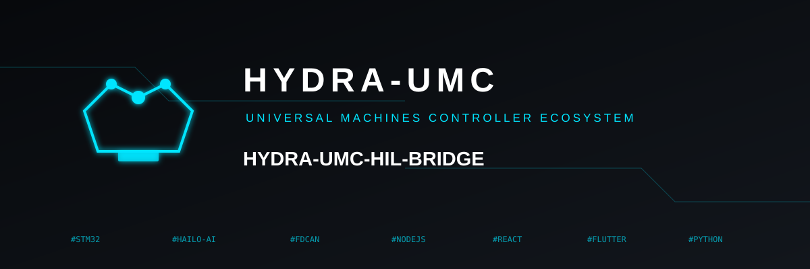
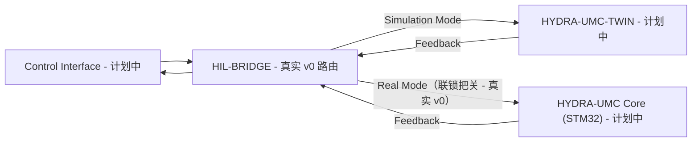

<p align="center">
  
</p>

# 🌉 HYDRA-UMC-HIL-BRIDGE

<p align="center"><a href="README.md">🇺🇸 English</a> | <a href="README_spa.md">🇪🇸 Español</a> | <a href="README_fra.md">🇫🇷 Français</a> | <a href="README_ita.md">🇮🇹 Italiano</a> | <a href="README_deu.md">🇩🇪 Deutsch</a> | 🇨🇳 <b>简体中文</b> | <a href="README_jpn.md">🇯🇵 日本語</a></p>

### ⚡ 用于真实与虚拟同步的硬件在环接口

<p align="left">
  
  
  
  
</p>

---

## 1. 🛠️ 技术概述

**HYDRA-UMC-HIL-BRIDGE** 是实现硬件在环（HIL）功能的通信动脉。它实时
同步物理控制器与数字孪生引擎之间的状态。

它使开发者能够从任何界面（应用程序、Suite、Studio）向仿真器发送指令，
就像它是一台物理机器人一样；反过来，它也可以将物理机器人的运动镜像到
虚拟世界中，用于远程监控和数字孪生影子跟随。

### 关键特性：
* 🛡️ **安全联锁（v0）：** 真实的 `route` 子命令会在孪生系统的风险报告指出碰撞即将发生时，阻止发往真实硬件的指令——下方"诚实说明"给出了今天到底能跑什么。
* 🌉 **双向桥接（v0，尚无传输层）：** 真实的、基于模式（真实/仿真）的路由和真实的、无条件的镜像已经存在；目前还没有连接到真正的 HYDRA-UMC-TWIN 或 HYDRA-UMC 控制器的真实 gRPC/WebSocket 连接。
* ⚡ **零延迟镜像（部分）：** 真实的 `mirror` 子命令今天会把指令镜像到一个内存中的记录接收器；在真实网络连接上的"零延迟"仍是未来工作。
* 📡 **统一协议（计划中）：** 使用 gRPC 进行高速本地同步，使用 WebSocket 进行远程监控——目前故意还没有接入任何网络传输层（见 `Cargo.toml`）。

**诚实说明——今天实际运行的内容：** `route --mode real|simulation --joint 名称 --position 数值 [--collision-risk] [--distance 米数]` 会做出真实的路由决策——`simulation` 模式总是发送，`real` 模式受真实安全联锁约束，只要设置了 `--collision-risk` 就会阻止指令。`mirror --joint 名称 --position 数值` 会无条件镜像一条指令。两者都路由到一个内存中的 `RecordingSink`，而非真正的控制器或真正的 HYDRA-UMC-TWIN 实例——目前还没有 gRPC/WebSocket 传输层。具体已交付内容请参见 [`CHANGELOG.md`](CHANGELOG.md)，尚待完成的内容请参见下方路线图。

---

## 2. 🔄 HIL 同步流程

`BRIDGE` 处基于模式的分流，以及 `Real Mode` 路径上的安全联锁闸门，
今天都是真实的（`bridge.rs`/`interlock.rs`），路由到的是一个内存中的
接收器，而非真实的实时进程。任何涉及真实 `APP`、`TWIN` 或 `CORE` 进程、
通过真实连接的部分，仍是未来工作。



---

## 3. 🧱 架构与设计决策

* **为何本桥接服务没有 `hardware/`/`firmware/`/`os/` 文件夹。** 纯软件——它将现有硬件（真实应用程序、真实的 HYDRA-UMC 固件）桥接到数字孪生系统，没有自己的板卡。
* **为何它是 HYDRA-UMC-TWIN 的兄弟项目，而非子模块。** 硬件在环桥接需要持续运行（并保持真实设备指令的持续流动），独立于 HYDRA-UMC-TWIN 自身的渲染/物理循环在那一刻正在做什么——作为独立进程意味着孪生系统的重启不会丢弃正在传输中的真实指令。
* **这如何融入生态系统的其余部分。** 使 HYDRA-UMC-SUITE、HYDRA-UMC-ANDROID-CONTROL 和 HYDRA-UMC-IOS-CONTROL 能够像控制一个真实的、由 HYDRA-UMC-SERVER 支撑的单元一样控制 HYDRA-UMC-TWIN——同一个控制界面，一个模拟的目标。
* **为何联锁信任孪生系统自身的 `collision_imminent` 标志，而不是从距离阈值重新推导一个。** 孪生系统在报告风险时已经完成了真实的几何/物理推理——在这里用一个独立的距离阈值去质疑那个结论，只会得到第二个、可能不一致的安全意见。具体这如何呼应 HYDRA-UMC-SAFETY-ZONES 的检测-执行边界，见 `interlock.rs` 自身的模块文档。
* **为何 `Simulation` 模式永远不受联锁约束。** 把指令路由到孪生系统而非真实硬件的全部意义，就在于能够安全地看到预测的碰撞真实发生——如果在那里阻止它，就违背了这个功能本身存在的意义。
* **为何 `CommandSink` 今天只是一个只有内存实现 `RecordingSink` 的 trait。** 目前还没有真正的 gRPC/WebSocket 传输层（见 `Cargo.toml` 自身的注释）——`RecordingSink` 对此很诚实：它只记录被要求发送的内容，不会向任何地方传输，与 HYDRA-UMC-SAFETY-ZONES 中 `NullEStopRequester` 的思路完全相同。

---

## 📂 目录结构

纯软件桥接服务，没有自己的硬件设计——因此本项目不携带 `hardware/`、
`firmware/` 或 `os/` 文件夹（参见 `SONNET/5.PLAN_EJECUCION_32_PROYECTOS_NUEVOS.txt` 中的文件夹裁剪规则）。

```text
HYDRA-UMC-HIL-BRIDGE/
├── src/
│   ├── protocol.rs       # 真实的 JointCommand/Mode 类型
│   ├── interlock.rs       # 真实的安全联锁决策
│   ├── bridge.rs            # 真实的基于模式的路由 + 镜像
│   └── main.rs                 # 入口点 + 真实的 `route`/`mirror` 子命令
├── docs/                # 文档与集成指南
├── build/               # 构建笔记/产物（cargo 自身的输出位于 target/，已被 gitignore）
├── images/              # 媒体与图表
├── scripts/             # 实用脚本
├── Cargo.toml           # 包元数据、依赖项、里程表版本号
├── bump_version.py      # 里程表式版本递增（由 build.sh/.bat 使用）
├── build.sh / build.bat # 递增版本号、`cargo test`，然后执行 `cargo build --release`
└── run.sh / run.bat     # 运行编译后的 release 二进制文件（转发参数）
```

---

## 🏗️ 构建与运行

需要 Rust 工具链（`cargo`/`rustc`，通过 [rustup](https://rustup.rs) 安装）
以及 Python 3.10+（仅供 `bump_version.py` 使用）。

```bash
# Linux / macOS
./build.sh   # 里程表式版本递增、`cargo test`（7 个测试），然后执行 `cargo build --release`
./run.sh     # 运行 target/release/hydra-umc-hil-bridge，打印名称 + 版本 + 角色
```

```bat
:: Windows
build.bat
run.bat
```

`build.sh`/`build.bat` 会按照生态系统的"里程表"规则（PATCH+1，超过 9
时进位到 MINOR）递增本项目自身的 `Cargo.toml` 版本号，运行真实的测试
套件，然后构建一个 release 二进制文件。

真实的 `route` 和 `mirror` 子命令：

```bash
./run.sh route --mode real --joint shoulder --position 0.5
# SENT: routed to real HYDRA-UMC controller

./run.sh route --mode real --joint shoulder --position 0.5 --collision-risk --distance 0.02
# BLOCKED: safety interlock refused to forward to real hardware (twin reports imminent collision at 0.020m)

./run.sh route --mode simulation --joint shoulder --position 0.5 --collision-risk --distance 0.02
# SENT: routed to HYDRA-UMC-TWIN (simulation)

./run.sh mirror --joint elbow --position -0.3
# MIRRORED: joint 'elbow' = -0.300000 shadowed into the twin
```

`route` 在发送成功时退出码为 `0`，被安全联锁阻止时为 `1`（这是一个真实
且有意义的结果，不是错误），输入无效时为 `2`。`mirror` 退出码为 `0`
或 `2`。

`Cargo.toml` 目前刻意不包含任何外部 crate——具体在真正的 gRPC/WebSocket
传输层工作开始时会添加什么，请见其内部的注释说明。

---

## 🚀 路线图
* **第一阶段：** 数字孪生与实时硬件遥测的同步，延迟低于 10ms。
* **第二阶段：** 物理复制品与工业级仿真器（Isaac Sim）的集成，以及可变形体支持。
* **第三阶段：** 用于去中心化故障转移和早期传感器退化检测的节点自愈自动化恢复模式。
* **第四阶段：** 多控制器 HIL 同步（集群 HIL）以及照片级真实合成数据生成支持。

---

## 🔗 相关项目

本项目是同一作者（JuanenRac / Electro Hobby 3D）打造的更大规模机器人生态
系统的一部分，涵盖固件、控制软件、AI 节点和车队工具。值得了解，因为某个
需求实际上可能是关于这些项目之一，而非本仓库。

### 项目族

**父项目：** **[HYDRA-UMC-TWIN](https://github.com/JuanenRac/HYDRA-UMC-TWIN)** —— 本桥接服务与之连接真实硬件的集成父项目。

**同族项目：**
- **[HYDRA-UMC-PHYSICS-REPLICA](https://github.com/JuanenRac/HYDRA-UMC-PHYSICS-REPLICA)** —— 同级仿真服务，同一父项目。
- **[HYDRA-UMC-SYNTHETIC-DATA-GEN](https://github.com/JuanenRac/HYDRA-UMC-SYNTHETIC-DATA-GEN)** —— 同级仿真服务，同一父项目。

### 直接相关（项目族之外）

- **[HYDRA-UMC-SERVER](https://github.com/JuanenRac/HYDRA-UMC-SERVER)** —— 硬件在环桥接的目标。
- **[HYDRA-UMC-SUITE](https://github.com/JuanenRac/HYDRA-UMC-SUITE)** —— 硬件在环桥接的目标。
- **[HYDRA-UMC-ANDROID-CONTROL](https://github.com/JuanenRac/HYDRA-UMC-ANDROID-CONTROL)** —— 硬件在环桥接的目标。
- **[HYDRA-UMC-IOS-CONTROL](https://github.com/JuanenRac/HYDRA-UMC-IOS-CONTROL)** —— 硬件在环桥接的目标。

### 生态系统的其余部分

**HYDRA-UMC 平台** —— 多机器人微工厂单元
- **[HYDRA-UMC](https://github.com/JuanenRac/HYDRA-UMC)** —— 协调最多 8 条机械臂的 CM5 + STM32H745 主板。
- **[HYDRA-UMC-SERVER](https://github.com/JuanenRac/HYDRA-UMC-SERVER)** —— 每个控制客户端所对接的 Express/WebSocket 后端。
- **[HYDRA-UMC-STUDIO](https://github.com/JuanenRac/HYDRA-UMC-STUDIO)** —— 基于 Web 的控制仪表盘，多机器人 3D 可视化。
- **[HYDRA-UMC-ANDROID-CONTROL](https://github.com/JuanenRac/HYDRA-UMC-ANDROID-CONTROL)** —— 通过 Wi-Fi/蓝牙的 Android 控制应用。
- **[HYDRA-UMC-IOS-CONTROL](https://github.com/JuanenRac/HYDRA-UMC-IOS-CONTROL)** —— 基于 Flutter 构建的 iOS/iPadOS 控制应用。
- **[HYDRA-UMC-SUITE](https://github.com/JuanenRac/HYDRA-UMC-SUITE)** —— 桌面端集群指挥中心（Python/PySide6）。
- **[HYDRA-UMC-EDITOR-URDF](https://github.com/JuanenRac/HYDRA-UMC-EDITOR-URDF)** —— 用于机器人目录的桌面端 URDF 模型编辑器。
- **[HYDRA-UMC-DSI](https://github.com/JuanenRac/HYDRA-UMC-DSI)** —— 机载 DSI 触摸屏的原生触控 UI。

**URTC 平台** —— 每台 HYDRA-UMC 机械臂搭载的工具头控制器
- **[URTC](https://github.com/JuanenRac/URTC)** —— CAN 总线工具头控制器，25 种工具配置。
- **[URTC-FLASHER](https://github.com/JuanenRac/URTC-FLASHER)** —— 桌面端 CAN-OTA + SWD/JTAG 刷写工具。
- **[URTC-TESTER](https://github.com/JuanenRac/URTC-TESTER)** —— 桌面端实时 CAN 总线诊断工具。
- **[URTC-WEB-STUDIO](https://github.com/JuanenRac/URTC-WEB-STUDIO)** —— 通过 Web Serial API 的浏览器端替代方案。

**🎥 视觉 AI 节点（Hailo-8）**
- [HYDRA-UMC-VISION-NODE](https://github.com/JuanenRac/HYDRA-UMC-VISION-NODE)
- [HYDRA-UMC-VISION-STREAMER](https://github.com/JuanenRac/HYDRA-UMC-VISION-STREAMER)
- [HYDRA-UMC-DETECTION-HEF](https://github.com/JuanenRac/HYDRA-UMC-DETECTION-HEF)
- [HYDRA-UMC-SAFETY-ZONES](https://github.com/JuanenRac/HYDRA-UMC-SAFETY-ZONES)
- [HYDRA-UMC-VISUAL-SERVOING-API](https://github.com/JuanenRac/HYDRA-UMC-VISUAL-SERVOING-API)

**🧠 认知 AI 节点（Hailo-10）**
- [HYDRA-UMC-COGNITIVE-NODE](https://github.com/JuanenRac/HYDRA-UMC-COGNITIVE-NODE)
- [HYDRA-UMC-VLA-ENGINE](https://github.com/JuanenRac/HYDRA-UMC-VLA-ENGINE)
- [HYDRA-UMC-VOICE-UI](https://github.com/JuanenRac/HYDRA-UMC-VOICE-UI)
- [HYDRA-UMC-SEMANTIC-PLANNER](https://github.com/JuanenRac/HYDRA-UMC-SEMANTIC-PLANNER)
- [HYDRA-UMC-DOCS-QA](https://github.com/JuanenRac/HYDRA-UMC-DOCS-QA)

**🐝 编排与集群**
- [HYDRA-UMC-ORCHESTRATOR](https://github.com/JuanenRac/HYDRA-UMC-ORCHESTRATOR)
- [HYDRA-UMC-SWARM-SYNC](https://github.com/JuanenRac/HYDRA-UMC-SWARM-SYNC)
- [HYDRA-UMC-PATH-PLANNER-3D](https://github.com/JuanenRac/HYDRA-UMC-PATH-PLANNER-3D)
- [HYDRA-UMC-JOB-DISPATCHER](https://github.com/JuanenRac/HYDRA-UMC-JOB-DISPATCHER)
- [HYDRA-UMC-NODE-HEALING](https://github.com/JuanenRac/HYDRA-UMC-NODE-HEALING)

**📊 数据与分析**
- [HYDRA-UMC-DATALAKE](https://github.com/JuanenRac/HYDRA-UMC-DATALAKE)
- [HYDRA-UMC-TELEMETRY-COLLECTOR](https://github.com/JuanenRac/HYDRA-UMC-TELEMETRY-COLLECTOR)
- [HYDRA-UMC-ANOMALY-DETECTOR](https://github.com/JuanenRac/HYDRA-UMC-ANOMALY-DETECTOR)
- [HYDRA-UMC-PRODUCTION-REPORTS](https://github.com/JuanenRac/HYDRA-UMC-PRODUCTION-REPORTS)

**🏭 工业网关**
- [HYDRA-UMC-GATEWAY-INDUSTRIAL](https://github.com/JuanenRac/HYDRA-UMC-GATEWAY-INDUSTRIAL)
- [HYDRA-UMC-OPCUA-SERVER](https://github.com/JuanenRac/HYDRA-UMC-OPCUA-SERVER)
- [HYDRA-UMC-MQTT-BROKER](https://github.com/JuanenRac/HYDRA-UMC-MQTT-BROKER)
- [HYDRA-UMC-MTCONNECT-ADAPTER](https://github.com/JuanenRac/HYDRA-UMC-MTCONNECT-ADAPTER)

**🛠️ 配套工具**
- [URTC-SMART-RACK](https://github.com/JuanenRac/URTC-SMART-RACK)
- [URTC-VISION-TOOL](https://github.com/JuanenRac/URTC-VISION-TOOL)
- [HYDRA-UMC-WATCH](https://github.com/JuanenRac/HYDRA-UMC-WATCH)
- [HYDRA-UMC-TOOL-CLI](https://github.com/JuanenRac/HYDRA-UMC-TOOL-CLI)
- [HYDRA-UMC-DASHBOARD-AI](https://github.com/JuanenRac/HYDRA-UMC-DASHBOARD-AI)


## 👤 作者
**JuanenRac**（Electro Hobby 3D）
📧 electrohobby3d@gmail.com

## 📜 许可证
GPL-3.0 —— 详见 LICENSE。

## 关联项目

> Canonical public ecosystem relationship map.

**Direct integrations:**
[HYDRA-UMC-OS](https://github.com/JuanenRac/HYDRA-UMC-OS) · [HYDRA-UMC-SDK](https://github.com/JuanenRac/HYDRA-UMC-SDK) · [HYDRA-UMC-SERVER](https://github.com/JuanenRac/HYDRA-UMC-SERVER) · [URTC](https://github.com/JuanenRac/URTC) · [HYDRA-UMC-TWIN](https://github.com/JuanenRac/HYDRA-UMC-TWIN) · [HYDRA-UMC-PHYSICS-REPLICA](https://github.com/JuanenRac/HYDRA-UMC-PHYSICS-REPLICA) · [HYDRA-UMC-EDITOR-URDF](https://github.com/JuanenRac/HYDRA-UMC-EDITOR-URDF)

**Platform and contracts:**
[HYDRA-UMC-OS](https://github.com/JuanenRac/HYDRA-UMC-OS) · [HYDRA-UMC-SDK](https://github.com/JuanenRac/HYDRA-UMC-SDK)

**Rest of the ecosystem:**
All remaining public repositories are grouped by the seven ecosystem layers in the [JuanenRac ecosystem dashboard](https://juanenrac.github.io/JuanenRac/).
