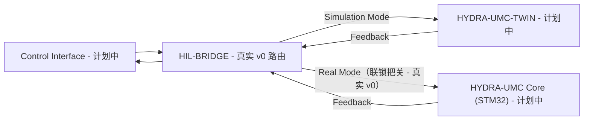

<p align="center">
  
</p>

# 🌉 HYDRA-UMC-HIL-BRIDGE

<p align="center"><a href="README.md">🇺🇸 English</a> | <a href="README_spa.md">🇪🇸 Español</a> | <a href="README_fra.md">🇫🇷 Français</a> | <a href="README_ita.md">🇮🇹 Italiano</a> | <a href="README_deu.md">🇩🇪 Deutsch</a> | 🇨🇳 <b>简体中文</b> | <a href="README_jpn.md">🇯🇵 日本語</a></p>

### ⚡ 用于真实与虚拟同步的硬件在环接口

<p align="left">
  
  
  
  
</p>

---

## 1. 🛠️ 技术概述

**HYDRA-UMC-HIL-BRIDGE** 是实现硬件在环（HIL）功能的通信动脉。它实时
同步物理控制器与数字孪生引擎之间的状态。

它使开发者能够从任何界面（应用程序、Suite、Studio）向仿真器发送指令，
就像它是一台物理机器人一样；反过来，它也可以将物理机器人的运动镜像到
虚拟世界中，用于远程监控和数字孪生影子跟随。

### 关键特性：
* 🛡️ **安全联锁（v0）：** 真实的 `route` 子命令会在孪生系统的风险报告指出碰撞即将发生时，阻止发往真实硬件的指令——下方"诚实说明"给出了今天到底能跑什么。
* 🌉 **双向桥接（v0，尚无传输层）：** 真实的、基于模式（真实/仿真）的路由和真实的、无条件的镜像已经存在；目前还没有连接到真正的 HYDRA-UMC-TWIN 或 HYDRA-UMC 控制器的真实 gRPC/WebSocket 连接。
* ⚡ **零延迟镜像（部分）：** 真实的 `mirror` 子命令今天会把指令镜像到一个内存中的记录接收器；在真实网络连接上的"零延迟"仍是未来工作。
* 📡 **统一协议（计划中）：** 使用 gRPC 进行高速本地同步，使用 WebSocket 进行远程监控——目前故意还没有接入任何网络传输层（见 `Cargo.toml`）。
* 🧪 **故障安全传输层，无需硬件即可测试（v0）：** `CommandSink::send()` 现在返回真实的 `Result`；新增的 `SimulatedTransport` 可以模拟超时或断开的链路，桥接服务会报告一个独立的 `TransportFailure` 结果，绝不会在指令实际未送达时声称已送达——可通过 `route` 上的 `--transport-latency-ms`/`--transport-timeout-ms`/`--transport-disconnected` 触发验证。

**诚实说明——今天实际运行的内容：** `route --mode real|simulation --joint 名称 --position 数值 [--collision-risk] [--distance 米数] [--transport-latency-ms 毫秒] [--transport-timeout-ms 毫秒] [--transport-disconnected]` 会做出真实的路由决策——`simulation` 模式总是发送，`real` 模式受真实安全联锁约束，只要设置了 `--collision-risk` 就会阻止指令。`mirror --joint 名称 --position 数值` 会无条件镜像一条指令。两者默认都路由到一个内存中的接收器（`RecordingSink`，而非真正的控制器或真正的 HYDRA-UMC-TWIN 实例），如果传入上述传输层参数，则路由到一个真的会失败（超时/断开）的 `SimulatedTransport`——目前还没有 gRPC/WebSocket 传输层。具体已交付内容请参见 [`CHANGELOG.md`](CHANGELOG.md)，尚待完成的内容请参见下方路线图。

---

## 2. 🔄 HIL 同步流程

`BRIDGE` 处基于模式的分流，以及 `Real Mode` 路径上的安全联锁闸门，
今天都是真实的（`bridge.rs`/`interlock.rs`），路由到的是一个内存中的
接收器，而非真实的实时进程。任何涉及真实 `APP`、`TWIN` 或 `CORE` 进程、
通过真实连接的部分，仍是未来工作。



---

## 3. 🧱 架构与设计决策

* **为何本桥接服务没有 `hardware/`/`firmware/`/`os/` 文件夹。** 纯软件——它将现有硬件（真实应用程序、真实的 HYDRA-UMC 固件）桥接到数字孪生系统，没有自己的板卡。
* **为何它是 HYDRA-UMC-TWIN 的兄弟项目，而非子模块。** 硬件在环桥接需要持续运行（并保持真实设备指令的持续流动），独立于 HYDRA-UMC-TWIN 自身的渲染/物理循环在那一刻正在做什么——作为独立进程意味着孪生系统的重启不会丢弃正在传输中的真实指令。
* **这如何融入生态系统的其余部分。** 使 HYDRA-UMC-SUITE、HYDRA-UMC-ANDROID-CONTROL 和 HYDRA-UMC-IOS-CONTROL 能够像控制一个真实的、由 HYDRA-UMC-SERVER 支撑的单元一样控制 HYDRA-UMC-TWIN——同一个控制界面，一个模拟的目标。
* **为何联锁信任孪生系统自身的 `collision_imminent` 标志，而不是从距离阈值重新推导一个。** 孪生系统在报告风险时已经完成了真实的几何/物理推理——在这里用一个独立的距离阈值去质疑那个结论，只会得到第二个、可能不一致的安全意见。具体这如何呼应 HYDRA-UMC-SAFETY-ZONES 的检测-执行边界，见 `interlock.rs` 自身的模块文档。
* **为何 `Simulation` 模式永远不受联锁约束。** 把指令路由到孪生系统而非真实硬件的全部意义，就在于能够安全地看到预测的碰撞真实发生——如果在那里阻止它，就违背了这个功能本身存在的意义。
* **为何 `CommandSink` 今天只是一个只有内存实现 `RecordingSink` 的 trait。** 目前还没有真正的 gRPC/WebSocket 传输层（见 `Cargo.toml` 自身的注释）——`RecordingSink` 对此很诚实：它只记录被要求发送的内容，不会向任何地方传输，与 HYDRA-UMC-SAFETY-ZONES 中 `NullEStopRequester` 的思路完全相同。
* **为何 `CommandSink::send()` 返回 `Result` 而非 `()`。** 无论联锁是否放行了该指令，真实传输层都可能送达失败（超时、断开）——如果 `send()` 不能失败，桥接服务就无法避免在指令从未真正到达时仍宣称成功。`SimulatedTransport` 存在的意义正是让这条失败路径在今天就是真实且可测试的，而不必等到真实传输层出现。
* **为何 `TransportFailure` 是与 `BlockedByInterlock` 分开的 `RouteOutcome`。** 这是两种不同的「没有发生」：一种是刻意的安全拒绝（联锁决定不转发），另一种是尽力而为的投递未能完成。把两者合并成一个通用失败会掩盖到底是哪一层安全机制真正拦下了指令——这对调试有用，也为未来可能区别对待两者的策略留出空间（重试一次传输失败是合理的；重试一次联锁拦截则不是）。

---

## 📂 目录结构

纯软件桥接服务，没有自己的硬件设计——因此本项目不携带 `hardware/`、
`firmware/` 或 `os/` 文件夹，遵循仓库结构策略。

```text
HYDRA-UMC-HIL-BRIDGE/
├── src/
│   ├── protocol.rs       # 真实的 JointCommand/Mode 类型
│   ├── interlock.rs      # 真实的安全联锁决策
│   ├── bridge.rs         # 真实的基于模式的路由 + 镜像 + CommandSink/SimulatedTransport
│   ├── server.rs         # 简洁的 JSON/HTTP 接口(tiny_http,阻塞式,无异步运行时)
│   └── main.rs           # 入口点 + 真实的 `route`/`mirror` 子命令
├── docs/                # 文档与集成指南
├── build/               # 构建笔记/产物（cargo 自身的输出位于 target/，已被 gitignore）
├── images/              # 媒体与图表
├── systemd/
│   └── hydra-umc-hil-bridge.service # 本地 CM5 route/mirror API 的 systemd 单元
├── tools/
│   ├── build_test.py    # 不递增版本号的构建检查
│   └── ci_validate.py   # CI 使用的清单/CHANGELOG/文档校验
├── Cargo.toml           # 包元数据、依赖项、里程表版本号
├── bump_version.py      # 原生版本的里程表式递增（由 build.sh/.bat 使用）
├── bump_manifest_version.py # 将 hydra-umc.project.json 的版本与原生版本同步(--sync)
├── build.sh / build.bat # 递增版本号、`cargo test`，然后执行 `cargo build --release`
├── build-test.sh / build-test.bat # 不递增版本号的构建检查
└── run.sh / run.bat     # 运行编译后的 release 二进制文件（转发参数）
```

---

## 🏗️ 构建与运行

需要 Rust 工具链（`cargo`/`rustc`，通过 [rustup](https://rustup.rs) 安装）
以及 Python 3.10+（仅供 `bump_version.py` 使用）。

```bash
# Linux / macOS
./build.sh   # 里程表式版本递增、`cargo test`（23 个测试），然后执行 `cargo build --release`
./run.sh     # 运行 target/release/hydra-umc-hil-bridge，打印名称 + 版本 + 角色
```

```bat
:: Windows
build.bat
run.bat
```

`build.sh`/`build.bat` 会按照生态系统的"里程表"规则（PATCH+1，超过 9
时进位到 MINOR）递增本项目自身的 `Cargo.toml` 版本号，运行真实的测试
套件，然后构建一个 release 二进制文件。

真实的 `route` 和 `mirror` 子命令：

```bash
./run.sh route --mode real --joint shoulder --position 0.5
# SENT: routed to real HYDRA-UMC controller

./run.sh route --mode real --joint shoulder --position 0.5 --collision-risk --distance 0.02
# BLOCKED: safety interlock refused to forward to real hardware (twin reports imminent collision at 0.020m)

./run.sh route --mode simulation --joint shoulder --position 0.5 --collision-risk --distance 0.02
# SENT: routed to HYDRA-UMC-TWIN (simulation)

./run.sh mirror --joint elbow --position -0.3
# MIRRORED: joint 'elbow' = -0.300000 shadowed into the twin

./run.sh route --mode real --joint shoulder --position 0.5 --transport-timeout-ms 100 --transport-latency-ms 500
# TRANSPORT FAILURE: command was not confirmed delivered (transport timed out after 100ms)

./run.sh route --mode real --joint shoulder --position 0.5 --transport-disconnected
# TRANSPORT FAILURE: command was not confirmed delivered (transport is disconnected)
```

`route` 在发送成功时退出码为 `0`，被安全联锁阻止时为 `1`（这是一个真实
且有意义的结果，不是错误），输入无效时为 `2`，传输失败时为 `3`
（联锁放行了指令，但投递未被确认）。`mirror` 退出码为 `0`、`2` 或 `3`。

`Cargo.toml` 目前刻意不包含任何外部 crate——具体在真正的 gRPC/WebSocket
传输层工作开始时会添加什么，请见其内部的注释说明。

---

## 🚀 路线图
* **第一阶段：** 数字孪生与实时硬件遥测的同步，延迟低于 10ms。
* **第二阶段：** 物理复制品与工业级仿真器（Isaac Sim）的集成，以及可变形体支持。
* **第三阶段：** 用于去中心化故障转移和早期传感器退化检测的节点自愈自动化恢复模式。
* **第四阶段：** 多控制器 HIL 同步（集群 HIL）以及照片级真实合成数据生成支持。

---

## 🔗 相关项目

本项目是同一作者(JuanenRac / Electro Hobby 3D)打造的 HYDRA-UMC 机器人生态系统的一部分。值得了解,因为某个请求实际上可能是关于这些项目之一,而非本仓库本身。

**父项目**
- **[HYDRA-UMC-TWIN](https://github.com/JuanenRac/HYDRA-UMC-TWIN)** — 面向数字孪生引擎的集成中枢,具备真实的版本兼容性同步契约;本仓库是其自身数字孪生引擎中一个具体仿真服务所属的父项目。

**兄弟项目** —— HYDRA-UMC-TWIN 自身数字孪生引擎中的其他仿真服务
- **[HYDRA-UMC-PHYSICS-REPLICA](https://github.com/JuanenRac/HYDRA-UMC-PHYSICS-REPLICA)** — 面向真实 URDF 子集的真实正向运动学与关节限位校验。
- **[HYDRA-UMC-SYNTHETIC-DATA-GEN](https://github.com/JuanenRac/HYDRA-UMC-SYNTHETIC-DATA-GEN)** — 具备 YOLO/COCO 标注导出功能的真实程序化 2D 场景生成器。

**直接相关**
- **[HYDRA-UMC-STUDIO](https://github.com/JuanenRac/HYDRA-UMC-STUDIO)** — 具有实时多机器人 3D 可视化的网页控制面板 —— 一旦存在真实传输层,即可像操作真实机器人一样通过本桥接发送指令的 3 个客户端界面之一。
- **[HYDRA-UMC-SUITE](https://github.com/JuanenRac/HYDRA-UMC-SUITE)** — 面向多台服务器的桌面(PySide6)集群指挥中心，打包为独立可执行文件 —— 一旦存在真实传输层,即可像操作真实机器人一样通过本桥接发送指令的 3 个客户端界面之一。
- **[HYDRA-UMC-ANDROID-CONTROL](https://github.com/JuanenRac/HYDRA-UMC-ANDROID-CONTROL)** — 具有生物识别登录和配对 Wear OS 伴侣应用的原生 Android 控制应用 —— 一旦存在真实传输层,即可像操作真实机器人一样通过本桥接发送指令的 3 个客户端界面之一。
- **[HYDRA-UMC-IOS-CONTROL](https://github.com/JuanenRac/HYDRA-UMC-IOS-CONTROL)** — 具有实时 WebSocket 同步的 iOS/iPadOS 控制应用(Flutter) —— 一旦存在真实传输层,即可像操作真实机器人一样通过本桥接发送指令的 3 个客户端界面之一。
- **[HYDRA-UMC-SERVER](https://github.com/JuanenRac/HYDRA-UMC-SERVER)** — 每个控制客户端真正通信的真实无头后端(REST/WebSocket) —— 这 3 个客户端界面背后的后端,一旦存在传输层,本桥接自身的 `route --mode real` 最终指向的真实控制器。

**生态系统中的其他项目**

*核心硬件与平台*
- **[HYDRA-UMC](https://github.com/JuanenRac/HYDRA-UMC)** — 机器人手臂的真实主板——CM5 主机 + 双核 STM32H745，通过 CAN-OTA/SPI-OTA 协调最多 8 条工具臂。
- **[HYDRA-UMC-OS](https://github.com/JuanenRac/HYDRA-UMC-OS)** — 面向 CM5 的可复现 Raspberry Pi OS 产品层——只读代理、经过验证的配置/配置文件、WiFi 首次配网。
- **[HYDRA-UMC-SDK](https://github.com/JuanenRac/HYDRA-UMC-SDK)** — 每个桥接都据此校验自身指令的共享 JSON-Schema 契约与安全门限边界。

*核心后端与客户端*
- **[HYDRA-UMC-DSI](https://github.com/JuanenRac/HYDRA-UMC-DSI)** — 面向机载 7 英寸 DSI 触摸屏的原生触控界面，直接嵌入 CM5 本体。
- **[HYDRA-UMC-EDITOR-URDF](https://github.com/JuanenRac/HYDRA-UMC-EDITOR-URDF)** — 将完成的模型推送到 STUDIO 自身目录的桌面版图形化 URDF 创建/编辑工具。
- **[HYDRA-UMC-BRIDGE-AMR](https://github.com/JuanenRac/HYDRA-UMC-BRIDGE-AMR)** — 通过真实的 VDA 5050 MQTT 发布者为 AGV/AMR 车队提供的协调边界。
- **[HYDRA-UMC-BRIDGE-CNC](https://github.com/JuanenRac/HYDRA-UMC-BRIDGE-CNC)** — 具备真实 GRBL 状态/控制字节访问能力的高层 CNC 单元协调器。
- **[HYDRA-UMC-BRIDGE-DROIDS](https://github.com/JuanenRac/HYDRA-UMC-BRIDGE-DROIDS)** — 面向足式/人形机器人的协调边界，具备真实的 Boston Dynamics Spot 指令发送器。
- **[HYDRA-UMC-BRIDGE-LASER](https://github.com/JuanenRac/HYDRA-UMC-BRIDGE-LASER)** — 读取 3 项真实钥匙/外壳/联锁 GPIO 安全信号的激光单元安全协调器。
- **[HYDRA-UMC-BRIDGE-OPENPNP](https://github.com/JuanenRac/HYDRA-UMC-BRIDGE-OPENPNP)** — 面向 OpenPnP 贴片机板级流程的安全高层协调器。
- **[HYDRA-UMC-BRIDGE-PRINTER3D](https://github.com/JuanenRac/HYDRA-UMC-BRIDGE-PRINTER3D)** — 面向 Moonraker/Klipper 3D 打印机的安全协调边界，具备真实的受控作业指令。
- **[HYDRA-UMC-BRIDGE-ROS2](https://github.com/JuanenRac/HYDRA-UMC-BRIDGE-ROS2)** — 具备真实的惰性导入 rclpy ROS 2 传输层的安全协调器。
- **[HYDRA-UMC-BRIDGE-UAV](https://github.com/JuanenRac/HYDRA-UMC-BRIDGE-UAV)** — 面向搭载摄像头的无人机的协调边界，具备真实的 MAVLink 指令发送器。

*URTC 工具平台*
- **[URTC](https://github.com/JuanenRac/URTC)** — 面向实体 Universal Robot Tool Controller 板卡的固件，通过 CAN 总线支持 25 种以上工具配置。
- **[URTC-FLASHER](https://github.com/JuanenRac/URTC-FLASHER)** — 面向 URTC 板卡的桌面图形烧录工具，支持 CAN-OTA 以及全芯片 SWD/JTAG。
- **[URTC-TESTER](https://github.com/JuanenRac/URTC-TESTER)** — 面向 URTC 板卡的桌面实时 CAN 总线诊断工具，每种工具配置对应一个面板。
- **[URTC-WEB-STUDIO](https://github.com/JuanenRac/URTC-WEB-STUDIO)** — 通过 Web Serial API 实现的浏览器版 URTC-TESTER 替代方案，无需本地安装。

*视觉 AI 节点(Hailo-8)*
- **[HYDRA-UMC-VISION-NODE](https://github.com/JuanenRac/HYDRA-UMC-VISION-NODE)** — 面向 Hailo-8 视觉流水线的集成中枢，具备逐阶段的真实硬件就绪检测。
- **[HYDRA-UMC-DETECTION-HEF](https://github.com/JuanenRac/HYDRA-UMC-DETECTION-HEF)** — 具备 Hailo 架构/校验和安全加载验证的真实编译模型注册表。
- **[HYDRA-UMC-VISION-STREAMER](https://github.com/JuanenRac/HYDRA-UMC-VISION-STREAMER)** — 具备真实 HailoRT 集成边界的真实 GStreamer 流水线 + MediaMTX 配置生成器。
- **[HYDRA-UMC-VISUAL-SERVOING-API](https://github.com/JuanenRac/HYDRA-UMC-VISUAL-SERVOING-API)** — 具备真实 Position-Based Visual Servoing 修正律，并依据上游区域状态进行安全门控。
- **[HYDRA-UMC-SAFETY-ZONES](https://github.com/JuanenRac/HYDRA-UMC-SAFETY-ZONES)** — 具备校准新鲜度强制检查的真实区域入侵检测与 E-STOP 请求。

*认知 AI 节点(Hailo-10)*
- **[HYDRA-UMC-COGNITIVE-NODE](https://github.com/JuanenRac/HYDRA-UMC-COGNITIVE-NODE)** — 面向 Hailo-10 认知流水线(LLM/VLA/语音编排)的集成中枢。
- **[HYDRA-UMC-VLA-ENGINE](https://github.com/JuanenRac/HYDRA-UMC-VLA-ENGINE)** — 面向 Vision-Language-Action 模型的真实动作 token 编解码与轨迹生成。
- **[HYDRA-UMC-VOICE-UI](https://github.com/JuanenRac/HYDRA-UMC-VOICE-UI)** — 具备受限、需确认的 Watch 中继的真实语音前端(VAD + 意图解析)。
- **[HYDRA-UMC-SEMANTIC-PLANNER](https://github.com/JuanenRac/HYDRA-UMC-SEMANTIC-PLANNER)** — 基于真实规则的任务分解，以及针对 MCU 错误码的语义化错误恢复。
- **[HYDRA-UMC-DOCS-QA](https://github.com/JuanenRac/HYDRA-UMC-DOCS-QA)** — 面向本生态系统自身 Markdown 文档的真实纯标准库 TF-IDF 文档检索。

*编排与集群*
- **[HYDRA-UMC-ORCHESTRATOR](https://github.com/JuanenRac/HYDRA-UMC-ORCHESTRATOR)** — 具备真实 gRPC/Protobuf 健康报告契约与任务状态机的集成中枢。
- **[HYDRA-UMC-JOB-DISPATCHER](https://github.com/JuanenRac/HYDRA-UMC-JOB-DISPATCHER)** — 基于真实 HTTP API 的真实优先级任务队列，支持去重。
- **[HYDRA-UMC-NODE-HEALING](https://github.com/JuanenRac/HYDRA-UMC-NODE-HEALING)** — 具备重试/退避与身份不匹配检测的真实基于 gRPC 的车队健康看门狗。
- **[HYDRA-UMC-PATH-PLANNER-3D](https://github.com/JuanenRac/HYDRA-UMC-PATH-PLANNER-3D)** — 具备真实障碍物/工作空间碰撞校验的真实基于 RRT 的三维路径规划器。
- **[HYDRA-UMC-SWARM-SYNC](https://github.com/JuanenRac/HYDRA-UMC-SWARM-SYNC)** — 经过多单元收敛属性测试的真实 CRDT LWW-Element-Map 状态同步。

*数据与分析*
- **[HYDRA-UMC-DATALAKE](https://github.com/JuanenRac/HYDRA-UMC-DATALAKE)** — 具备真实数据摄入/查询 HTTP API 的真实 sqlite3 时序数据存储。
- **[HYDRA-UMC-ANOMALY-DETECTOR](https://github.com/JuanenRac/HYDRA-UMC-ANOMALY-DETECTOR)** — 具备漂移监测能力的真实 FFT + 统计基线异常检测器。
- **[HYDRA-UMC-PRODUCTION-REPORTS](https://github.com/JuanenRac/HYDRA-UMC-PRODUCTION-REPORTS)** — 基于 DATALAKE 历史数据的真实 OEE/可用率计算，支持可复现的 CSV 导出。
- **[HYDRA-UMC-TELEMETRY-COLLECTOR](https://github.com/JuanenRac/HYDRA-UMC-TELEMETRY-COLLECTOR)** — 面向 DATALAKE 的真实 CAN/WebSocket 数据摄入管道，支持序列去重。

*工业网关*
- **[HYDRA-UMC-GATEWAY-INDUSTRIAL](https://github.com/JuanenRac/HYDRA-UMC-GATEWAY-INDUSTRIAL)** — 中继至工业协议的集成中枢，具备真实的指令白名单/背压控制层。
- **[HYDRA-UMC-OPCUA-SERVER](https://github.com/JuanenRac/HYDRA-UMC-OPCUA-SERVER)** — 经真实二进制协议客户端会话验证的真实 OPC-UA 地址空间。
- **[HYDRA-UMC-MQTT-BROKER](https://github.com/JuanenRac/HYDRA-UMC-MQTT-BROKER)** — 具备可选按客户端认证与主题 ACL 的真实 MQTT 代理。
- **[HYDRA-UMC-MTCONNECT-ADAPTER](https://github.com/JuanenRac/HYDRA-UMC-MTCONNECT-ADAPTER)** — 具备降级模式输出的真实 MTConnect `/probe` 与 `/current` XML 端点。

*辅助工具与生态系统运维*
- **[HYDRA-UMC-DASHBOARD-AI](https://github.com/JuanenRac/HYDRA-UMC-DASHBOARD-AI)** — 基于 DATALAKE/ANOMALY-DETECTOR 的智能摘要与异常高亮面板，具备诚实的统计回退机制。
- **[HYDRA-UMC-TOOL-CLI](https://github.com/JuanenRac/HYDRA-UMC-TOOL-CLI)** — 具备真实、稳定退出码契约的车队 CLI，是 HYDRA-UMC-SERVER 自身 API 的真实在线客户端。
- **[HYDRA-UMC-WATCH](https://github.com/JuanenRac/HYDRA-UMC-WATCH)** — 具备真实触觉提醒与配对手机语音中继功能的 WearOS 伴侣应用。
- **[URTC-SMART-RACK](https://github.com/JuanenRac/URTC-SMART-RACK)** — 面向板卡安装机架的固件，具备真实的工具 ID 解码与 Smart Idle 预热逻辑。
- **[URTC-VISION-TOOL](https://github.com/JuanenRac/URTC-VISION-TOOL)** — 面向热成像/RGB 检测工具头的固件及真实 Python 视觉伴侣程序。
- **[HYDRA-UMC-UPDATER](https://github.com/JuanenRac/HYDRA-UMC-UPDATER)** — 发现、克隆并更新本生态系统中每个仓库的管理类桌面工具。


---

## 📚 文档与社区

- **[CONTRIBUTING.md](CONTRIBUTING.md)** —— 提交 Pull Request 所需的技术栈和编码规范。
- **[CODE_OF_CONDUCT.md](CODE_OF_CONDUCT.md)** —— 本社区所期望的行为准则。
- **[SECURITY.md](SECURITY.md)** —— 如何报告漏洞，以及本项目真实的安全关注重点。
- **[SUPPORT.md](SUPPORT.md)** —— 在哪里提问和报告缺陷。
- **[LICENSE.md](LICENSE.md)** —— 本项目自身的许可证。

## 👤 作者
**JuanenRac** (Electro Hobby 3D)
📧 electrohobby3d@gmail.com
📺 [youtube.com/@electrohobby3d](https://youtube.com/@electrohobby3d)

## 📜 许可证
GPL-3.0 —— 详见 LICENSE。
